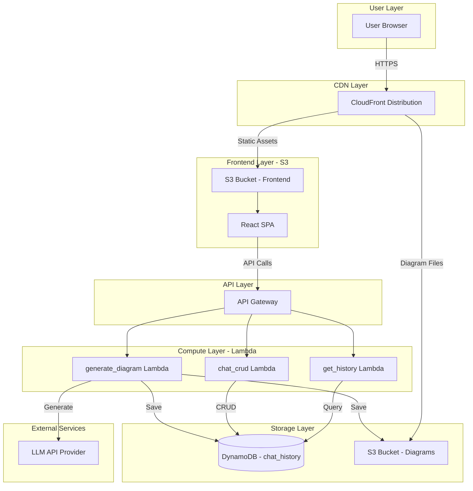
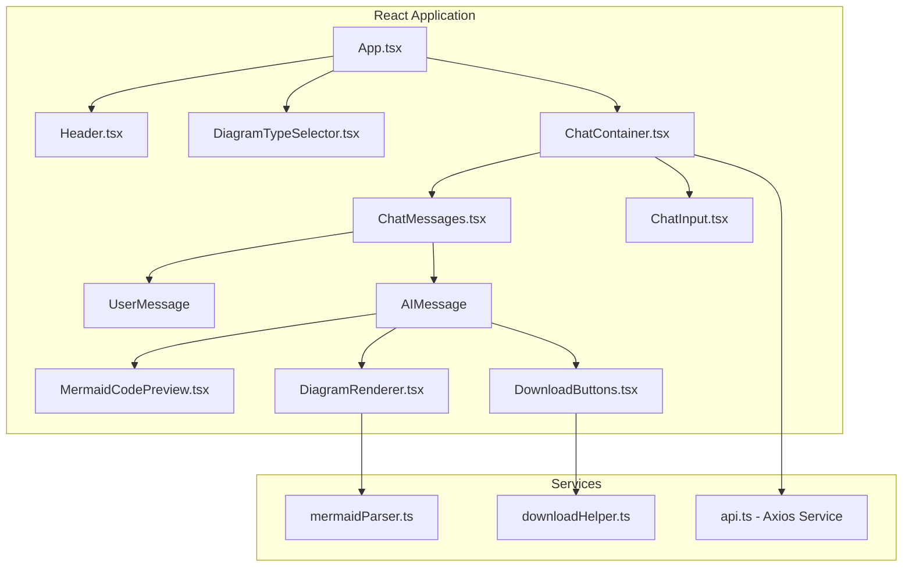

# Design Document: Architecture AI Assistant

## Overview

The Architecture AI Assistant is a cloud-native web application that enables users to generate software architecture diagrams through natural language conversations with an LLM. The system is designed with a focus on strong cloud infrastructure (80%) and a simple, working AI application (20%).

The application follows a serverless architecture pattern using AWS services:
- Frontend: React SPA hosted on S3 with CloudFront CDN
- Backend: Python Lambda functions behind API Gateway
- Storage: DynamoDB for chat history, S3 for diagram files
- Infrastructure: Terraform for Infrastructure-as-Code

## Architecture



## Components and Interfaces

### Frontend Components



### Backend Lambda Functions

| Function | Purpose | Trigger | Timeout | Memory |
|----------|---------|---------|---------|--------|
| generate_diagram | Call LLM, generate Mermaid, save to S3/DynamoDB | POST /api/diagram/generate | 60s | 512MB |
| chat_crud | Save chat messages to DynamoDB | POST /api/chat/save | 10s | 256MB |
| get_history | Query chat history from DynamoDB | GET /api/chat/history | 10s | 256MB |

### API Interfaces

#### POST /api/diagram/generate

Request:
```json
{
  "userPrompt": "string",
  "diagramType": "flowchart|erdiagram|sequence|class|state|architecture|dfd"
}
```

Response:
```json
{
  "chatId": "uuid",
  "timestamp": 1702564800,
  "mermaidCode": "graph TD\n  A[Node] --> B[Node]",
  "imageUrl": "https://cloudfront-url/diagrams/uuid.png",
  "markdownUrl": "https://cloudfront-url/diagrams/uuid.md",
  "status": "completed"
}
```

#### GET /api/chat/history

Query Parameters: `limit` (default: 50), `nextToken` (optional)

Response:
```json
{
  "chats": [
    {
      "chatId": "uuid",
      "timestamp": 1702564800,
      "userMessage": "string",
      "diagramType": "flowchart",
      "mermaidCode": "string",
      "imageUrl": "string",
      "status": "completed"
    }
  ],
  "count": 15,
  "nextToken": "string|null"
}
```

#### POST /api/chat/save

Request:
```json
{
  "chatId": "uuid",
  "userMessage": "string",
  "diagramType": "string"
}
```

Response:
```json
{
  "success": true,
  "chatId": "uuid",
  "timestamp": 1702564800
}
```

## Data Models

### DynamoDB Table: chat_history

| Attribute | Type | Key | Description |
|-----------|------|-----|-------------|
| chatId | String | Partition Key | UUID for the chat entry |
| timestamp | Number | Sort Key | Unix timestamp |
| userMessage | String | - | User's prompt text |
| diagramType | String | - | Type of diagram requested |
| aiResponse | String | - | Full AI response text |
| mermaidCode | String | - | Extracted Mermaid code |
| diagramImageS3Key | String | - | S3 key for PNG image |
| diagramMarkdownS3Key | String | - | S3 key for markdown file |
| imageUrl | String | - | CloudFront URL for image |
| markdownUrl | String | - | CloudFront URL for markdown |
| status | String | - | pending, completed, failed |

### S3 Bucket Structure

```
s3://architecture-ai-bucket/
├── frontend/
│   ├── index.html
│   ├── static/
│   │   ├── js/
│   │   └── css/
│   └── assets/
└── diagrams/
    ├── {chatId}.md
    ├── {chatId}.png
    └── ...
```

### TypeScript Types (Frontend)

```typescript
interface ChatMessage {
  chatId: string;
  timestamp: number;
  userMessage: string;
  diagramType: DiagramType;
  aiResponse?: string;
  mermaidCode?: string;
  imageUrl?: string;
  markdownUrl?: string;
  status: 'pending' | 'completed' | 'failed';
}

type DiagramType = 
  | 'flowchart' 
  | 'erdiagram' 
  | 'sequence' 
  | 'class' 
  | 'state' 
  | 'architecture' 
  | 'dfd';

interface GenerateDiagramRequest {
  userPrompt: string;
  diagramType: DiagramType;
}

interface GenerateDiagramResponse {
  chatId: string;
  timestamp: number;
  mermaidCode: string;
  imageUrl: string;
  markdownUrl: string;
  status: string;
}

interface ChatHistoryResponse {
  chats: ChatMessage[];
  count: number;
  nextToken?: string;
}
```

## Correctness Properties

*A property is a characteristic or behavior that should hold true across all valid executions of a system-essentially, a formal statement about what the system should do. Properties serve as the bridge between human-readable specifications and machine-verifiable correctness guarantees.*

Based on the prework analysis, the following correctness properties have been identified. Redundant properties have been consolidated to provide unique validation value.

### Property 1: Diagram Type Context Inclusion

*For any* diagram type selected by the user, the API request payload SHALL contain that diagram type value in the diagramType field.

**Validates: Requirements 1.4**

### Property 2: Mermaid Code Validity

*For any* generated Mermaid code string, the code SHALL pass Mermaid syntax validation for the specified diagram type.

**Validates: Requirements 2.1, 2.5**

### Property 3: Mermaid Code Display

*For any* AI response containing Mermaid code, the frontend SHALL render the code within a syntax-highlighted code block element.

**Validates: Requirements 2.2**

### Property 4: Mermaid to React Flow Conversion

*For any* valid Mermaid code string, the parser SHALL produce a non-empty array of React Flow nodes and edges.

**Validates: Requirements 2.3, 9.1**

### Property 5: S3 Storage Round Trip

*For any* generated diagram, saving the Mermaid code to S3 and then retrieving it SHALL return identical content.

**Validates: Requirements 3.1, 3.2**

### Property 6: Download Button Presence

*For any* displayed diagram with a completed status, the UI SHALL contain both PNG and markdown download buttons.

**Validates: Requirements 3.3, 3.4**

### Property 7: Chat Persistence Round Trip

*For any* chat message saved to DynamoDB, querying by chatId SHALL return the same message content with matching timestamp.

**Validates: Requirements 4.1, 4.2**

### Property 8: Diagram Re-rendering Consistency

*For any* stored Mermaid code loaded from chat history, re-rendering SHALL produce visually equivalent diagram output.

**Validates: Requirements 4.3**

### Property 9: Pagination Limit Compliance

*For any* chat history query with a limit parameter N, the returned results count SHALL be less than or equal to N.

**Validates: Requirements 4.4**

### Property 10: System Prompt Construction

*For any* diagram type, the constructed LLM prompt SHALL contain diagram-type-specific Mermaid syntax instructions.

**Validates: Requirements 5.2, 10.1**

### Property 11: Mermaid Code Extraction

*For any* LLM response containing ```mermaid code blocks, the extraction function SHALL return the code content without delimiters.

**Validates: Requirements 5.3, 10.5**

### Property 12: Invalid Code Error Handling

*For any* Mermaid code that fails validation, the system SHALL return an error response with status code 400 and error details.

**Validates: Requirements 5.4, 7.4**

### Property 13: Generate API Response Format

*For any* valid POST request to /api/diagram/generate, the response SHALL contain chatId, mermaidCode, imageUrl, and markdownUrl fields.

**Validates: Requirements 7.1**

### Property 14: History API Response Format

*For any* GET request to /api/chat/history, the response SHALL contain a chats array and count field.

**Validates: Requirements 7.2**

### Property 15: Save API Confirmation

*For any* POST request to /api/chat/save with valid data, the response SHALL contain success:true and the saved chatId.

**Validates: Requirements 7.3**

### Property 16: Node Layout Non-Overlap

*For any* diagram with multiple nodes, the automatic layout algorithm SHALL position nodes such that no two nodes occupy the same coordinates.

**Validates: Requirements 9.4**

## Error Handling

### Frontend Error Handling

| Error Type | User Message | Recovery Action |
|------------|--------------|-----------------|
| Network Error | "Unable to connect. Please check your internet connection." | Show retry button |
| API Timeout | "Request timed out. Please try again." | Show retry button |
| Invalid Response | "Something went wrong. Please try again." | Show retry button |
| Mermaid Parse Error | "Unable to render diagram. The generated code may be invalid." | Show raw code |

### Backend Error Handling

| Error Type | HTTP Status | Response Body |
|------------|-------------|---------------|
| Missing Parameters | 400 | `{"error": "Missing required field: userPrompt"}` |
| Invalid Diagram Type | 400 | `{"error": "Invalid diagram type: xyz"}` |
| LLM API Error | 502 | `{"error": "LLM service unavailable"}` |
| S3 Upload Error | 500 | `{"error": "Failed to save diagram"}` |
| DynamoDB Error | 500 | `{"error": "Failed to save chat history"}` |

### LLM Error Recovery

```python
def call_llm_with_retry(prompt: str, max_retries: int = 3) -> str:
    for attempt in range(max_retries):
        try:
            response = llm_client.generate(prompt)
            return response
        except RateLimitError:
            time.sleep(2 ** attempt)  # Exponential backoff
        except TimeoutError:
            if attempt == max_retries - 1:
                raise
    raise LLMServiceError("Max retries exceeded")
```

## Testing Strategy

### Unit Testing

Unit tests verify specific examples and edge cases:

- **Frontend Components**: Test rendering of ChatMessage, DiagramRenderer, DiagramTypeSelector
- **API Service**: Test request/response handling, error states
- **Mermaid Parser**: Test parsing of each diagram type
- **Lambda Functions**: Test input validation, response formatting

Testing Framework: Jest + React Testing Library (Frontend), pytest (Backend)

### Property-Based Testing

Property-based tests verify universal properties across all inputs. The system uses:
- **Frontend**: fast-check library for TypeScript
- **Backend**: hypothesis library for Python

Each property test runs a minimum of 100 iterations with random inputs.

Property tests are tagged with format: `**Feature: architecture-ai-assistant, Property {number}: {property_text}**`

### Test Categories

| Category | Framework | Focus |
|----------|-----------|-------|
| Unit Tests | Jest/pytest | Individual functions, edge cases |
| Property Tests | fast-check/hypothesis | Universal properties, random inputs |
| Integration Tests | Supertest/pytest | API endpoints, database operations |
| E2E Tests | Playwright (optional) | Full user flows |

### LLM Prompt Testing

The LLM system prompts are tested by:
1. Verifying prompt contains required syntax instructions for each diagram type
2. Testing extraction of Mermaid code from various response formats
3. Validating generated Mermaid code against syntax rules

## Infrastructure Design

### Terraform Module Structure

```
infrastructure/terraform/
├── main.tf           # Provider, backend configuration
├── variables.tf      # Input variables
├── outputs.tf        # Output values
├── vpc.tf            # VPC, subnets (optional for Lambda)
├── api_gateway.tf    # API Gateway REST API
├── lambda.tf         # Lambda functions, layers
├── dynamodb.tf       # DynamoDB table
├── s3.tf             # S3 buckets
├── cloudfront.tf     # CloudFront distribution
├── iam.tf            # IAM roles, policies
└── terraform.tfvars  # Variable values
```

### IAM Least Privilege Policy

```json
{
  "Version": "2012-10-17",
  "Statement": [
    {
      "Effect": "Allow",
      "Action": [
        "dynamodb:PutItem",
        "dynamodb:GetItem",
        "dynamodb:Query"
      ],
      "Resource": "arn:aws:dynamodb:*:*:table/chat_history"
    },
    {
      "Effect": "Allow",
      "Action": [
        "s3:PutObject",
        "s3:GetObject"
      ],
      "Resource": "arn:aws:s3:::architecture-ai-bucket/diagrams/*"
    },
    {
      "Effect": "Allow",
      "Action": [
        "logs:CreateLogGroup",
        "logs:CreateLogStream",
        "logs:PutLogEvents"
      ],
      "Resource": "arn:aws:logs:*:*:*"
    }
  ]
}
```

### Deployment Script

```bash
#!/bin/bash
# deploy.sh - One-command deployment

set -e

echo "🚀 Deploying Architecture AI Assistant..."

# 1. Deploy infrastructure
cd infrastructure/terraform
terraform init
terraform apply -auto-approve
OUTPUTS=$(terraform output -json)

# 2. Build frontend
cd ../../src/frontend
npm install
npm run build

# 3. Upload frontend to S3
BUCKET=$(echo $OUTPUTS | jq -r '.s3_bucket_name.value')
aws s3 sync build/ s3://$BUCKET/frontend/ --delete

# 4. Invalidate CloudFront cache
DISTRO=$(echo $OUTPUTS | jq -r '.cloudfront_distribution_id.value')
aws cloudfront create-invalidation --distribution-id $DISTRO --paths "/*"

echo "✅ Deployment complete!"
echo "Frontend URL: $(echo $OUTPUTS | jq -r '.cloudfront_url.value')"
```
