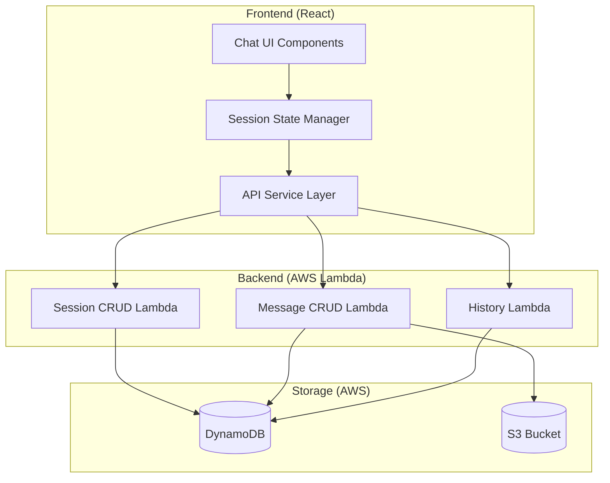

# Design Document: Chat Session Management

## Overview

This design introduces a session-based architecture for the Architecture AI Assistant chat system. The current flat message structure will be replaced with a hierarchical model where sessions contain multiple messages. This enables proper "New Chat" functionality, session-based history navigation, and conversation continuity.

## Architecture

The system follows a three-tier architecture:



## Components and Interfaces

### Backend Components

#### 1. Session Service (Lambda)

Handles session lifecycle operations.

```typescript
interface SessionService {
  createSession(): Promise<Session>;
  getSession(sessionId: string): Promise<Session>;
  listSessions(params: ListParams): Promise<SessionListResponse>;
  updateSessionTitle(sessionId: string, title: string): Promise<void>;
  deleteSession(sessionId: string): Promise<void>;
}

interface Session {
  sessionId: string;
  title: string;
  diagramType: DiagramType;
  createdAt: number;
  updatedAt: number;
  messageCount: number;
}

interface ListParams {
  limit?: number;
  nextToken?: string;
}

interface SessionListResponse {
  sessions: Session[];
  count: number;
  nextToken?: string;
}
```

#### 2. Message Service (Enhanced)

Extended to support session-based message storage.

```typescript
interface MessageService {
  saveMessage(sessionId: string, message: MessageInput): Promise<Message>;
  getMessages(sessionId: string): Promise<Message[]>;
}

interface MessageInput {
  userMessage: string;
  diagramType: DiagramType;
  aiResponse?: string;
  mermaidCode?: string;
  imageUrl?: string;
  markdownUrl?: string;
}

interface Message {
  messageId: string;
  sessionId: string;
  timestamp: number;
  userMessage: string;
  diagramType: DiagramType;
  aiResponse?: string;
  mermaidCode?: string;
  imageUrl?: string;
  markdownUrl?: string;
  status: MessageStatus;
}
```

### Frontend Components

#### 1. Session State Manager

Manages current session and session list state.

```typescript
interface SessionState {
  currentSessionId: string | null;
  sessions: Session[];
  isCreatingSession: boolean;
  isLoadingSessions: boolean;
}

interface SessionActions {
  createNewSession(): Promise<string>;
  selectSession(sessionId: string): void;
  loadSessions(): Promise<void>;
  updateSessionTitle(sessionId: string, title: string): Promise<void>;
}
```

#### 2. Updated Sidebar Component

Displays sessions instead of individual messages.

```typescript
interface SidebarProps {
  isOpen: boolean;
  sessions: Session[];
  currentSessionId: string | null;
  onNewChat: () => void;
  onSelectSession: (sessionId: string) => void;
  isLoading: boolean;
}
```

#### 3. Updated ChatContainer Component

Loads and displays messages for the current session.

```typescript
interface ChatContainerProps {
  selectedDiagramType: DiagramType;
  currentSessionId: string | null;
  onSessionCreated: (sessionId: string) => void;
  onFirstMessage: (sessionId: string, title: string) => void;
}
```

### API Endpoints

| Method | Endpoint | Description |
|--------|----------|-------------|
| POST | /api/session | Create a new session |
| GET | /api/session | List all sessions |
| GET | /api/session/{sessionId} | Get session details |
| PUT | /api/session/{sessionId} | Update session (title) |
| DELETE | /api/session/{sessionId} | Delete session |
| GET | /api/session/{sessionId}/messages | Get messages for session |
| POST | /api/session/{sessionId}/messages | Add message to session |

## Data Models

### DynamoDB Table Schema

The existing table will be restructured to support sessions:

**Sessions Table** (new or repurposed):
- Partition Key: `PK` (String) - Format: `SESSION#{sessionId}`
- Sort Key: `SK` (String) - Format: `METADATA` for session, `MSG#{timestamp}` for messages

```
| PK                  | SK              | Attributes                                    |
|---------------------|-----------------|-----------------------------------------------|
| SESSION#abc123      | METADATA        | title, diagramType, createdAt, updatedAt, ... |
| SESSION#abc123      | MSG#1702000001  | messageId, userMessage, aiResponse, ...       |
| SESSION#abc123      | MSG#1702000002  | messageId, userMessage, aiResponse, ...       |
```

### Session Entity

```json
{
  "PK": "SESSION#uuid-here",
  "SK": "METADATA",
  "sessionId": "uuid-here",
  "title": "Microservices architecture for e-commerce",
  "diagramType": "architecture",
  "createdAt": 1702000000,
  "updatedAt": 1702000100,
  "messageCount": 3
}
```

### Message Entity

```json
{
  "PK": "SESSION#uuid-here",
  "SK": "MSG#1702000001",
  "messageId": "msg-uuid-here",
  "sessionId": "uuid-here",
  "timestamp": 1702000001,
  "userMessage": "Create a microservices architecture...",
  "diagramType": "architecture",
  "aiResponse": "Here's a microservices architecture...",
  "mermaidCode": "flowchart TB...",
  "imageUrl": "https://s3.../diagram.png",
  "markdownUrl": "https://s3.../diagram.md",
  "status": "completed"
}
```

## Correctness Properties

*A property is a characteristic or behavior that should hold true across all valid executions of a system-essentially, a formal statement about what the system should do. Properties serve as the bridge between human-readable specifications and machine-verifiable correctness guarantees.*

Based on the prework analysis, the following correctness properties must be validated:

### Property 1: Session ID Uniqueness
*For any* two session creation operations, the generated Session_IDs SHALL be unique and non-colliding.
**Validates: Requirements 1.1**

### Property 2: Session Creation State Reset
*For any* session creation operation, the resulting UI state SHALL have an empty messages array and the currentSessionId set to the newly created session.
**Validates: Requirements 1.2, 1.3**

### Property 3: Title Extraction Correctness
*For any* user message string, the extracted session title SHALL be the first 50 characters of the message, with ellipsis appended if the original exceeds 50 characters.
**Validates: Requirements 4.1, 4.2**

### Property 4: Message-Session Association
*For any* message saved with a Session_ID, retrieving messages for that session SHALL include the saved message.
**Validates: Requirements 2.1, 5.4**

### Property 5: Message Field Completeness
*For any* stored message, the record SHALL contain all required fields: messageId, sessionId, timestamp, userMessage, diagramType, and status.
**Validates: Requirements 2.2**

### Property 6: Message Chronological Ordering
*For any* session with multiple messages, retrieving messages SHALL return them ordered by timestamp in ascending order.
**Validates: Requirements 2.3, 5.3**

### Property 7: Serialization Round-Trip
*For any* valid message object, serializing to JSON and deserializing back SHALL produce an equivalent object.
**Validates: Requirements 2.4, 2.5**

### Property 8: Session Date Grouping
*For any* set of sessions with various timestamps, the grouping function SHALL correctly categorize them into Today, Yesterday, Last 7 Days, or Older based on their createdAt timestamp.
**Validates: Requirements 3.1**

### Property 9: Session List Metadata Completeness
*For any* session list API response, each session object SHALL contain sessionId, title, createdAt, updatedAt, and diagramType fields.
**Validates: Requirements 5.2**

### Property 10: Invalid Session ID Error Handling
*For any* API request with a malformed or non-existent Session_ID, the API SHALL return a 400 status code with an error message.
**Validates: Requirements 5.5**

## Error Handling

### Backend Error Handling

| Error Scenario | HTTP Status | Error Response |
|----------------|-------------|----------------|
| Invalid Session_ID format | 400 | `{"error": "Invalid session ID format"}` |
| Session not found | 404 | `{"error": "Session not found"}` |
| Missing required fields | 400 | `{"error": "Missing required field: {field}"}` |
| DynamoDB error | 500 | `{"error": "Internal server error"}` |
| Invalid diagram type | 400 | `{"error": "Invalid diagram type"}` |

### Frontend Error Handling

- Display toast notifications for transient errors
- Show inline error messages for form validation
- Implement retry logic for network failures
- Graceful degradation when session creation fails

## Testing Strategy

### Unit Testing

Unit tests will cover:
- Session ID generation uniqueness
- Title extraction logic
- Date grouping utility functions
- API request/response formatting
- Error handling paths

### Property-Based Testing

Property-based tests will be implemented using **fast-check** library for TypeScript/JavaScript. Each correctness property will have a corresponding PBT that generates random inputs and verifies the property holds.

Configuration:
- Minimum 100 iterations per property test
- Each test tagged with format: `**Feature: chat-session-management, Property {number}: {property_text}**`

Property tests will cover:
1. Session ID uniqueness across many generations
2. Title extraction for various string lengths and content
3. Message ordering for random timestamp sequences
4. Serialization round-trip for random message objects
5. Date grouping for random timestamp distributions
6. Error responses for invalid inputs

### Integration Testing

- API endpoint integration tests
- DynamoDB read/write operations
- Frontend-backend communication
- Session lifecycle (create → add messages → retrieve → delete)

