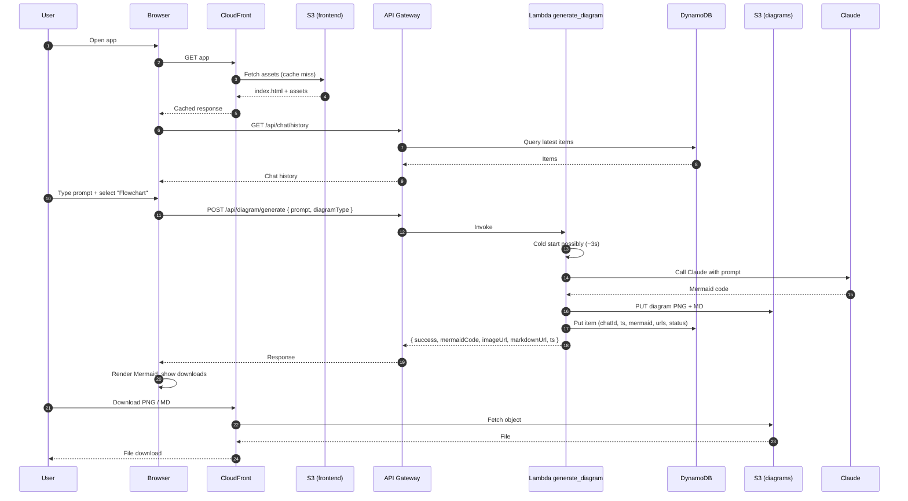
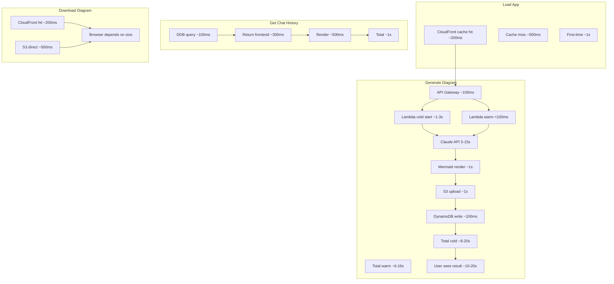
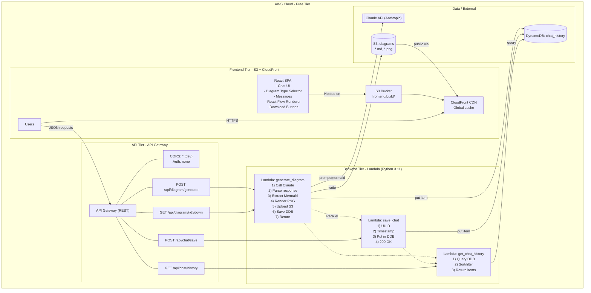
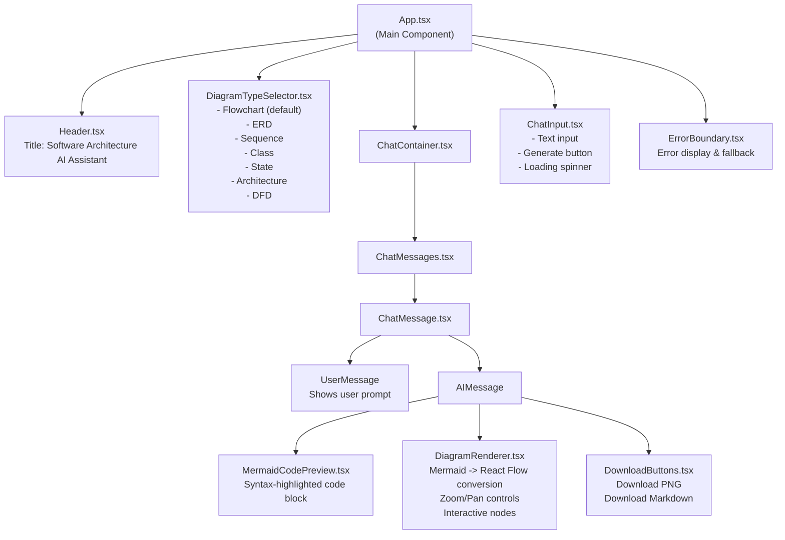

# turn architecture diagrams in this markdown file to the mermaid!!!

Here are Mermaid equivalents of the key architecture diagrams from your markdown. Paste these into any Mermaid-ready renderer to visualize them.[^1_1]

## Complete system architecture

```mermaid
graph TD
  subgraph AWS Cloud (Free Tier)
    subgraph Frontend Tier (S3 + CloudFront)
      A1[React SPA\n- Chat UI\n- Diagram Type Selector\n- Messages\n- React Flow Renderer\n- Download Buttons]
      A2[S3 Bucket\nfrontend/build/]
      A3[CloudFront CDN\nGlobal cache]
      A1 -->|"Hosted on"| A2 --> A3
      U[Users] -->|"HTTPS"| A3
    end

    subgraph API Tier (API Gateway)
      B1[API Gateway REST]
      B2[/POST /api/diagram/generate/]
      B3[/GET /api/chat/history/]
      B4[/POST /api/chat/save/]
      B5[/GET /api/diagram/{id}/down/]
      B6[CORS: * (dev)\nAuth: none]
      B1 --- B6
      B1 --- B2
      B1 --- B3
      B1 --- B4
      B1 --- B5
    end

    subgraph Backend Tier (Lambda Python 3.11)
      C1[Lambda: generate_diagram\n1) Call Claude\n2) Parse response\n3) Extract Mermaid\n4) Render PNG\n5) Upload S3\n6) Save DDB\n7) Return]
      C2[Lambda: save_chat\n1) UUID\n2) Timestamp\n3) Put in DDB\n4) 200 OK]
      C3[Lambda: get_chat_history\n1) Query DDB\n2) Sort/filter\n3) Return items]
      C1 -.->|"Parallel"| C2
      C1 -.-> C3
      C2 -.-> C3
    end

    subgraph Data/External
      D1[(DynamoDB: chat_history)]
      D2[(S3: diagrams/\n*.md, *.png)]
      D3[[Claude API (Anthropic)]]
    end
  end

  %% Flows
  U -->|"JSON requests"| B1
  B2 --> C1
  B3 --> C3
  B4 --> C2
  B5 --> C1

  C1 -->|"prompt/mermaid"| D3
  C1 -->|"write"| D2
  C1 -->|"put item"| D1
  C2 -->|"put item"| D1
  C3 -->|"query"| D1

  D2 -->|"public via"| A3
```


## Data flow: user interaction




## Frontend component interaction

```mermaid
graph TD
  subgraph App.tsx
    H[Header.tsx\nTitle: "Software Architecture AI Assistant"]
    DTS[DiagramTypeSelector.tsx\n- Flowchart (default)\n- ERD\n- Sequence\n- Class\n- State\n- Architecture\n- DFD]
    CC[ChatContainer.tsx]
    CI[ChatInput.tsx\n- Text input\n- Generate button\n- Loading spinner]
    EB[ErrorBoundary.tsx]
  end

  CC --> CM[ChatMessages.tsx]
  CM --> CMsg[ChatMessage.tsx]
  CMsg --> UM[UserMessage\nshows prompt]
  CMsg --> AIM[AIMessage]
  AIM --> MCP[MermaidCodePreview.tsx\nsyntax highlighted]
  AIM --> DR[DiagramRenderer.tsx\nMermaid -> React Flow\nZoom/Pan\nInteractive nodes]
  AIM --> DB[DownloadButtons.tsx\nPNG / Markdown]

  H -.-> App.tsx
  DTS -.-> App.tsx
  CC -.-> App.tsx
  CI -.-> App.tsx
  EB -.-> App.tsx
```


## DynamoDB table and S3 layout

```mermaid
classDiagram
  class ChatItem {
    +string chatId
    +number timestamp
    +string userMessage
    +string diagramType
    +string aiResponse
    +string mermaidCode
    +string diagramImageS3Key
    +string diagramMarkdownS3Key
    +string imageUrl
    +string markdownUrl
    +string status
    +number processingTime
    +number ttl
  }

  class DynamoDB_chat_history {
    <<Table>>
    PartitionKey: chatId (UUID)
    SortKey: timestamp (Unix)
  }

  class S3_architecture_ai_bucket {
    <<Bucket>>
    frontend/
    diagrams/
  }

  class S3_diagrams_prefix {
    <<Prefix>>
    {uuid}.png
    {uuid}.md
  }

  DynamoDB_chat_history "1" --> "many" ChatItem : stores
  S3_architecture_ai_bucket --> S3_diagrams_prefix : contains
```


## Security architecture

```mermaid
graph TD
  subgraph IAM Role (Lambda Execution)
    P1[dynamodb:PutItem/GetItem/Query\nResource: table/chat_history]
    P2[s3:PutObject/GetObject\nResource: bucket/diagrams/*]
    P3[logs:*]
    P4[secretsmanager:GetSecretValue\nResource: claude-api-key]
  end

  subgraph API Gateway CORS (MVP)
    C1[Allow Origins: *]
    C2[Allow Methods: GET, POST, OPTIONS]
    C3[Allow Headers: Content-Type, Authorization]
    C4[Allow Credentials: false]
    C5[Expose Headers: X-Request-Id]
  end

  subgraph Network Security
    SG_ALB[ALB SG (optional)\n443 inbound only]
    SG_L[Lambda SG\nOutbound to CloudFront/DDB/S3]
    SG_DB[DB SG\nAllow only from Lambda SG]
  end

  P1:::perm -->|Least privilege| SG_L
  P2:::perm --> SG_L
  P3:::perm --> SG_L
  P4:::perm --> SG_L

  classDef perm fill:#eef,stroke:#55f
```


## Performance characteristics



If you want these split into separate .md files or prefer different Mermaid types (flowchart vs sequence vs ER), say which sections to adjust and the target format.

<div align="center">⁂</div>

[^1_1]: System_Architecture_Overview.md


---

# graph TD

subgraph AWS Cloud (Free Tier)

    subgraph Frontend Tier (S3 + CloudFront)
    
      A1[React SPA\n- Chat UI\n- Diagram Type Selector\n- Messages\n- React Flow Renderer\n- Download Buttons]
    
      A2[S3 Bucket\nfrontend/build/]
    
      A3[CloudFront CDN\nGlobal cache]
    
      A1 -->|"Hosted on"| A2 --> A3
    
      U[Users] -->|"HTTPS"| A3
    
    end
    
    
    
    subgraph API Tier (API Gateway)
    
      B1[API Gateway REST]
    
      B2[/POST /api/diagram/generate/]
    
      B3[/GET /api/chat/history/]
    
      B4[/POST /api/chat/save/]
    
      B5[/GET /api/diagram/{id}/down/]
    
      B6[CORS: * (dev)\nAuth: none]
    
      B1 --- B6
    
      B1 --- B2
    
      B1 --- B3
    
      B1 --- B4
    
      B1 --- B5
    
    end
    
    
    
    subgraph Backend Tier (Lambda Python 3.11)
    
      C1[Lambda: generate_diagram\n1) Call Claude\n2) Parse response\n3) Extract Mermaid\n4) Render PNG\n5) Upload S3\n6) Save DDB\n7) Return]
    
      C2[Lambda: save_chat\n1) UUID\n2) Timestamp\n3) Put in DDB\n4) 200 OK]
    
      C3[Lambda: get_chat_history\n1) Query DDB\n2) Sort/filter\n3) Return items]
    
      C1 -.->|"Parallel"| C2
    
      C1 -.-> C3
    
      C2 -.-> C3
    
    end
    
    
    
    subgraph Data/External
    
      D1[(DynamoDB: chat_history)]
    
      D2[(S3: diagrams/\n*.md, *.png)]
    
      D3[[Claude API (Anthropic)]]
    
    end
    end

%% Flows

U -->|"JSON requests"| B1

B2 --> C1

B3 --> C3

B4 --> C2

B5 --> C1

C1 -->|"prompt/mermaid"| D3

C1 -->|"write"| D2

C1 -->|"put item"| D1

C2 -->|"put item"| D1

C3 -->|"query"| D1

D2 -->|"public via"| A3

---
for the "Complete system architecture" it says:
Error: On line 1
MermaidDetailedError: Parse error on line 2:
... subgraph AWS Cloud (Free Tier)    subg
-----------------------^
Expecting 'SEMI', 'NEWLINE', 'SPACE', 'EOF', 'GRAPH', 'DIR', 'subgraph', 'SQS', 'end', 'AMP', 'COLON', 'START_LINK', 'STYLE', 'LINKSTYLE', 'CLASSDEF', 'CLASS', 'CLICK', 'DOWN', 'UP', 'NUM', 'NODE_STRING', 'BRKT', 'MINUS', 'MULT', 'UNICODE_TEXT', got 'PS'
Need help fixing syntax errors?
Fix with AI
Snippets

---
graph TD
  subgraph App.tsx
    H[Header.tsx\nTitle: "Software Architecture AI Assistant"]
    DTS[DiagramTypeSelector.tsx\n- Flowchart (default)\n- ERD\n- Sequence\n- Class\n- State\n- Architecture\n- DFD]
    CC[ChatContainer.tsx]
    CI[ChatInput.tsx\n- Text input\n- Generate button\n- Loading spinner]
    EB[ErrorBoundary.tsx]
  end

CC --> CM[ChatMessages.tsx]
  CM --> CMsg[ChatMessage.tsx]
  CMsg --> UM[UserMessage\nshows prompt]
  CMsg --> AIM[AIMessage]
  AIM --> MCP[MermaidCodePreview.tsx\nsyntax highlighted]
  AIM --> DR[DiagramRenderer.tsx\nMermaid -> React Flow\nZoom/Pan\nInteractive nodes]
  AIM --> DB[DownloadButtons.tsx\nPNG / Markdown]

H -.-> App.tsx
  DTS -.-> App.tsx
  CC -.-> App.tsx
  CI -.-> App.tsx
  EB -.-> App.tsx

---
for the "Frontend component interaction" it says:
Error: On line 2
MermaidDetailedError: Parse error on line 3:
...Header.tsx\nTitle: "Software Architectur...
-----------------------^
Expecting 'SQE', 'DOUBLECIRCLEEND', 'PE', '-)', 'STADIUMEND', 'SUBROUTINEEND', 'PIPE', 'CYLINDEREND', 'DIAMOND_STOP', 'TAGEND', 'TRAPEND', 'INVTRAPEND', 'UNICODE_TEXT', 'TEXT', 'TAGSTART', got 'STR'
Need help fixing syntax errors?
Fix with AI
Snippets

---
you need to fix your mermaid diagrams!!!

The errors are coming from **two Mermaid gotchas**: (1) `subgraph` titles with parentheses need quoting, and (2) node text that contains quotes (`"..."`) or other special characters should be wrapped/escaped (use `["..."]`) instead of raw quotes inside the label. Mermaid’s flowchart docs explicitly recommend quoting/escaping “troublesome” characters in node text, and subgraphs follow the `subgraph ... end` structure.[^2_1][^2_2]

## Fixed: Complete system architecture

Changes made: quoted subgraph titles, removed `/.../` endpoint “node shapes” (slashes confuse parsing), and used `["..."]` labels with `<br/>` line breaks.[^2_2][^2_1]




## Fixed: Frontend component interaction

Changes made: used a real node id (`APP["App.tsx ..."]`) instead of trying to reference `App.tsx` as an identifier, and removed the literal quotes inside labels (replaced with single quotes / no quotes). Mermaid supports quoting node text and using `<br/>` for line breaks.[^2_1][^2_2]



If you tell which renderer you’re using (Mermaid Live Editor, GitHub, Notion, Obsidian, Mermaid Chart, etc.), the syntax can be tuned further—some platforms lag Mermaid versions and are stricter about certain characters.
<span style="display:none">[^2_10][^2_11][^2_12][^2_13][^2_14][^2_15][^2_16][^2_17][^2_18][^2_19][^2_20][^2_3][^2_4][^2_5][^2_6][^2_7][^2_8][^2_9]</span>

<div align="center">⁂</div>

[^2_1]: https://emersonbottero.github.io/mermaid-docs/syntax/flowchart.html

[^2_2]: https://mermaid.js.org/syntax/flowchart.html

[^2_3]: https://docs.mermaidchart.com/mermaid-oss/syntax/flowchart.html

[^2_4]: https://ckeditor.com/blog/basic-overview-of-creating-flowcharts-using-mermaid/

[^2_5]: https://docs.mermaidchart.com/mermaid-oss/syntax/flowchart.html?id=special-characters-that-break-syntax

[^2_6]: https://github.com/mermaid-js/mermaid/issues/2428

[^2_7]: https://docsbot.ai/prompts/technical/fix-mermaid-graph-parse-error

[^2_8]: http://mermaid.js.org/syntax/flowchart.html

[^2_9]: https://ampcode.com/threads/T-20bd7894-9b02-4ec8-a877-52e80124daf6

[^2_10]: https://stackoverflow.com/questions/62283192/mermaid-js-syntax-in-azure-broken

[^2_11]: https://www.freecodecamp.org/news/use-mermaid-javascript-library-to-create-flowcharts/

[^2_12]: https://mermaid.js.org/syntax/flowchart.html?id=special-characters-that-break-syntax

[^2_13]: https://github.com/mermaid-js/mermaid/issues/737

[^2_14]: https://stackoverflow.com/questions/28121525/mermaid-cli-how-do-you-escape-characters

[^2_15]: https://github.com/mermaid-js/mermaid/issues/170

[^2_16]: https://github.com/mermaid-js/mermaid/issues/2595

[^2_17]: https://stackoverflow.com/questions/72578214/how-to-style-a-mermaid-subgraphs-title

[^2_18]: https://stackoverflow.com/questions/77964627/mermaid-diagram-escape-invalid-characters

[^2_19]: https://github.com/mermaidjs/mermaid.cli/issues/68

[^2_20]: https://www.youtube.com/watch?v=ZovjIyZhN4k


---

# flowchart TD

U["Users"]

subgraph AWS["AWS Cloud - Free Tier"]
    subgraph FE["Frontend Tier - S3 + CloudFront"]
      ```      A1["React SPA<br/>- Chat UI<br/>- Diagram Type Selector<br/>- Messages<br/>- React Flow Renderer<br/>- Download Buttons"]      ```
      A2["S3 Bucket<br/>frontend/build/"]
      A3["CloudFront CDN<br/>Global cache"]
      A1 -->|"Hosted on"| A2 --> A3
      U -->|"HTTPS"| A3
    end

subgraph API["API Tier - API Gateway"]
      B1["API Gateway (REST)"]
      B2["POST /api/diagram/generate"]
      B3["GET /api/chat/history"]
      B4["POST /api/chat/save"]
      B5["GET /api/diagram/{id}/down"]
      B6["CORS: * (dev)<br/>Auth: none"]

B1 --- B6
      B1 --- B2
      B1 --- B3
      B1 --- B4
      B1 --- B5
    end

subgraph BE["Backend Tier - Lambda (Python 3.11)"]
      C1["Lambda: generate_diagram<br/>1) Call Claude<br/>2) Parse response<br/>3) Extract Mermaid<br/>4) Render PNG<br/>5) Upload S3<br/>6) Save DDB<br/>7) Return"]
      C2["Lambda: save_chat<br/>1) UUID<br/>2) Timestamp<br/>3) Put in DDB<br/>4) 200 OK"]
      C3["Lambda: get_chat_history<br/>1) Query DDB<br/>2) Sort/filter<br/>3) Return items"]

C1 -.->|"Parallel"| C2
      C1 -.-> C3
      C2 -.-> C3
    end

subgraph DATA["Data / External"]
      D1[("DynamoDB: chat_history")]
      D2[("S3: diagrams<br/>*.md, *.png")]
      D3[["Claude API (Anthropic)"]]
    end
  end

%% Flows
  U -->|"JSON requests"| B1
  B2 --> C1
  B3 --> C3
  B4 --> C2
  B5 --> C1

C1 -->|"prompt/mermaid"| D3
  C1 -->|"write"| D2
  C1 -->|"put item"| D1
  C2 -->|"put item"| D1
  C3 -->|"query"| D1

D2 -->|"public via"| A3

---
sequenceDiagram
  autonumber
  participant User
  participant Browser
  participant CloudFront
  participant S3 as S3 (frontend)
  participant API as API Gateway
  participant Gen as Lambda generate_diagram
  participant DDB as DynamoDB
  participant S3d as S3 (diagrams)

User->>Browser: Open app
  Browser->>CloudFront: GET app
  CloudFront->>S3: Fetch assets (cache miss)
  S3-->>CloudFront: index.html + assets
  CloudFront-->>Browser: Cached response

Browser->>API: GET /api/chat/history
  API->>DDB: Query latest items
  DDB-->>API: Items
  API-->>Browser: Chat history

User->>Browser: Type prompt + select "Flowchart"
  Browser->>API: POST /api/diagram/generate { prompt, diagramType }
  API->>Gen: Invoke
  Gen->>Gen: Cold start possibly (~3s)
  Gen->>Claude: Call Claude with prompt
  Claude-->>Gen: Mermaid code
  Gen->>S3d: PUT diagram PNG + MD
  Gen->>DDB: Put item (chatId, ts, mermaid, urls, status)
  Gen-->>API: { success, mermaidCode, imageUrl, markdownUrl, ts }
  API-->>Browser: Response

Browser->>Browser: Render Mermaid, show downloads
  User->>CloudFront: Download PNG / MD
  CloudFront->>S3d: Fetch object
  S3d-->>CloudFront: File
  CloudFront-->>User: File download

---
flowchart TD
  APP["App.tsx<br/>(Main Component)"]

H["Header.tsx<br/>Title: Software Architecture AI Assistant"]
  ```  DTS["DiagramTypeSelector.tsx<br/>- Flowchart (default)<br/>- ERD<br/>- Sequence<br/>- Class<br/>- State<br/>- Architecture<br/>- DFD"]  ```
  CC["ChatContainer.tsx"]
  ```  CI["ChatInput.tsx<br/>- Text input<br/>- Generate button<br/>- Loading spinner"]  ```
  EB["ErrorBoundary.tsx<br/>Error display \& fallback"]

APP --> H
  APP --> DTS
  APP --> CC
  APP --> CI
  APP --> EB

CC --> CM["ChatMessages.tsx"]
  CM --> CMsg["ChatMessage.tsx"]
  CMsg --> UM["UserMessage<br/>Shows user prompt"]
  CMsg --> AIM["AIMessage"]

AIM --> MCP["MermaidCodePreview.tsx<br/>Syntax-highlighted code block"]
  ```  AIM --> DR["DiagramRenderer.tsx<br/>Mermaid -> React Flow conversion<br/>Zoom/Pan controls<br/>Interactive nodes"]  ```
  ```  AIM --> DB["DownloadButtons.tsx<br/>Download PNG<br/>Download Markdown"]  ```

---
classDiagram
  class ChatItem {
    +string chatId
    +number timestamp
    +string userMessage
    +string diagramType
    +string aiResponse
    +string mermaidCode
    +string diagramImageS3Key
    +string diagramMarkdownS3Key
    +string imageUrl
    +string markdownUrl
    +string status
    +number processingTime
    +number ttl
  }

class DynamoDB_chat_history {
    <<Table>>
    PartitionKey: chatId (UUID)
    SortKey: timestamp (Unix)
  }

class S3_architecture_ai_bucket {
    frontend/
    diagrams/
  }

class S3_diagrams_prefix {
    <<Prefix>>
    uuid.png
    uuid.md
  }

DynamoDB_chat_history "1" --> "many" ChatItem : stores
  S3_architecture_ai_bucket --> S3_diagrams_prefix : contains

---
flowchart TD
  subgraph IAM_Role_Lambda_Execution
    P1[dynamodb: PutItem/GetItem/Query Resource: table/chat_history]
    P2[s3: PutObject/GetObject Resource: bucket/diagrams/*]
    P3[logs: *]
    P4[secretsmanager: GetSecretValue Resource: claude-api-key]
  end

subgraph API_Gateway_CORS_MVP
    C1[Allow Origins: *]
    C2[Allow Methods: GET, POST, OPTIONS]
    C3[Allow Headers: Content-Type, Authorization]
    C4[Allow Credentials: false]
    C5[Expose Headers: X-Request-Id]
  end

subgraph Network_Security
    SG_ALB[ALB Security Group optional 443 inbound only]
    SG_L[Lambda Security Group Outbound to CloudFront/DDB/S3]
    SG_DB[DB Security Group Allow only from Lambda Security Group]
  end

P1:::perm -->|Least privilege| SG_L
  P2:::perm --> SG_L
  P3:::perm --> SG_L
  P4:::perm --> SG_L

classDef perm fill:\#eef,stroke:\#55f

---
flowchart TD
  subgraph Load App
    L1[CloudFront cache hit ~200ms]
    L2[Cache miss ~500ms]
    L3[First-time ~1s]
  end

subgraph Generate Diagram
    G1[API Gateway ~100ms]
    G2[Lambda cold start ~1-3s]
    G3[Lambda warm <100ms]
    G4[Claude API 5-15s]
    G5[Mermaid render ~1s]
    G6[S3 upload ~1s]
    G7[DynamoDB write ~100ms]
    G8[Total cold ~8-20s]
    G9[Total warm ~6-16s]
    G10[User sees result ~10-20s]
  end

subgraph Get Chat History
    H1[DDB query ~100ms]
    H2[Return frontend ~300ms]
    H3[Render ~500ms]
    H4[Total ~1s]
  end

subgraph Download Diagram
    D1[CloudFront hit ~200ms]
    D2[S3 direct ~500ms]
    D3[Browser depends on size]
  end

L1 --> G1
  G1 --> G2 --> G4 --> G5 --> G6 --> G7 --> G8 --> G10
  G1 --> G3 --> G4
  H1 --> H2 --> H3 --> H4
  D1 --> D3
  D2 --> D3

---
this is correct generated Mermaid Diagrams!!!

and also this is for the Eraser.io:
title Serverless Diagram Generation Platform (AWS Free Tier)

Users [icon: users]

Frontend Tier [icon: monitor, color: blue] {
  React SPA [icon: react, label: "React SPA"]
  S3 Frontend [icon: aws-s3, label: "S3 (frontend/build/)"]
  CloudFront CDN [icon: aws-cloudfront, label: "CloudFront CDN"]
}

API Tier [icon: aws-api-gateway, color: orange] {
  API Gateway [icon: aws-api-gateway]
  API Generate Diagram [icon: code, label: "/POST /api/diagram/generate/"]
  API Get Chat History [icon: message-circle, label: "/GET /api/chat/history/"]
  API Save Chat [icon: save, label: "/POST /api/chat/save/"]
  API Download Diagram [icon: download, label: "/GET /api/diagram/{id}/down/"]
  API CORS Auth_1 [icon: shield, label: "CORS: * (dev), Auth: none"]
}

Backend Tier [icon: aws-lambda, color: green] {
  Lambda Generate Diagram [icon: aws-lambda, label: "generate_diagram"]
  Lambda Save Chat [icon: aws-lambda, label: "save_chat"]
  Lambda Get Chat History [icon: aws-lambda, label: "get_chat_history"]
}

Data External [icon: database, color: purple] {
  DynamoDB Chat History [icon: aws-dynamodb, label: "DynamoDB: chat_history"]
  S3 Diagrams [icon: aws-s3, label: "S3: diagrams/"]
  Claude API [icon: openai, label: "Claude API (Anthropic)"]
}

// Connections
Users > CloudFront CDN: HTTPS
CloudFront CDN > S3 Frontend: hosted on
S3 Frontend > React SPA

Users > API Gateway: JSON requests

API Gateway > API Generate Diagram
API Gateway > API Get Chat History
API Gateway > API Save Chat
API Gateway > API Download Diagram
API Gateway -- API CORS Auth_2 [label: "API CORS Auth"]

API Generate Diagram > Lambda Generate Diagram
API Get Chat History > Lambda Get Chat History
API Save Chat > Lambda Save Chat
API Download Diagram > Lambda Generate Diagram

// Lambda internal flows
Lambda Generate Diagram --> Lambda Save Chat: Parallel
Lambda Generate Diagram --> Lambda Get Chat History: Parallel
Lambda Save Chat --> Lambda Get Chat History: Parallel

// Backend to Data/External
Lambda Generate Diagram > Claude API: prompt/mermaid
Lambda Generate Diagram > S3 Diagrams: write
Lambda Generate Diagram > DynamoDB Chat History: put item
Lambda Save Chat > DynamoDB Chat History: put item
Lambda Get Chat History > DynamoDB Chat History: query

// Public diagram access
S3 Diagrams > CloudFront CDN: public via

---

YOU ALWAYS NEED TO GENERATE PROPER AND WORKING MERMAID ARCHITECTURE DIAGRAMS!!!
AS YOU READ MY ARCHITECTURE, I'M IMPLEMENTING THE "Software Architecture AI Assistant" APPLICATION THAT WILL GENERATE THE DIAGRAMS!!!

PROVIDE A COMPERHANSIVE FILE AND DOCUMENT/GUIDE FOR YOURSELF AND FOR THE "Backend Lambda Generate Diagram > Claude (or any model) API: prompt/mermaid" PROMPT OF PROPER GENERATION!!!

Below is a “generation contract” you can keep as an internal guide **and** use verbatim as the system/developer prompt for `Backend Lambda generate_diagram -> Claude (or any model) API` so the model consistently returns working Mermaid for your “Software Architecture AI Assistant” app.[^3_1]

## Context (your app)

Your platform is a serverless AWS design with a React SPA hosted on S3 and served via CloudFront, API Gateway REST endpoints, and Lambda functions that generate diagrams, save chat, and fetch chat history.  The system persists chat/diagram metadata in DynamoDB (`chat_history`) and stores diagram artifacts (Markdown + PNG) in S3 under `diagrams/`, publicly accessible via CloudFront.[^3_1]

## Mermaid output contract

Mermaid flowcharts must follow Mermaid’s flowchart grammar (nodes + edges, `subgraph ... end`, etc.), and “troublesome characters” should be wrapped in quoted text/strings rather than left raw.  Avoid known syntax pitfalls in labels/edges such as lowercase `end` in node text (use `End/END`) and edge patterns that accidentally create circle/cross edges when a target starts with `o` or `x` (use a leading space or capitalization).

**Hard rules the model must follow**

- Output **only** Mermaid code (no backticks, no Markdown, no explanations).
- Exactly **one** diagram per response.
- Start with one of: `flowchart TD`, `sequenceDiagram`, `classDiagram`, `stateDiagram-v2`, `erDiagram` (based on requested type).
- Node IDs: `A1`, `B2`, `API_GW`, etc. (letters/numbers/underscore only); never use `App.tsx` as an identifier (put it in the label instead).
- Labels: always use `ID["..."]` (or `ID[("...")]` / `ID[["..."]]` if you intentionally want those shapes), and prefer `<br/>` for line breaks inside labels.
- Subgraphs: always use `subgraph ID["Title"]` … `end` (quote titles and keep IDs simple).


## Drop-in LLM prompt (Lambda → Model)

Use this as your **system** (or high-priority developer) prompt when calling Claude/any LLM from `generate_diagram`.[^3_1]

**Prompt template**

- **Inputs** (provided by Lambda):
    - `diagram_type`: one of `flowchart | sequence | class | er | state`
    - `user_prompt`: free text from user
    - `app_context`: short fixed context (your AWS architecture + components)

```text
You are a Mermaid code generator. Return ONLY Mermaid code. No markdown fences, no prose.

GOAL
Generate a syntactically valid Mermaid diagram for the requested diagram_type that matches the user_prompt and the provided app_context.

DIAGRAM TYPE
diagram_type = {{diagram_type}}
- If diagram_type=flowchart: start with "flowchart TD"
- If diagram_type=sequence: start with "sequenceDiagram"
- If diagram_type=class: start with "classDiagram"
- If diagram_type=er: start with "erDiagram"
- If diagram_type=state: start with "stateDiagram-v2"

SYNTAX SAFETY RULES (MUST FOLLOW)
1) Output exactly ONE diagram.
2) Node IDs must match: [A-Za-z][A-Za-z0-9_]* (no dots, slashes, hyphens).
3) All node text must be inside brackets with quotes, like: ID["Some text"].
4) For multi-line labels use "<br/>" (not raw newlines inside the label).
5) Subgraphs must use: subgraph ID["Title"] ... end
6) Never put lowercase "end" as a standalone word inside any node label; use "End" or "END".
7) Avoid edge targets starting with lowercase "o" or "x" immediately after a link operator; capitalize them or insert a space in the label (IDs should not start with o/x anyway).
8) Do not use surrounding slashes to indicate endpoints (e.g., avoid [/GET /path/]); represent endpoints as plain labels: ID["GET /path"].
9) Keep it readable: prefer 10–30 nodes; group related nodes in subgraphs.

CONTENT RULES
- If user_prompt is about the "Software Architecture AI Assistant" system, prefer these real components:
  - Frontend: React SPA, S3 (frontend/build), CloudFront
  - API: API Gateway with /api/diagram/generate, /api/chat/history, /api/chat/save, /api/diagram/{id}/down
  - Backend: Lambda generate_diagram, save_chat, get_chat_history
  - Data: DynamoDB chat_history, S3 diagrams/, External LLM API (Claude/Anthropic)
- Use edge labels when helpful, like: A -->|"JSON requests"| B

INPUTS
app_context:
{{app_context}}

user_prompt:
{{user_prompt}}

RETURN FORMAT
Return only the Mermaid diagram text beginning with the correct diagram header.
```


## Backend validation \& auto-repair

Because your Lambda already “parses Mermaid code from response” and then renders it to PNG before saving to S3/DynamoDB, add a strict validation/repair step before rendering to reduce failures.  Mermaid’s own guidance highlights that some special characters/words can break parsing and should be handled via quoting/escaping, so validation should specifically scan for those hazards and normalize the output.[^3_1]

**Recommended Lambda steps**

- Normalize whitespace: convert tabs/NBSP to spaces; trim trailing spaces; ensure `\n` newlines.
- Enforce “only Mermaid”:
    - Strip code fences if present.
    - If multiple diagrams detected (multiple headers), keep the first and reject/regen.
- Lint checks (fast string checks):
    - Reject any node IDs containing `.`, `/`, `-`, `{`, `}`, `:` (IDs should be simple).
    - Replace any label containing `end` with `End` (or regenerate).
    - Replace endpoint nodes shaped like `[/GET .../]` into `["GET ..."]`.
- If validation fails: re-ask the model with a short “fix” prompt: “Return the same diagram, corrected to satisfy Syntax Safety Rules; output ONLY Mermaid.”

If you want, share the exact Mermaid runtime you’re using to render in Lambda (e.g., `@mermaid-js/mermaid-cli`, `mermaid-js` in Node, Playwright + Mermaid, etc.) and the target Mermaid version—then the contract can be tightened further to match that renderer’s exact capabilities.

<div align="center">⁂</div>

[^3_1]: System_Architecture_Overview.md

