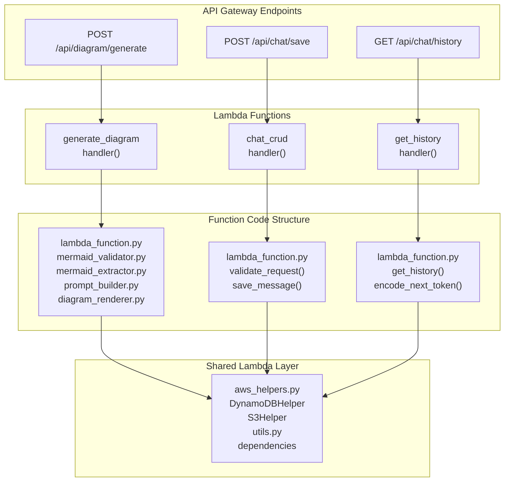
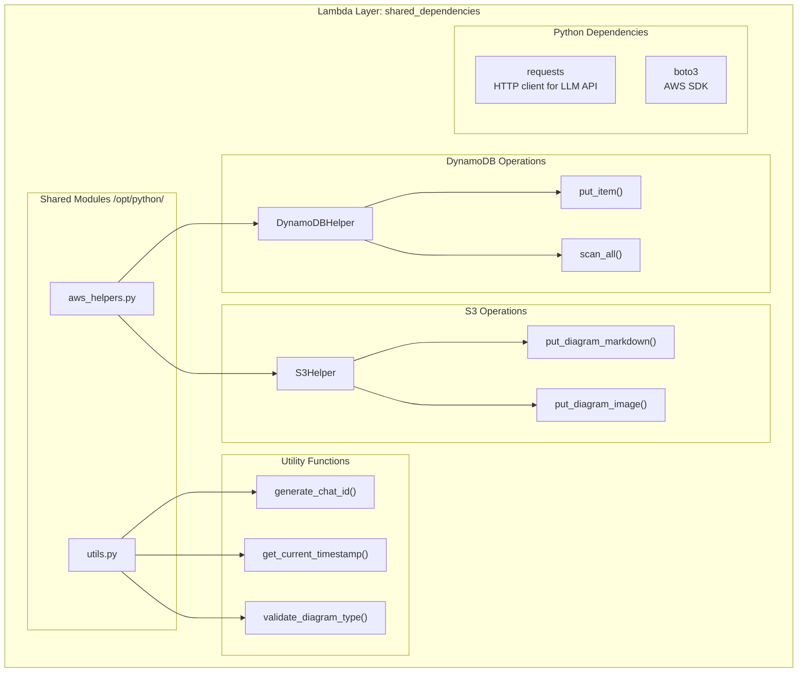
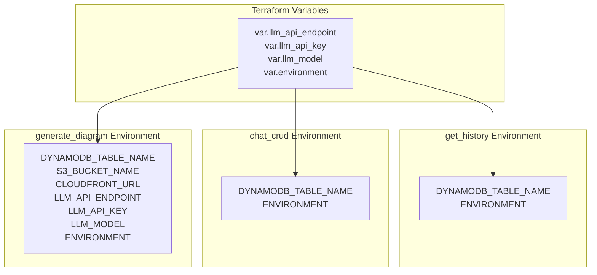
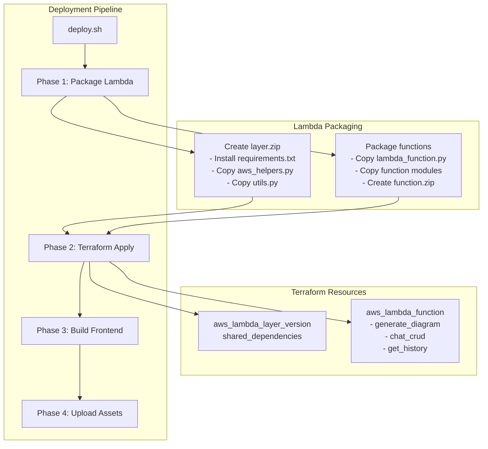

# Backend Lambda Functions

> **Relevant source files**
> * [infrastructure/scripts/lambda/deploy_lambda.py](https://github.com/dotpep/architecture-ai-assistant/blob/1285f968/infrastructure/scripts/lambda/deploy_lambda.py)
> * [infrastructure/terraform/api_gateway.tf](https://github.com/dotpep/architecture-ai-assistant/blob/1285f968/infrastructure/terraform/api_gateway.tf)
> * [infrastructure/terraform/lambda.tf](https://github.com/dotpep/architecture-ai-assistant/blob/1285f968/infrastructure/terraform/lambda.tf)
> * [src/backend/lambda_functions/chat_crud/lambda_function.py](https://github.com/dotpep/architecture-ai-assistant/blob/1285f968/src/backend/lambda_functions/chat_crud/lambda_function.py)
> * [src/backend/lambda_functions/generate_diagram/README.md](https://github.com/dotpep/architecture-ai-assistant/blob/1285f968/src/backend/lambda_functions/generate_diagram/README.md)
> * [src/backend/lambda_functions/generate_diagram/lambda_function.py](https://github.com/dotpep/architecture-ai-assistant/blob/1285f968/src/backend/lambda_functions/generate_diagram/lambda_function.py)
> * [src/backend/lambda_functions/get_history/lambda_function.py](https://github.com/dotpep/architecture-ai-assistant/blob/1285f968/src/backend/lambda_functions/get_history/lambda_function.py)
> * [tests/e2e/e2e_verification.py](https://github.com/dotpep/architecture-ai-assistant/blob/1285f968/tests/e2e/e2e_verification.py)
> * [tests/e2e/verify_deployment.py](https://github.com/dotpep/architecture-ai-assistant/blob/1285f968/tests/e2e/verify_deployment.py)
> * [tests/unit/manual_test_generate_diagram.py](https://github.com/dotpep/architecture-ai-assistant/blob/1285f968/tests/unit/manual_test_generate_diagram.py)
> * [tests/unit/test_chat_crud.py](https://github.com/dotpep/architecture-ai-assistant/blob/1285f968/tests/unit/test_chat_crud.py)
> * [tests/unit/test_generate_diagram.py](https://github.com/dotpep/architecture-ai-assistant/blob/1285f968/tests/unit/test_generate_diagram.py)
> * [tests/unit/test_mermaid_components.py](https://github.com/dotpep/architecture-ai-assistant/blob/1285f968/tests/unit/test_mermaid_components.py)

## Purpose and Scope

This document provides an overview of the three AWS Lambda functions that comprise the backend processing layer of the Architecture AI Assistant: `generate_diagram`, `chat_crud`, and `get_history`. These functions handle diagram generation, chat persistence, and history retrieval respectively.

For detailed implementation of each function, see:

* [Generate Diagram Function](/dotpep/architecture-ai-assistant/4.1-generate-diagram-function) - Deep dive into LLM integration and diagram generation
* [Chat CRUD Function](/dotpep/architecture-ai-assistant/4.2-chat-crud-function) - Chat message persistence operations
* [Get History Function](/dotpep/architecture-ai-assistant/4.3-get-history-function) - Chat history retrieval with pagination
* [Shared Backend Utilities](/dotpep/architecture-ai-assistant/4.4-shared-backend-utilities) - Common modules used across Lambda functions

For API endpoint definitions and request/response schemas, see [API Endpoints and Interfaces](/dotpep/architecture-ai-assistant/2.1-api-endpoints-and-interfaces).

## Lambda Function Architecture

The backend consists of three specialized Lambda functions, each with a single responsibility. All functions share a common Lambda layer containing dependencies and utility modules.

### Function Overview

| Function Name | Handler | Timeout | Memory | Primary Purpose |
| --- | --- | --- | --- | --- |
| `generate_diagram` | `lambda_function.handler` | 60s | 512MB | Generate diagrams via LLM API, validate Mermaid code, render PNG, store in S3/DynamoDB |
| `chat_crud` | `lambda_function.handler` | 10s | 256MB | Save chat messages to DynamoDB with validation |
| `get_history` | `lambda_function.handler` | 10s | 256MB | Retrieve paginated chat history from DynamoDB |

**Lambda Function Structure and API Mapping**



Sources: [infrastructure/terraform/lambda.tf L1-L184](https://github.com/dotpep/architecture-ai-assistant/blob/1285f968/infrastructure/terraform/lambda.tf#L1-L184)

 [infrastructure/terraform/api_gateway.tf L1-L449](https://github.com/dotpep/architecture-ai-assistant/blob/1285f968/infrastructure/terraform/api_gateway.tf#L1-L449)

### Lambda Function Responsibilities

**generate_diagram Lambda**

The `generate_diagram` function orchestrates the complete diagram generation pipeline:

1. Validates incoming request with `validate_request()` at [src/backend/lambda_functions/generate_diagram/lambda_function.py L26-L68](https://github.com/dotpep/architecture-ai-assistant/blob/1285f968/src/backend/lambda_functions/generate_diagram/lambda_function.py#L26-L68)
2. Constructs specialized LLM prompts via `build_complete_prompt()` from `prompt_builder.py`
3. Calls external LLM API using `call_llm_api()` at [src/backend/lambda_functions/generate_diagram/lambda_function.py L70-L135](https://github.com/dotpep/architecture-ai-assistant/blob/1285f968/src/backend/lambda_functions/generate_diagram/lambda_function.py#L70-L135)
4. Extracts Mermaid code with `extract_mermaid_code()` from `mermaid_extractor.py`
5. Validates syntax using `validate_mermaid_code()` from `mermaid_validator.py`
6. Renders diagram to PNG and saves to S3 via `save_diagram_to_s3()` from `diagram_renderer.py`
7. Persists metadata to DynamoDB using `DynamoDBHelper.put_item()`

**chat_crud Lambda**

The `chat_crud` function provides simplified chat persistence:

1. Validates request body using `validate_request()` at [src/backend/lambda_functions/chat_crud/lambda_function.py L42-L65](https://github.com/dotpep/architecture-ai-assistant/blob/1285f968/src/backend/lambda_functions/chat_crud/lambda_function.py#L42-L65)
2. Generates unique `chatId` via `generate_chat_id()` if not provided
3. Adds timestamp using `get_current_timestamp()`
4. Validates `diagramType` using `validate_diagram_type()`
5. Saves complete chat record to DynamoDB via `DynamoDBHelper.put_item()`

**get_history Lambda**

The `get_history` function implements paginated chat retrieval:

1. Parses query parameters for `limit` (1-100, default 50) and `nextToken`
2. Decodes pagination token using `decode_next_token()` at [src/backend/lambda_functions/get_history/lambda_function.py L86-L101](https://github.com/dotpep/architecture-ai-assistant/blob/1285f968/src/backend/lambda_functions/get_history/lambda_function.py#L86-L101)
3. Scans DynamoDB using `DynamoDBHelper.scan_all()` with pagination support
4. Sorts results by `timestamp` in descending order
5. Encodes `LastEvaluatedKey` as base64 token for next page

Sources: [src/backend/lambda_functions/generate_diagram/lambda_function.py L1-L300](https://github.com/dotpep/architecture-ai-assistant/blob/1285f968/src/backend/lambda_functions/generate_diagram/lambda_function.py#L1-L300)

 [src/backend/lambda_functions/chat_crud/lambda_function.py L1-L160](https://github.com/dotpep/architecture-ai-assistant/blob/1285f968/src/backend/lambda_functions/chat_crud/lambda_function.py#L1-L160)

 [src/backend/lambda_functions/get_history/lambda_function.py L1-L194](https://github.com/dotpep/architecture-ai-assistant/blob/1285f968/src/backend/lambda_functions/get_history/lambda_function.py#L1-L194)

## Lambda Layer and Shared Dependencies

All three Lambda functions share a common Lambda layer containing Python dependencies and utility modules. This layer is defined at [infrastructure/terraform/lambda.tf L9-L19](https://github.com/dotpep/architecture-ai-assistant/blob/1285f968/infrastructure/terraform/lambda.tf#L9-L19)

**Lambda Layer Contents**



The layer is packaged during deployment at `build/lambda/lambda_layer.zip` and uploaded to AWS Lambda. Functions access layer modules via `/opt/python/` import path as seen at [src/backend/lambda_functions/generate_diagram/lambda_function.py L16](https://github.com/dotpep/architecture-ai-assistant/blob/1285f968/src/backend/lambda_functions/generate_diagram/lambda_function.py#L16-L16)

**Shared Module Details**

| Module | Classes/Functions | Purpose |
| --- | --- | --- |
| `aws_helpers.py` | `DynamoDBHelper`, `S3Helper` | AWS service abstractions for DynamoDB and S3 operations |
| `utils.py` | `generate_chat_id()`, `get_current_timestamp()`, `validate_diagram_type()` | Common utilities for ID generation, timestamps, validation |

Sources: [infrastructure/terraform/lambda.tf L9-L19](https://github.com/dotpep/architecture-ai-assistant/blob/1285f968/infrastructure/terraform/lambda.tf#L9-L19)

 [infrastructure/scripts/lambda/deploy_lambda.py L53-L92](https://github.com/dotpep/architecture-ai-assistant/blob/1285f968/infrastructure/scripts/lambda/deploy_lambda.py#L53-L92)

## Environment Configuration

Each Lambda function receives configuration through environment variables defined in Terraform. These variables are injected at [infrastructure/terraform/lambda.tf L71-L81](https://github.com/dotpep/architecture-ai-assistant/blob/1285f968/infrastructure/terraform/lambda.tf#L71-L81)

 for `generate_diagram`, [infrastructure/terraform/lambda.tf L119-L124](https://github.com/dotpep/architecture-ai-assistant/blob/1285f968/infrastructure/terraform/lambda.tf#L119-L124)

 for `chat_crud`, and [infrastructure/terraform/lambda.tf L162-L167](https://github.com/dotpep/architecture-ai-assistant/blob/1285f968/infrastructure/terraform/lambda.tf#L162-L167)

 for `get_history`.

**Environment Variables by Function**



**Environment Variable Reference**

| Variable | Required By | Default | Purpose |
| --- | --- | --- | --- |
| `DYNAMODB_TABLE_NAME` | All functions | `aws_dynamodb_table.chat_history.name` | DynamoDB table for chat persistence |
| `S3_BUCKET_NAME` | `generate_diagram` | `aws_s3_bucket.main.id` | S3 bucket for diagram storage |
| `CLOUDFRONT_URL` | `generate_diagram` | CloudFront domain | Base URL for diagram access |
| `LLM_API_ENDPOINT` | `generate_diagram` | From `var.llm_api_endpoint` | LLM API endpoint (OpenAI-compatible) |
| `LLM_API_KEY` | `generate_diagram` | From `var.llm_api_key` | LLM API authentication key |
| `LLM_MODEL` | `generate_diagram` | `gpt-3.5-turbo` | LLM model identifier |
| `ENVIRONMENT` | All functions | From `var.environment` | Deployment environment (dev/prod) |

The `generate_diagram` function accesses these variables at [src/backend/lambda_functions/generate_diagram/lambda_function.py L86-L103](https://github.com/dotpep/architecture-ai-assistant/blob/1285f968/src/backend/lambda_functions/generate_diagram/lambda_function.py#L86-L103)

 when making LLM API calls.

Sources: [infrastructure/terraform/lambda.tf L71-L81](https://github.com/dotpep/architecture-ai-assistant/blob/1285f968/infrastructure/terraform/lambda.tf#L71-L81)

 [infrastructure/terraform/lambda.tf L119-L124](https://github.com/dotpep/architecture-ai-assistant/blob/1285f968/infrastructure/terraform/lambda.tf#L119-L124)

 [infrastructure/terraform/lambda.tf L162-L167](https://github.com/dotpep/architecture-ai-assistant/blob/1285f968/infrastructure/terraform/lambda.tf#L162-L167)

## Execution Characteristics and Resource Allocation

Each Lambda function is configured with specific timeout and memory allocations optimized for its workload.

**Resource Allocation Strategy**

| Function | Timeout | Memory | Rationale |
| --- | --- | --- | --- |
| `generate_diagram` | 60s | 512MB | Requires time for LLM API round-trip (up to 50s), Mermaid validation, and PNG rendering. Higher memory supports concurrent operations. |
| `chat_crud` | 10s | 256MB | Simple DynamoDB write operation with minimal processing. Standard allocation sufficient. |
| `get_history` | 10s | 256MB | DynamoDB scan operations with pagination. Standard allocation for query processing. |

The `generate_diagram` timeout is set at [infrastructure/terraform/lambda.tf L63](https://github.com/dotpep/architecture-ai-assistant/blob/1285f968/infrastructure/terraform/lambda.tf#L63-L63)

 to accommodate the LLM API call timeout of 50 seconds defined at [src/backend/lambda_functions/generate_diagram/lambda_function.py L117](https://github.com/dotpep/architecture-ai-assistant/blob/1285f968/src/backend/lambda_functions/generate_diagram/lambda_function.py#L117-L117)

 This provides a 10-second buffer for request validation, code extraction/validation, and S3 operations.

**CloudWatch Logging**

All Lambda functions write to CloudWatch Logs with 14-day retention:

* `generate_diagram`: `/aws/lambda/${function_name}` defined at [infrastructure/terraform/lambda.tf L90-L97](https://github.com/dotpep/architecture-ai-assistant/blob/1285f968/infrastructure/terraform/lambda.tf#L90-L97)
* `chat_crud`: `/aws/lambda/${function_name}` defined at [infrastructure/terraform/lambda.tf L133-L140](https://github.com/dotpep/architecture-ai-assistant/blob/1285f968/infrastructure/terraform/lambda.tf#L133-L140)
* `get_history`: `/aws/lambda/${function_name}` defined at [infrastructure/terraform/lambda.tf L176-L183](https://github.com/dotpep/architecture-ai-assistant/blob/1285f968/infrastructure/terraform/lambda.tf#L176-L183)

Functions log key events such as request validation, LLM API calls, validation failures, and DynamoDB operations using Python's `print()` function, which writes to CloudWatch automatically.

Sources: [infrastructure/terraform/lambda.tf L57-L87](https://github.com/dotpep/architecture-ai-assistant/blob/1285f968/infrastructure/terraform/lambda.tf#L57-L87)

 [infrastructure/terraform/lambda.tf L105-L130](https://github.com/dotpep/architecture-ai-assistant/blob/1285f968/infrastructure/terraform/lambda.tf#L105-L130)

 [infrastructure/terraform/lambda.tf L148-L173](https://github.com/dotpep/architecture-ai-assistant/blob/1285f968/infrastructure/terraform/lambda.tf#L148-L173)

## Integration Points and Data Flow

The Lambda functions integrate with multiple AWS services and external APIs. The following diagram shows complete data flow through the system.

**Complete Backend Data Flow**

```mermaid
sequenceDiagram
  participant API Gateway
  participant generate_diagram
  participant handler()
  participant LLM API
  participant OpenAI-compatible
  participant MermaidValidator
  participant validate_mermaid_code()
  participant diagram_renderer
  participant save_diagram_to_s3()
  participant S3 Bucket
  participant diagrams/
  participant DynamoDB
  participant chat_history
  participant chat_crud
  participant save_message()
  participant get_history
  participant get_history()

  note over API Gateway,handler(): Diagram Generation Flow
  API Gateway->>generate_diagram: POST /api/diagram/generate
  generate_diagram->>generate_diagram: validate_request()
  generate_diagram->>generate_diagram: build_complete_prompt()
  generate_diagram->>LLM API: call_llm_api(system, user)
  LLM API-->>generate_diagram: Mermaid code response
  generate_diagram->>generate_diagram: extract_mermaid_code()
  generate_diagram->>MermaidValidator: validate_mermaid_code()
  MermaidValidator-->>generate_diagram: is_valid, error
  generate_diagram->>diagram_renderer: save_diagram_to_s3()
  diagram_renderer->>S3 Bucket: PUT diagrams/{chatId}.md
  diagram_renderer->>S3 Bucket: PUT diagrams/{chatId}.png
  S3 Bucket-->>diagram_renderer: CloudFront URLs
  diagram_renderer-->>generate_diagram: markdown_url, image_url
  generate_diagram->>DynamoDB: DynamoDBHelper.put_item()
  DynamoDB-->>generate_diagram: Success
  generate_diagram-->>API Gateway: 200 + URLs
  note over API Gateway,save_message(): Chat Save Flow
  API Gateway->>chat_crud: POST /api/chat/save
  chat_crud->>chat_crud: validate_request()
  chat_crud->>chat_crud: generate_chat_id()
  chat_crud->>DynamoDB: DynamoDBHelper.put_item()
  DynamoDB-->>chat_crud: Success
  chat_crud-->>API Gateway: 200 + chatId
  note over API Gateway,get_history(): History Retrieval Flow
  API Gateway->>get_history: GET /api/chat/history?limit=50
  get_history->>get_history: decode_next_token()
  get_history->>DynamoDB: DynamoDBHelper.scan_all()
  DynamoDB-->>get_history: items + LastEvaluatedKey
  get_history->>get_history: encode_next_token()
  get_history-->>API Gateway: 200 + chats + nextToken
```

**External Service Integration**

The `generate_diagram` function integrates with two external services:

1. **LLM API**: Makes POST requests to `LLM_API_ENDPOINT` with OpenAI-compatible schema at [src/backend/lambda_functions/generate_diagram/lambda_function.py L95-L120](https://github.com/dotpep/architecture-ai-assistant/blob/1285f968/src/backend/lambda_functions/generate_diagram/lambda_function.py#L95-L120)  Includes system and user prompts, temperature setting (0.7), and max tokens (2000).
2. **Kroki Service** (via `diagram_renderer.py`): Renders Mermaid diagrams to PNG format. Implementation currently generates placeholder images but is designed to integrate with Kroki API.

Sources: [src/backend/lambda_functions/generate_diagram/lambda_function.py L184-L300](https://github.com/dotpep/architecture-ai-assistant/blob/1285f968/src/backend/lambda_functions/generate_diagram/lambda_function.py#L184-L300)

 [src/backend/lambda_functions/chat_crud/lambda_function.py L67-L133](https://github.com/dotpep/architecture-ai-assistant/blob/1285f968/src/backend/lambda_functions/chat_crud/lambda_function.py#L67-L133)

 [src/backend/lambda_functions/get_history/lambda_function.py L103-L167](https://github.com/dotpep/architecture-ai-assistant/blob/1285f968/src/backend/lambda_functions/get_history/lambda_function.py#L103-L167)

## IAM Roles and Permissions

Each Lambda function has a dedicated IAM execution role with least-privilege permissions. Roles are defined in [infrastructure/terraform/iam.tf](https://github.com/dotpep/architecture-ai-assistant/blob/1285f968/infrastructure/terraform/iam.tf)

 and attached at function creation.

**IAM Role Mapping**

| Lambda Function | IAM Role Resource | Required Permissions |
| --- | --- | --- |
| `generate_diagram` | `aws_iam_role.lambda_generate_diagram` | DynamoDB PutItem, S3 PutObject, CloudWatch Logs |
| `chat_crud` | `aws_iam_role.lambda_chat_crud` | DynamoDB PutItem, CloudWatch Logs |
| `get_history` | `aws_iam_role.lambda_get_history` | DynamoDB Scan, CloudWatch Logs |

The role ARNs are referenced at [infrastructure/terraform/lambda.tf L60](https://github.com/dotpep/architecture-ai-assistant/blob/1285f968/infrastructure/terraform/lambda.tf#L60-L60)

 for `generate_diagram`, [infrastructure/terraform/lambda.tf L108](https://github.com/dotpep/architecture-ai-assistant/blob/1285f968/infrastructure/terraform/lambda.tf#L108-L108)

 for `chat_crud`, and [infrastructure/terraform/lambda.tf L151](https://github.com/dotpep/architecture-ai-assistant/blob/1285f968/infrastructure/terraform/lambda.tf#L151-L151)

 for `get_history`.

API Gateway requires explicit permission to invoke each Lambda function. These permissions are granted via `aws_lambda_permission` resources at [infrastructure/terraform/api_gateway.tf L358-L383](https://github.com/dotpep/architecture-ai-assistant/blob/1285f968/infrastructure/terraform/api_gateway.tf#L358-L383)

Sources: [infrastructure/terraform/lambda.tf L57-L173](https://github.com/dotpep/architecture-ai-assistant/blob/1285f968/infrastructure/terraform/lambda.tf#L57-L173)

 [infrastructure/terraform/api_gateway.tf L358-L383](https://github.com/dotpep/architecture-ai-assistant/blob/1285f968/infrastructure/terraform/api_gateway.tf#L358-L383)

## Error Handling and Response Formats

All Lambda functions implement consistent error handling and CORS-compliant response formatting.

**Standard Response Structure**

Each function uses helper functions to create standardized responses:

* `create_error_response(status_code, message)` at [src/backend/lambda_functions/generate_diagram/lambda_function.py L147-L164](https://github.com/dotpep/architecture-ai-assistant/blob/1285f968/src/backend/lambda_functions/generate_diagram/lambda_function.py#L147-L164)
* `create_success_response(data)` at [src/backend/lambda_functions/generate_diagram/lambda_function.py L167-L182](https://github.com/dotpep/architecture-ai-assistant/blob/1285f968/src/backend/lambda_functions/generate_diagram/lambda_function.py#L167-L182)
* `create_response(status_code, body)` at [src/backend/lambda_functions/chat_crud/lambda_function.py L19-L39](https://github.com/dotpep/architecture-ai-assistant/blob/1285f968/src/backend/lambda_functions/chat_crud/lambda_function.py#L19-L39)

All responses include CORS headers:

```
{
    'Access-Control-Allow-Origin': '*',
    'Access-Control-Allow-Headers': 'Content-Type,X-Amz-Date,Authorization,...',
    'Access-Control-Allow-Methods': 'GET,POST,OPTIONS'
}
```

**Error Categories**

| Status Code | Error Type | Example Scenarios |
| --- | --- | --- |
| 400 | Client Error | Invalid JSON, missing required fields, invalid diagram type, Mermaid validation failure |
| 405 | Method Not Allowed | Unsupported HTTP method for endpoint |
| 500 | Internal Error | DynamoDB/S3 operation failure, unexpected exceptions |
| 502 | Bad Gateway | LLM API timeout or connection failure |

The `generate_diagram` function specifically catches LLM API errors and returns 502 status at [src/backend/lambda_functions/generate_diagram/lambda_function.py L224-L226](https://github.com/dotpep/architecture-ai-assistant/blob/1285f968/src/backend/lambda_functions/generate_diagram/lambda_function.py#L224-L226)

 to distinguish external service failures from internal errors.

**OPTIONS Request Handling**

All functions handle CORS preflight OPTIONS requests at the handler level, returning 200 with appropriate CORS headers. This is implemented at [src/backend/lambda_functions/generate_diagram/lambda_function.py L184-L300](https://github.com/dotpep/architecture-ai-assistant/blob/1285f968/src/backend/lambda_functions/generate_diagram/lambda_function.py#L184-L300)

 [src/backend/lambda_functions/chat_crud/lambda_function.py L135-L159](https://github.com/dotpep/architecture-ai-assistant/blob/1285f968/src/backend/lambda_functions/chat_crud/lambda_function.py#L135-L159)

 and [src/backend/lambda_functions/get_history/lambda_function.py L169-L194](https://github.com/dotpep/architecture-ai-assistant/blob/1285f968/src/backend/lambda_functions/get_history/lambda_function.py#L169-L194)

Sources: [src/backend/lambda_functions/generate_diagram/lambda_function.py L147-L182](https://github.com/dotpep/architecture-ai-assistant/blob/1285f968/src/backend/lambda_functions/generate_diagram/lambda_function.py#L147-L182)

 [src/backend/lambda_functions/chat_crud/lambda_function.py L19-L39](https://github.com/dotpep/architecture-ai-assistant/blob/1285f968/src/backend/lambda_functions/chat_crud/lambda_function.py#L19-L39)

 [src/backend/lambda_functions/get_history/lambda_function.py L47-L68](https://github.com/dotpep/architecture-ai-assistant/blob/1285f968/src/backend/lambda_functions/get_history/lambda_function.py#L47-L68)

## Deployment and Packaging

Lambda functions are packaged and deployed through a multi-stage process orchestrated by the deployment script and Terraform.

**Deployment Process**



The Lambda packaging process is implemented in [infrastructure/scripts/lambda/deploy_lambda.py L53-L141](https://github.com/dotpep/architecture-ai-assistant/blob/1285f968/infrastructure/scripts/lambda/deploy_lambda.py#L53-L141)

:

1. **Create Lambda Layer** (`create_layer()`): Installs dependencies from `requirements.txt` into `build/lambda/layer/python/`, copies shared modules, creates `lambda_layer.zip`
2. **Package Functions** (`package_function()`): For each function, copies function-specific Python files, includes shared modules at root level for direct import, creates individual function ZIP files
3. **Terraform Apply**: Uses placeholder ZIP initially (defined at [infrastructure/terraform/lambda.tf L26-L48](https://github.com/dotpep/architecture-ai-assistant/blob/1285f968/infrastructure/terraform/lambda.tf#L26-L48) ), actual function code uploaded post-provisioning

The layer is attached to each function via the `layers` attribute at [infrastructure/terraform/lambda.tf L69](https://github.com/dotpep/architecture-ai-assistant/blob/1285f968/infrastructure/terraform/lambda.tf#L69-L69)

 [infrastructure/terraform/lambda.tf L117](https://github.com/dotpep/architecture-ai-assistant/blob/1285f968/infrastructure/terraform/lambda.tf#L117-L117)

 and [infrastructure/terraform/lambda.tf L160](https://github.com/dotpep/architecture-ai-assistant/blob/1285f968/infrastructure/terraform/lambda.tf#L160-L160)

Sources: [infrastructure/scripts/lambda/deploy_lambda.py L1-L226](https://github.com/dotpep/architecture-ai-assistant/blob/1285f968/infrastructure/scripts/lambda/deploy_lambda.py#L1-L226)

 [infrastructure/terraform/lambda.tf L26-L48](https://github.com/dotpep/architecture-ai-assistant/blob/1285f968/infrastructure/terraform/lambda.tf#L26-L48)

## Testing Strategy

Lambda functions are tested at multiple levels to ensure reliability. For detailed test implementation, see [Testing](/dotpep/architecture-ai-assistant/7-testing).

**Unit Test Coverage**

| Test Suite | Location | Functions Tested |
| --- | --- | --- |
| `test_generate_diagram.py` | [tests/unit/test_generate_diagram.py](https://github.com/dotpep/architecture-ai-assistant/blob/1285f968/tests/unit/test_generate_diagram.py) | `validate_request()`, `create_error_response()`, `create_success_response()` |
| `test_chat_crud.py` | [tests/unit/test_chat_crud.py](https://github.com/dotpep/architecture-ai-assistant/blob/1285f968/tests/unit/test_chat_crud.py) | `validate_request()`, `save_message()`, `handler()` |
| `test_mermaid_components.py` | [tests/unit/test_mermaid_components.py](https://github.com/dotpep/architecture-ai-assistant/blob/1285f968/tests/unit/test_mermaid_components.py) | `validate_mermaid_code()`, `extract_mermaid_code()`, `build_complete_prompt()` |

**End-to-End Verification**

The E2E test suite at [tests/e2e/verify_deployment.py](https://github.com/dotpep/architecture-ai-assistant/blob/1285f968/tests/e2e/verify_deployment.py)

 and [tests/e2e/e2e_verification.py](https://github.com/dotpep/architecture-ai-assistant/blob/1285f968/tests/e2e/e2e_verification.py)

 validates complete user flows:

* CloudFront frontend accessibility
* API Gateway endpoint availability
* Diagram generation end-to-end (LLM call → validation → S3 storage → DynamoDB persistence)
* Chat save and history retrieval
* Download URL accessibility

Tests mock boto3 and AWS services for unit testing, while E2E tests run against deployed infrastructure.

Sources: [tests/unit/test_generate_diagram.py L1-L361](https://github.com/dotpep/architecture-ai-assistant/blob/1285f968/tests/unit/test_generate_diagram.py#L1-L361)

 [tests/unit/test_chat_crud.py L1-L223](https://github.com/dotpep/architecture-ai-assistant/blob/1285f968/tests/unit/test_chat_crud.py#L1-L223)

 [tests/unit/test_mermaid_components.py L1-L240](https://github.com/dotpep/architecture-ai-assistant/blob/1285f968/tests/unit/test_mermaid_components.py#L1-L240)

 [tests/e2e/verify_deployment.py L1-L310](https://github.com/dotpep/architecture-ai-assistant/blob/1285f968/tests/e2e/verify_deployment.py#L1-L310)