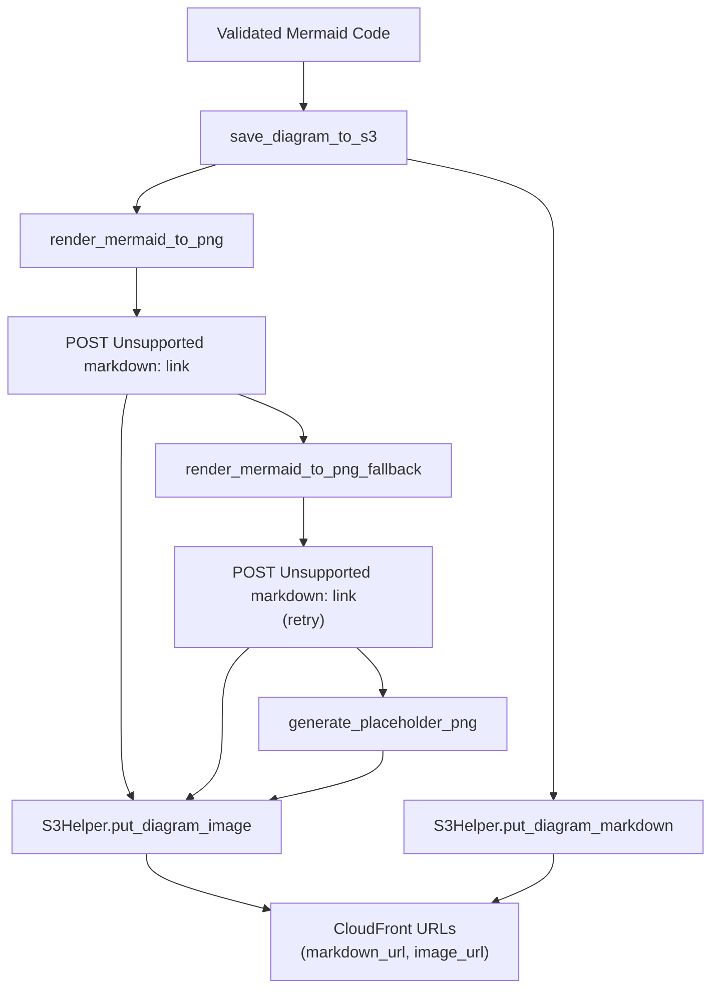
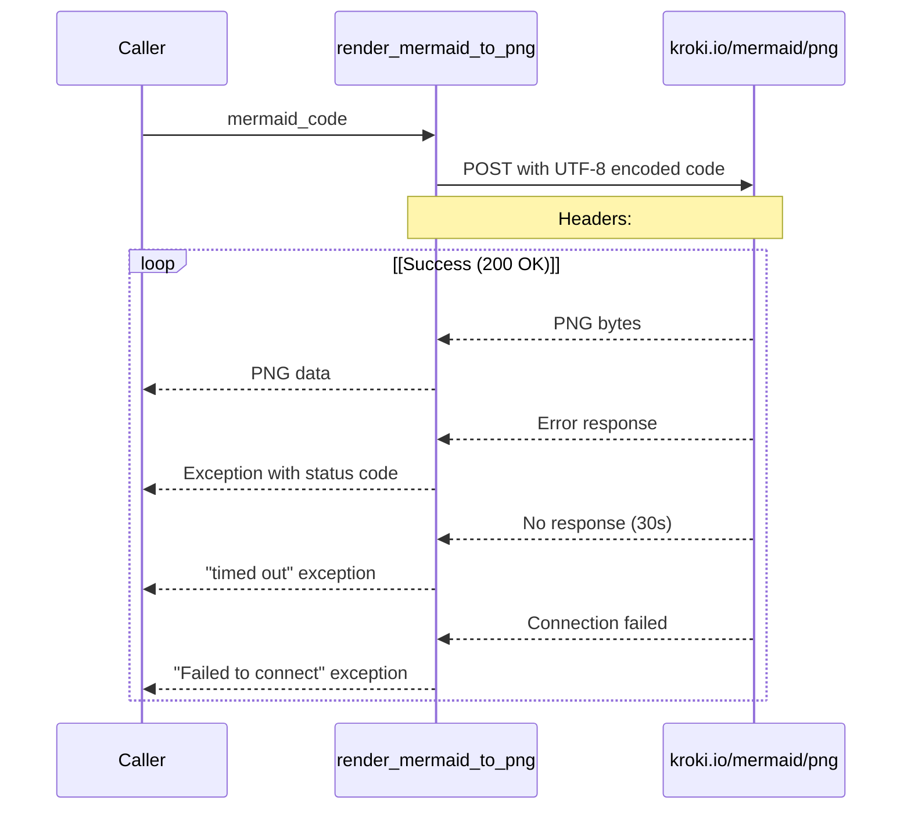
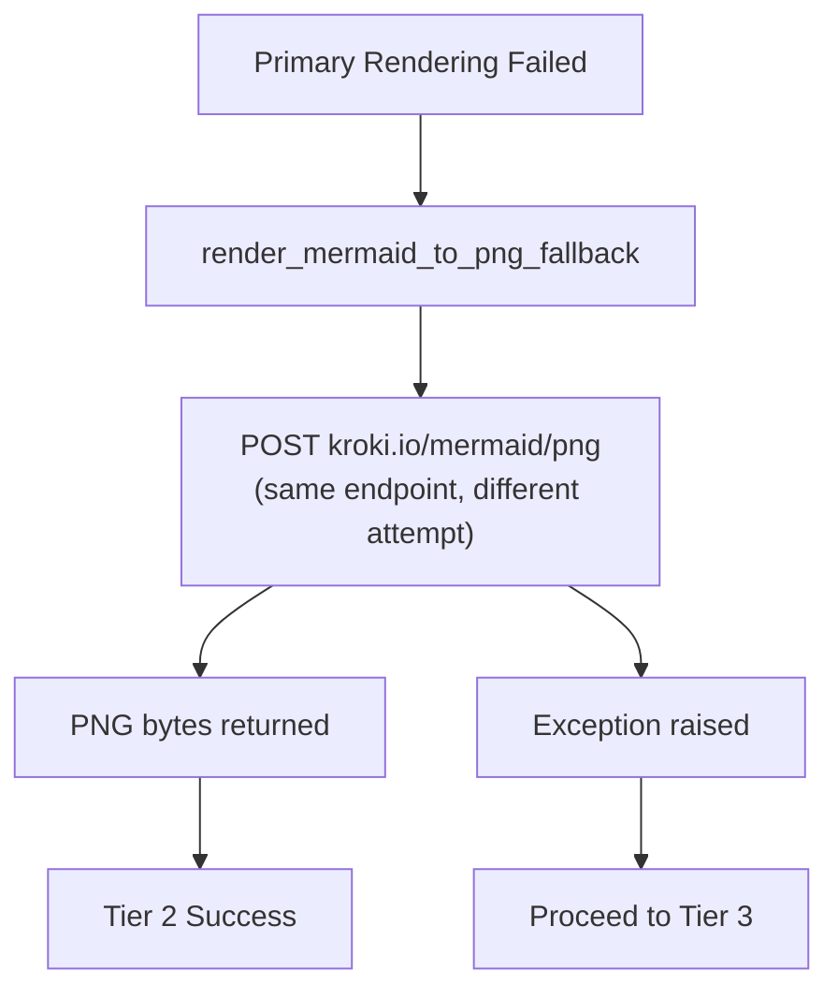

# Diagram Rendering and Storage

> **Relevant source files**
> * [docs/tests/DIAGRAM_RENDERER_TESTS.md](https://github.com/dotpep/architecture-ai-assistant/blob/1285f968/docs/tests/DIAGRAM_RENDERER_TESTS.md)
> * [src/backend/lambda_functions/generate_diagram/diagram_renderer.py](https://github.com/dotpep/architecture-ai-assistant/blob/1285f968/src/backend/lambda_functions/generate_diagram/diagram_renderer.py)
> * [tests/unit/test_diagram_renderer.py](https://github.com/dotpep/architecture-ai-assistant/blob/1285f968/tests/unit/test_diagram_renderer.py)

## Purpose and Scope

This document details the diagram rendering and storage subsystem within the `generate_diagram` Lambda function. This module is responsible for converting validated Mermaid code into PNG images using the Kroki rendering service, implementing a three-tier resilience strategy (primary rendering, fallback retry, placeholder generation), and persisting both markdown source and PNG images to S3 with CloudFront URLs.

For information about Mermaid code validation that occurs before rendering, see [Mermaid Code Validation](/dotpep/architecture-ai-assistant/4.1.1-mermaid-code-validation). For details on extracting Mermaid code from LLM responses, see [Mermaid Code Extraction](/dotpep/architecture-ai-assistant/4.1.2-mermaid-code-extraction). For the complete diagram generation orchestration, see [Generate Diagram Function](/dotpep/architecture-ai-assistant/4.1-generate-diagram-function).

**Sources:** [src/backend/lambda_functions/generate_diagram/diagram_renderer.py L1-L6](https://github.com/dotpep/architecture-ai-assistant/blob/1285f968/src/backend/lambda_functions/generate_diagram/diagram_renderer.py#L1-L6)

## Architecture Overview

The diagram rendering subsystem implements a fault-tolerant pipeline that ensures diagram generation never completely fails. The system accepts validated Mermaid code and produces both markdown source files and PNG images stored in S3, accessible via CloudFront URLs.

### Rendering Pipeline Components



**Sources:** [src/backend/lambda_functions/generate_diagram/diagram_renderer.py L108-L148](https://github.com/dotpep/architecture-ai-assistant/blob/1285f968/src/backend/lambda_functions/generate_diagram/diagram_renderer.py#L108-L148)

### Function Responsibilities

| Function | Purpose | Return Type | Error Handling |
| --- | --- | --- | --- |
| `render_mermaid_to_png()` | Primary PNG rendering via Kroki | `bytes` | Raises exception on failure |
| `render_mermaid_to_png_fallback()` | Retry rendering if primary fails | `bytes` | Raises exception on failure |
| `generate_placeholder_png()` | Generate minimal 1x1 white PNG | `bytes` | Never fails |
| `save_diagram_to_s3()` | Orchestrate rendering + S3 storage | `tuple[str, str]` | Falls through to placeholder |

**Sources:** [src/backend/lambda_functions/generate_diagram/diagram_renderer.py L14-L148](https://github.com/dotpep/architecture-ai-assistant/blob/1285f968/src/backend/lambda_functions/generate_diagram/diagram_renderer.py#L14-L148)

## Kroki API Integration

The system uses the public Kroki service at `https://kroki.io` to convert Mermaid syntax to PNG images. Kroki is a unified API for diagram rendering that supports multiple diagram types.

### Primary Rendering Function

The `render_mermaid_to_png()` function implements the primary rendering path:



**Key Implementation Details:**

* **Endpoint:** `https://kroki.io/mermaid/png` [diagram_renderer.py L36](https://github.com/dotpep/architecture-ai-assistant/blob/1285f968/diagram_renderer.py#L36-L36)
* **HTTP Method:** POST with Mermaid code as request body [diagram_renderer.py L35-L42](https://github.com/dotpep/architecture-ai-assistant/blob/1285f968/diagram_renderer.py#L35-L42)
* **Content Type:** `text/plain` to match Kroki's expected format [diagram_renderer.py L39](https://github.com/dotpep/architecture-ai-assistant/blob/1285f968/diagram_renderer.py#L39-L39)
* **Encoding:** UTF-8 encoding of Mermaid code [diagram_renderer.py L37](https://github.com/dotpep/architecture-ai-assistant/blob/1285f968/diagram_renderer.py#L37-L37)
* **Timeout:** 30 seconds to prevent indefinite hangs [diagram_renderer.py L42](https://github.com/dotpep/architecture-ai-assistant/blob/1285f968/diagram_renderer.py#L42-L42)
* **User Agent:** Custom identifier for monitoring/debugging [diagram_renderer.py L40](https://github.com/dotpep/architecture-ai-assistant/blob/1285f968/diagram_renderer.py#L40-L40)

**Sources:** [src/backend/lambda_functions/generate_diagram/diagram_renderer.py L14-L58](https://github.com/dotpep/architecture-ai-assistant/blob/1285f968/src/backend/lambda_functions/generate_diagram/diagram_renderer.py#L14-L58)

### Error Handling Matrix

| Exception Type | Cause | Handler | Line Reference |
| --- | --- | --- | --- |
| `requests.exceptions.Timeout` | No response within 30s | Raises: "timed out (30s)" | [diagram_renderer.py L53-L54](https://github.com/dotpep/architecture-ai-assistant/blob/1285f968/diagram_renderer.py#L53-L54) |
| `requests.exceptions.ConnectionError` | Network failure | Raises: "Failed to connect to rendering service" | [diagram_renderer.py L55-L56](https://github.com/dotpep/architecture-ai-assistant/blob/1285f968/diagram_renderer.py#L55-L56) |
| `requests.exceptions.RequestException` | General request error | Raises: "Failed to render diagram" | [diagram_renderer.py L57-L58](https://github.com/dotpep/architecture-ai-assistant/blob/1285f968/diagram_renderer.py#L57-L58) |
| HTTP 4xx/5xx | Invalid code or server error | Raises: "Kroki rendering failed with status {code}" | [diagram_renderer.py L45-L47](https://github.com/dotpep/architecture-ai-assistant/blob/1285f968/diagram_renderer.py#L45-L47) |

**Sources:** [src/backend/lambda_functions/generate_diagram/diagram_renderer.py L45-L58](https://github.com/dotpep/architecture-ai-assistant/blob/1285f968/src/backend/lambda_functions/generate_diagram/diagram_renderer.py#L45-L58)

## Three-Tier Resilience Strategy

The rendering system implements a cascading fallback mechanism to ensure diagram generation always produces some output, even when external services fail.

### Tier 1: Primary Rendering

The first attempt uses `render_mermaid_to_png()` with full error handling:

```python
# Called from save_diagram_to_s3()
try:
    print("Rendering diagram to PNG...")
    png_data = render_mermaid_to_png(mermaid_code)
    print("PNG rendering succeeded")
except Exception as e:
    print(f"PNG rendering failed: {str(e)}")
    # Falls through to Tier 2
```

**Sources:** [src/backend/lambda_functions/generate_diagram/diagram_renderer.py L126-L131](https://github.com/dotpep/architecture-ai-assistant/blob/1285f968/src/backend/lambda_functions/generate_diagram/diagram_renderer.py#L126-L131)

### Tier 2: Fallback Rendering

If primary rendering fails, `render_mermaid_to_png_fallback()` retries the same Kroki endpoint:



The fallback function is intentionally simple and nearly identical to the primary renderer, allowing for transient network issues or temporary Kroki unavailability to resolve between attempts.

**Sources:** [src/backend/lambda_functions/generate_diagram/diagram_renderer.py L61-L93](https://github.com/dotpep/architecture-ai-assistant/blob/1285f968/src/backend/lambda_functions/generate_diagram/diagram_renderer.py#L61-L93)

 [diagram_renderer.py L134-L139](https://github.com/dotpep/architecture-ai-assistant/blob/1285f968/diagram_renderer.py#L134-L139)

### Tier 3: Placeholder Generation

If both rendering attempts fail, `generate_placeholder_png()` returns a minimal valid PNG:

**Placeholder Characteristics:**

* **Dimensions:** 1x1 pixel
* **Color:** White
* **Size:** < 200 bytes
* **Format:** Valid PNG with proper header signature (`\x89PNG\r\n\x1a\n`)
* **Guarantee:** Never fails or raises exceptions

The placeholder is a hardcoded byte array that represents the smallest possible valid PNG image:

```markdown
# Minimal 1x1 white PNG (never fails)
png = b'\x89PNG\r\n\x1a\n...'  # Full PNG specification bytes
return png
```

**Sources:** [src/backend/lambda_functions/generate_diagram/diagram_renderer.py L96-L105](https://github.com/dotpep/architecture-ai-assistant/blob/1285f968/src/backend/lambda_functions/generate_diagram/diagram_renderer.py#L96-L105)

 [diagram_renderer.py L141-L143](https://github.com/dotpep/architecture-ai-assistant/blob/1285f968/diagram_renderer.py#L141-L143)

### Resilience Flow Diagram

```

```

**Sources:** [src/backend/lambda_functions/generate_diagram/diagram_renderer.py L123-L148](https://github.com/dotpep/architecture-ai-assistant/blob/1285f968/src/backend/lambda_functions/generate_diagram/diagram_renderer.py#L123-L148)

## S3 Storage and CloudFront URLs

The `save_diagram_to_s3()` function orchestrates the complete storage workflow, persisting both markdown source and PNG images to S3.

### Storage Workflow

```

```

**Sources:** [src/backend/lambda_functions/generate_diagram/diagram_renderer.py L108-L148](https://github.com/dotpep/architecture-ai-assistant/blob/1285f968/src/backend/lambda_functions/generate_diagram/diagram_renderer.py#L108-L148)

### S3 Storage Paths

The S3Helper (documented in [Shared Backend Utilities](/dotpep/architecture-ai-assistant/4.4-shared-backend-utilities)) generates standardized paths for diagram assets:

| Asset Type | S3 Path Pattern | CloudFront URL Pattern | Purpose |
| --- | --- | --- | --- |
| Markdown Source | `/diagrams/{chat_id}.md` | `https://{cloudfront_domain}/diagrams/{chat_id}.md` | Raw Mermaid code for display/download |
| PNG Image | `/diagrams/{chat_id}.png` | `https://{cloudfront_domain}/diagrams/{chat_id}.png` | Rendered diagram visualization |

The `chat_id` is a unique identifier generated by the parent `generate_diagram` Lambda function (see [Generate Diagram Function](/dotpep/architecture-ai-assistant/4.1-generate-diagram-function)).

**Sources:** [src/backend/lambda_functions/generate_diagram/diagram_renderer.py L108-L148](https://github.com/dotpep/architecture-ai-assistant/blob/1285f968/src/backend/lambda_functions/generate_diagram/diagram_renderer.py#L108-L148)

### Function Signature and Return Values

```python
def save_diagram_to_s3(s3_helper, chat_id: str, mermaid_code: str) -> tuple[str, str]:
    """
    Save diagram to S3 as both markdown and PNG.
    
    Args:
        s3_helper: S3Helper instance (provides put_diagram_markdown, put_diagram_image)
        chat_id: Unique identifier for the diagram
        mermaid_code: Mermaid diagram code
        
    Returns:
        Tuple of (markdown_url, image_url) - both are CloudFront URLs
    """
```

**Example Return Value:**

```
(
    "https://d1a2b3c4d5e6f7.cloudfront.net/diagrams/chat-20240115-abc123.md",
    "https://d1a2b3c4d5e6f7.cloudfront.net/diagrams/chat-20240115-abc123.png"
)
```

**Sources:** [src/backend/lambda_functions/generate_diagram/diagram_renderer.py L108-L118](https://github.com/dotpep/architecture-ai-assistant/blob/1285f968/src/backend/lambda_functions/generate_diagram/diagram_renderer.py#L108-L118)

## Complete Rendering and Storage Workflow

This diagram shows how the rendering module integrates with other components in the `generate_diagram` Lambda:

```

```

**Sources:** [src/backend/lambda_functions/generate_diagram/diagram_renderer.py L1-L148](https://github.com/dotpep/architecture-ai-assistant/blob/1285f968/src/backend/lambda_functions/generate_diagram/diagram_renderer.py#L1-L148)

## Error Handling and Logging

The module implements comprehensive error handling with detailed logging at each stage:

### Logging Strategy

```

```

### Log Messages Reference

| Stage | Log Message | Line | Indicates |
| --- | --- | --- | --- |
| Primary render start | `"Rendering diagram to PNG..."` | [127](https://github.com/dotpep/architecture-ai-assistant/blob/1285f968/127) | Beginning of rendering |
| Primary success | `"PNG rendering succeeded"` | [129](https://github.com/dotpep/architecture-ai-assistant/blob/1285f968/129) | Tier 1 success |
| Primary failure | `"PNG rendering failed: {error}"` | [131](https://github.com/dotpep/architecture-ai-assistant/blob/1285f968/131) | Proceeding to Tier 2 |
| Fallback start | `"Attempting fallback rendering..."` | [135](https://github.com/dotpep/architecture-ai-assistant/blob/1285f968/135) | Tier 2 attempt |
| Fallback success | `"Fallback rendering succeeded"` | [137](https://github.com/dotpep/architecture-ai-assistant/blob/1285f968/137) | Tier 2 success |
| Fallback failure | `"Fallback rendering also failed: {error}"` | [139](https://github.com/dotpep/architecture-ai-assistant/blob/1285f968/139) | Proceeding to Tier 3 |
| Placeholder use | `"Using minimal placeholder PNG"` | [142](https://github.com/dotpep/architecture-ai-assistant/blob/1285f968/142) | Tier 3 activated |

**Sources:** [src/backend/lambda_functions/generate_diagram/diagram_renderer.py L126-L143](https://github.com/dotpep/architecture-ai-assistant/blob/1285f968/src/backend/lambda_functions/generate_diagram/diagram_renderer.py#L126-L143)

### Exception Propagation

The rendering functions (`render_mermaid_to_png`, `render_mermaid_to_png_fallback`) raise exceptions on failure, but `save_diagram_to_s3()` catches all exceptions and ensures the workflow always completes:

```python
# Exception handling pattern in save_diagram_to_s3()
try:
    png_data = render_mermaid_to_png(mermaid_code)
except Exception as e:
    # Log and continue - never propagate upward
    print(f"Error: {str(e)}")
    # Proceed to next tier
```

This design ensures that validation errors (from [Mermaid Code Validation](/dotpep/architecture-ai-assistant/4.1.1-mermaid-code-validation)) can fail the request, but rendering failures never do—instead, they fall back gracefully to placeholders.

**Sources:** [src/backend/lambda_functions/generate_diagram/diagram_renderer.py L126-L143](https://github.com/dotpep/architecture-ai-assistant/blob/1285f968/src/backend/lambda_functions/generate_diagram/diagram_renderer.py#L126-L143)

## Configuration and Dependencies

### External Dependencies

| Dependency | Purpose | Import Statement |
| --- | --- | --- |
| `requests` | HTTP client for Kroki API | `import requests` |
| `json` | JSON handling (minimal usage) | `import json` |
| `os` | Environment variables (minimal usage) | `import os` |

**Sources:** [src/backend/lambda_functions/generate_diagram/diagram_renderer.py L8-L11](https://github.com/dotpep/architecture-ai-assistant/blob/1285f968/src/backend/lambda_functions/generate_diagram/diagram_renderer.py#L8-L11)

### Kroki Service Configuration

The module uses hardcoded Kroki service URLs:

* **Primary Endpoint:** `https://kroki.io/mermaid/png`
* **Fallback Endpoint:** `https://kroki.io/mermaid/png` (same, different attempt)
* **Timeout:** 30 seconds per request
* **Content Type:** `text/plain`
* **User Agent:** `Architecture-AI-Assistant/1.0`

No environment variables are required for Kroki configuration as it uses a public, stateless API.

**Sources:** [src/backend/lambda_functions/generate_diagram/diagram_renderer.py L36-L42](https://github.com/dotpep/architecture-ai-assistant/blob/1285f968/src/backend/lambda_functions/generate_diagram/diagram_renderer.py#L36-L42)

 [diagram_renderer.py L74-L81](https://github.com/dotpep/architecture-ai-assistant/blob/1285f968/diagram_renderer.py#L74-L81)

### S3Helper Integration

The module depends on the S3Helper class (from [Shared Backend Utilities](/dotpep/architecture-ai-assistant/4.4-shared-backend-utilities)) which must provide:

* `put_diagram_markdown(chat_id: str, mermaid_code: str) -> str` - Returns CloudFront URL
* `put_diagram_image(chat_id: str, png_data: bytes) -> str` - Returns CloudFront URL

The S3Helper abstracts AWS credentials, bucket names, and CloudFront domain configuration.

**Sources:** [src/backend/lambda_functions/generate_diagram/diagram_renderer.py L108-L148](https://github.com/dotpep/architecture-ai-assistant/blob/1285f968/src/backend/lambda_functions/generate_diagram/diagram_renderer.py#L108-L148)

## Testing

The module includes comprehensive unit tests covering all functions and failure scenarios. For complete test documentation, see the test specification document.

### Test Coverage Summary

| Test Category | Tests | Coverage |
| --- | --- | --- |
| Primary Rendering | 7 tests | Success, timeout, connection error, HTTP errors (400, 500), empty response, complex diagrams |
| Fallback Rendering | 3 tests | Success, HTTP error, exception handling |
| Placeholder Generation | 3 tests | PNG validity, size constraints, consistency |
| S3 Integration | 4 tests | Successful save, fallback usage, placeholder usage, multiple chat IDs |
| Integration Tests | 2 tests | Complete workflow, S3 save workflow |

**Total:** 19 tests, all passing.

**Sources:** [tests/unit/test_diagram_renderer.py L1-L369](https://github.com/dotpep/architecture-ai-assistant/blob/1285f968/tests/unit/test_diagram_renderer.py#L1-L369)

 [docs/tests/DIAGRAM_RENDERER_TESTS.md L1-L104](https://github.com/dotpep/architecture-ai-assistant/blob/1285f968/docs/tests/DIAGRAM_RENDERER_TESTS.md#L1-L104)