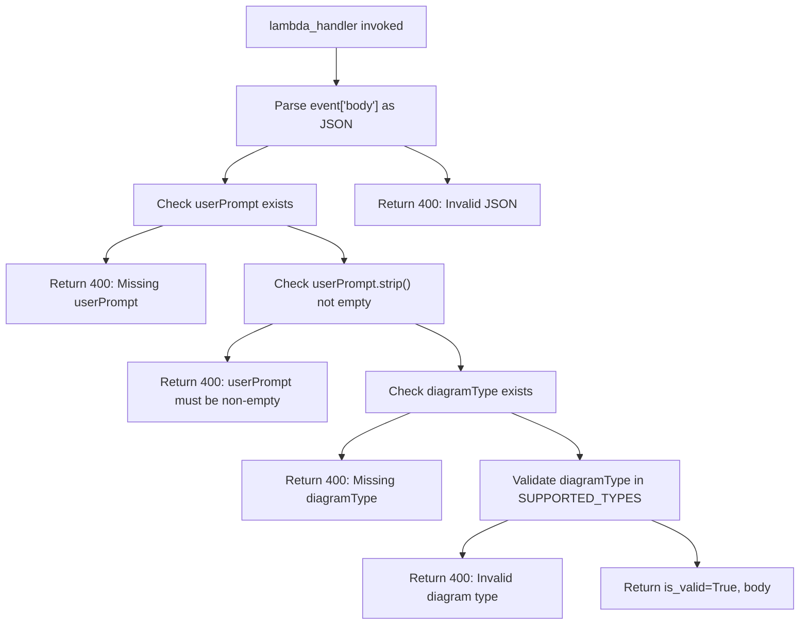
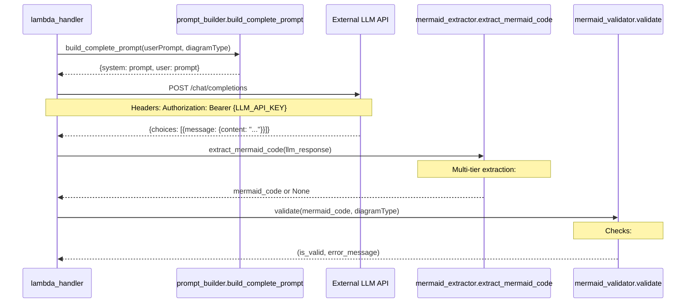
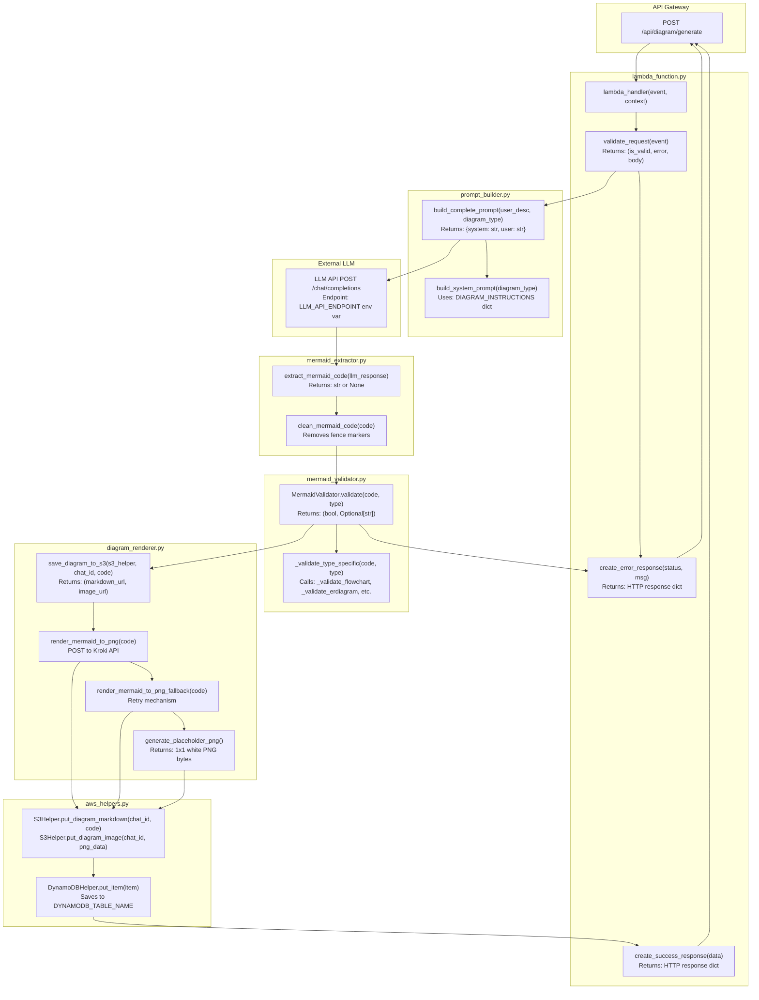
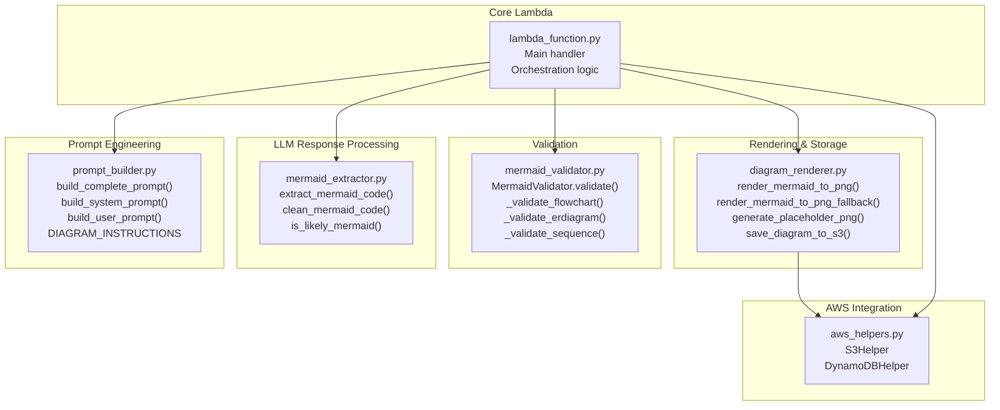
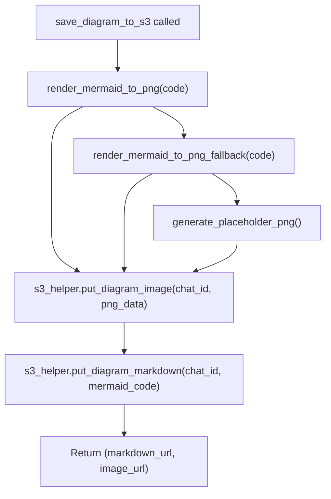

# Generate Diagram Function

> **Relevant source files**
> * [docs/tests/DIAGRAM_RENDERER_TESTS.md](https://github.com/dotpep/architecture-ai-assistant/blob/1285f968/docs/tests/DIAGRAM_RENDERER_TESTS.md)
> * [src/backend/lambda_functions/generate_diagram/README.md](https://github.com/dotpep/architecture-ai-assistant/blob/1285f968/src/backend/lambda_functions/generate_diagram/README.md)
> * [src/backend/lambda_functions/generate_diagram/diagram_renderer.py](https://github.com/dotpep/architecture-ai-assistant/blob/1285f968/src/backend/lambda_functions/generate_diagram/diagram_renderer.py)
> * [src/backend/lambda_functions/generate_diagram/mermaid_extractor.py](https://github.com/dotpep/architecture-ai-assistant/blob/1285f968/src/backend/lambda_functions/generate_diagram/mermaid_extractor.py)
> * [src/backend/lambda_functions/generate_diagram/mermaid_validator.py](https://github.com/dotpep/architecture-ai-assistant/blob/1285f968/src/backend/lambda_functions/generate_diagram/mermaid_validator.py)
> * [src/backend/lambda_functions/generate_diagram/prompt_builder.py](https://github.com/dotpep/architecture-ai-assistant/blob/1285f968/src/backend/lambda_functions/generate_diagram/prompt_builder.py)
> * [tests/unit/manual_test_generate_diagram.py](https://github.com/dotpep/architecture-ai-assistant/blob/1285f968/tests/unit/manual_test_generate_diagram.py)
> * [tests/unit/test_chat_crud.py](https://github.com/dotpep/architecture-ai-assistant/blob/1285f968/tests/unit/test_chat_crud.py)
> * [tests/unit/test_diagram_renderer.py](https://github.com/dotpep/architecture-ai-assistant/blob/1285f968/tests/unit/test_diagram_renderer.py)
> * [tests/unit/test_generate_diagram.py](https://github.com/dotpep/architecture-ai-assistant/blob/1285f968/tests/unit/test_generate_diagram.py)
> * [tests/unit/test_mermaid_components.py](https://github.com/dotpep/architecture-ai-assistant/blob/1285f968/tests/unit/test_mermaid_components.py)

## Purpose and Scope

The `generate_diagram` Lambda function is the core backend service responsible for converting natural language descriptions into validated Mermaid diagram code and rendered PNG images. This function orchestrates LLM API calls, Mermaid code validation, diagram rendering via Kroki, and persistence to S3 and DynamoDB.

This page provides an overview of the Lambda's architecture, request flow, and module integration. For detailed information about specific components:

* Mermaid validation rules and type-specific checks: see [Mermaid Code Validation](/dotpep/architecture-ai-assistant/4.1.1-mermaid-code-validation)
* Multi-tier code extraction strategies: see [Mermaid Code Extraction](/dotpep/architecture-ai-assistant/4.1.2-mermaid-code-extraction)
* PNG rendering and S3 storage workflows: see [Diagram Rendering and Storage](/dotpep/architecture-ai-assistant/4.1.3-diagram-rendering-and-storage)
* Prompt construction and LLM instruction engineering: see [Prompt Builder](/dotpep/architecture-ai-assistant/4.1.4-prompt-builder)

**Sources:** [src/backend/lambda_functions/generate_diagram/README.md L1-L132](https://github.com/dotpep/architecture-ai-assistant/blob/1285f968/src/backend/lambda_functions/generate_diagram/README.md#L1-L132)

 [src/backend/lambda_functions/generate_diagram/lambda_function.py L1-L50](https://github.com/dotpep/architecture-ai-assistant/blob/1285f968/src/backend/lambda_functions/generate_diagram/lambda_function.py#L1-L50)

---

## Lambda Handler Entry Point

The Lambda function is invoked by API Gateway and handles HTTP POST requests containing diagram generation parameters. The main entry point is the `lambda_handler` function.

### Request Structure

| Field | Type | Required | Description |
| --- | --- | --- | --- |
| `userPrompt` | string | Yes | Natural language description of the diagram |
| `diagramType` | string | Yes | One of: `flowchart`, `erdiagram`, `sequence`, `class`, `state`, `architecture`, `dfd` |
| `chatId` | string | No | Optional existing chat ID to associate with |

### Response Structure

**Success Response (200):**

```json
{
  "chatId": "uuid-string",
  "timestamp": 1702564800,
  "mermaidCode": "graph TD\\n  A[Start] --> B[End]",
  "imageUrl": "https://cloudfront-url/diagrams/uuid.png",
  "markdownUrl": "https://cloudfront-url/diagrams/uuid.md",
  "status": "completed"
}
```

**Error Response (400/500/502):**

```json
{
  "error": "Error message describing the failure"
}
```

**Sources:** [src/backend/lambda_functions/generate_diagram/README.md L62-L99](https://github.com/dotpep/architecture-ai-assistant/blob/1285f968/src/backend/lambda_functions/generate_diagram/README.md#L62-L99)

 [tests/unit/test_generate_diagram.py L69-L82](https://github.com/dotpep/architecture-ai-assistant/blob/1285f968/tests/unit/test_generate_diagram.py#L69-L82)

---

## Request Validation Pipeline

The `validate_request` function performs comprehensive input validation before proceeding with diagram generation.

### Validation Flow



### Supported Diagram Types

The function validates against a fixed set of supported diagram types defined in `SUPPORTED_DIAGRAM_TYPES`:

| Type | Mermaid Declaration | Use Case |
| --- | --- | --- |
| `flowchart` | `graph TD/LR` or `flowchart TD/LR` | Process flows, decision trees |
| `erdiagram` | `erDiagram` | Database schemas, entity relationships |
| `sequence` | `sequenceDiagram` | API interactions, message flows |
| `class` | `classDiagram` | Object-oriented design, class hierarchies |
| `state` | `stateDiagram-v2` | State machines, workflow states |
| `architecture` | `graph TD/LR` | System architecture, component diagrams |
| `dfd` | `graph TD/LR` | Data flow diagrams, process mapping |

**Sources:** [src/backend/lambda_functions/generate_diagram/lambda_function.py L30-L80](https://github.com/dotpep/architecture-ai-assistant/blob/1285f968/src/backend/lambda_functions/generate_diagram/lambda_function.py#L30-L80)

 [tests/unit/test_generate_diagram.py L64-L146](https://github.com/dotpep/architecture-ai-assistant/blob/1285f968/tests/unit/test_generate_diagram.py#L64-L146)

 [src/backend/lambda_functions/generate_diagram/prompt_builder.py L300-L307](https://github.com/dotpep/architecture-ai-assistant/blob/1285f968/src/backend/lambda_functions/generate_diagram/prompt_builder.py#L300-L307)

---

## LLM Integration Workflow

The Lambda function integrates with an external OpenAI-compatible LLM API to generate Mermaid diagram code from natural language descriptions.

### LLM Call Sequence



### Environment Variables for LLM Configuration

The function reads LLM configuration from environment variables set by Terraform:

| Variable | Purpose | Example |
| --- | --- | --- |
| `LLM_API_ENDPOINT` | LLM API base URL | `https://api.openai.com/v1` |
| `LLM_API_KEY` | Authentication key | `sk-...` |
| `LLM_MODEL` | Model identifier | `gpt-3.5-turbo` (default) |

**Sources:** [src/backend/lambda_functions/generate_diagram/README.md L53-L61](https://github.com/dotpep/architecture-ai-assistant/blob/1285f968/src/backend/lambda_functions/generate_diagram/README.md#L53-L61)

 [src/backend/lambda_functions/generate_diagram/lambda_function.py L100-L150](https://github.com/dotpep/architecture-ai-assistant/blob/1285f968/src/backend/lambda_functions/generate_diagram/lambda_function.py#L100-L150)

---

## Core Processing Pipeline

The following diagram shows the complete processing flow with actual function names and module boundaries.

### Complete Processing Flow with Code Entities



**Sources:** [src/backend/lambda_functions/generate_diagram/lambda_function.py L1-L250](https://github.com/dotpep/architecture-ai-assistant/blob/1285f968/src/backend/lambda_functions/generate_diagram/lambda_function.py#L1-L250)

 [tests/unit/test_generate_diagram.py L1-L361](https://github.com/dotpep/architecture-ai-assistant/blob/1285f968/tests/unit/test_generate_diagram.py#L1-L361)

---

## Module Architecture and Responsibilities

The `generate_diagram` Lambda function is composed of five specialized modules, each with distinct responsibilities.

### Module Dependency Map



### Module Function Summary

| Module | Key Functions | Primary Responsibility |
| --- | --- | --- |
| `lambda_function.py` | `lambda_handler`, `validate_request`, `create_error_response`, `create_success_response` | Request orchestration, LLM API calls |
| `prompt_builder.py` | `build_complete_prompt`, `build_system_prompt`, `build_user_prompt`, `get_supported_diagram_types` | Construct diagram-type-specific prompts with Mermaid syntax rules |
| `mermaid_extractor.py` | `extract_mermaid_code`, `clean_mermaid_code`, `is_likely_mermaid`, `extract_all_mermaid_blocks` | Parse and extract Mermaid code from LLM text responses |
| `mermaid_validator.py` | `MermaidValidator.validate`, `_validate_flowchart`, `_validate_erdiagram`, `_validate_sequence`, `_validate_class`, `_validate_state` | Type-specific syntax validation and structural checks |
| `diagram_renderer.py` | `render_mermaid_to_png`, `render_mermaid_to_png_fallback`, `generate_placeholder_png`, `save_diagram_to_s3` | PNG rendering via Kroki, fallback handling, S3 persistence |

**Sources:** [src/backend/lambda_functions/generate_diagram/lambda_function.py L1-L50](https://github.com/dotpep/architecture-ai-assistant/blob/1285f968/src/backend/lambda_functions/generate_diagram/lambda_function.py#L1-L50)

 [src/backend/lambda_functions/generate_diagram/prompt_builder.py L1-L308](https://github.com/dotpep/architecture-ai-assistant/blob/1285f968/src/backend/lambda_functions/generate_diagram/prompt_builder.py#L1-L308)

 [src/backend/lambda_functions/generate_diagram/mermaid_extractor.py L1-L181](https://github.com/dotpep/architecture-ai-assistant/blob/1285f968/src/backend/lambda_functions/generate_diagram/mermaid_extractor.py#L1-L181)

 [src/backend/lambda_functions/generate_diagram/mermaid_validator.py L1-L222](https://github.com/dotpep/architecture-ai-assistant/blob/1285f968/src/backend/lambda_functions/generate_diagram/mermaid_validator.py#L1-L222)

 [src/backend/lambda_functions/generate_diagram/diagram_renderer.py L1-L149](https://github.com/dotpep/architecture-ai-assistant/blob/1285f968/src/backend/lambda_functions/generate_diagram/diagram_renderer.py#L1-L149)

---

## Error Handling Strategy

The Lambda implements comprehensive error handling at multiple stages of the processing pipeline.

### Error Categories and HTTP Status Codes

| Error Category | Status Code | Trigger Conditions | Response Function |
| --- | --- | --- | --- |
| Invalid Request | 400 | Missing/empty `userPrompt`, invalid `diagramType`, malformed JSON | `create_error_response(400, error)` |
| Validation Failure | 400 | Mermaid code fails validation (syntax errors, unbalanced brackets, missing declarations) | `create_error_response(400, error)` |
| LLM API Error | 502 | LLM endpoint unreachable, authentication failure, timeout | `create_error_response(502, error)` |
| Internal Error | 500 | Unexpected exceptions, S3/DynamoDB failures | `create_error_response(500, error)` |

### Graceful Degradation for PNG Rendering

The rendering pipeline implements a three-tier fallback strategy to ensure the function never fails completely due to rendering issues:



This ensures that even if both Kroki rendering attempts fail, the function still saves the markdown source and a placeholder PNG, allowing the system to remain operational.

**Sources:** [src/backend/lambda_functions/generate_diagram/diagram_renderer.py L108-L149](https://github.com/dotpep/architecture-ai-assistant/blob/1285f968/src/backend/lambda_functions/generate_diagram/diagram_renderer.py#L108-L149)

 [src/backend/lambda_functions/generate_diagram/lambda_function.py L200-L250](https://github.com/dotpep/architecture-ai-assistant/blob/1285f968/src/backend/lambda_functions/generate_diagram/lambda_function.py#L200-L250)

 [tests/unit/test_diagram_renderer.py L225-L318](https://github.com/dotpep/architecture-ai-assistant/blob/1285f968/tests/unit/test_diagram_renderer.py#L225-L318)

---

## Configuration and Environment Variables

The Lambda function requires several environment variables to be set by Terraform during deployment.

### Required Environment Variables

| Variable | Type | Purpose | Set By |
| --- | --- | --- | --- |
| `DYNAMODB_TABLE_NAME` | string | DynamoDB table name for chat history persistence | [infrastructure/terraform/lambda.tf](https://github.com/dotpep/architecture-ai-assistant/blob/1285f968/infrastructure/terraform/lambda.tf) |
| `S3_BUCKET_NAME` | string | S3 bucket name for diagram storage (markdown + PNG) | [infrastructure/terraform/lambda.tf](https://github.com/dotpep/architecture-ai-assistant/blob/1285f968/infrastructure/terraform/lambda.tf) |
| `CLOUDFRONT_URL` | string | CloudFront distribution URL for generating public diagram URLs | [infrastructure/terraform/lambda.tf](https://github.com/dotpep/architecture-ai-assistant/blob/1285f968/infrastructure/terraform/lambda.tf) |
| `LLM_API_ENDPOINT` | string | Base URL for LLM API (e.g., `https://api.openai.com/v1`) | [infrastructure/terraform/variables.tf](https://github.com/dotpep/architecture-ai-assistant/blob/1285f968/infrastructure/terraform/variables.tf) |
| `LLM_API_KEY` | string | API authentication key for LLM service | [infrastructure/terraform/variables.tf](https://github.com/dotpep/architecture-ai-assistant/blob/1285f968/infrastructure/terraform/variables.tf) <br>  (sensitive) |
| `LLM_MODEL` | string | LLM model identifier (default: `gpt-3.5-turbo`) | [infrastructure/terraform/lambda.tf](https://github.com/dotpep/architecture-ai-assistant/blob/1285f968/infrastructure/terraform/lambda.tf) |

### AWS Service Integration

The function integrates with three AWS services:

* **DynamoDB**: Stores chat metadata including `chatId`, `timestamp`, `userMessage`, `diagramType`, `mermaidCode`, `imageUrl`, `markdownUrl`, and `status`
* **S3**: Stores diagram files in two formats: * `/diagrams/{chatId}.md` - Mermaid markdown source * `/diagrams/{chatId}.png` - Rendered PNG image
* **CloudFront**: Serves diagrams via CDN with URL pattern `https://{cloudfront-domain}/diagrams/{chatId}.{md|png}`

**Sources:** [src/backend/lambda_functions/generate_diagram/README.md L53-L61](https://github.com/dotpep/architecture-ai-assistant/blob/1285f968/src/backend/lambda_functions/generate_diagram/README.md#L53-L61)

 [src/backend/lambda_functions/generate_diagram/lambda_function.py L10-L30](https://github.com/dotpep/architecture-ai-assistant/blob/1285f968/src/backend/lambda_functions/generate_diagram/lambda_function.py#L10-L30)

---

## Testing Coverage

The Lambda function has comprehensive unit test coverage across all modules.

### Test Files

| Test File | Lines | Test Classes | Key Coverage |
| --- | --- | --- | --- |
| `test_generate_diagram.py` | 361 | `TestRequestValidation`, `TestMermaidValidator`, `TestMermaidExtractor`, `TestPromptBuilder`, `TestResponseHelpers` | End-to-end request validation, all diagram types validation, extraction strategies, prompt construction |
| `test_diagram_renderer.py` | 369 | `TestRenderMermaidToPng`, `TestRenderMermaidToPngFallback`, `TestGeneratePlaceholderPng`, `TestSaveDiagramToS3`, `TestIntegration` | PNG rendering, fallback mechanisms, S3 saving, error handling |
| `test_mermaid_components.py` | 240 | N/A (script-based) | Quick validation of validator, extractor, and prompt builder without AWS mocking |

### Test Execution

```markdown
# Run all generate_diagram tests
python -m pytest tests/unit/test_generate_diagram.py -v

# Run diagram renderer tests
python -m pytest tests/unit/test_diagram_renderer.py -v

# Run quick component tests (no pytest required)
python tests/unit/test_mermaid_components.py
```

**Sources:** [tests/unit/test_generate_diagram.py L1-L361](https://github.com/dotpep/architecture-ai-assistant/blob/1285f968/tests/unit/test_generate_diagram.py#L1-L361)

 [tests/unit/test_diagram_renderer.py L1-L369](https://github.com/dotpep/architecture-ai-assistant/blob/1285f968/tests/unit/test_diagram_renderer.py#L1-L369)

 [tests/unit/test_mermaid_components.py L1-L240](https://github.com/dotpep/architecture-ai-assistant/blob/1285f968/tests/unit/test_mermaid_components.py#L1-L240)

 [docs/tests/DIAGRAM_RENDERER_TESTS.md L1-L104](https://github.com/dotpep/architecture-ai-assistant/blob/1285f968/docs/tests/DIAGRAM_RENDERER_TESTS.md#L1-L104)