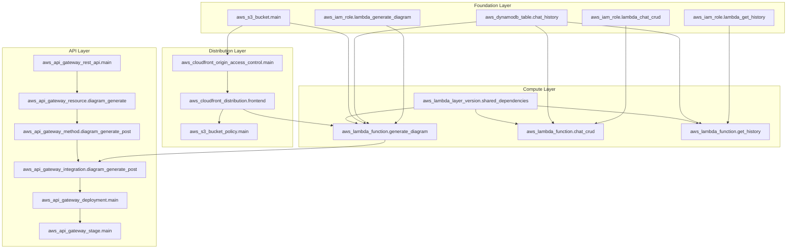
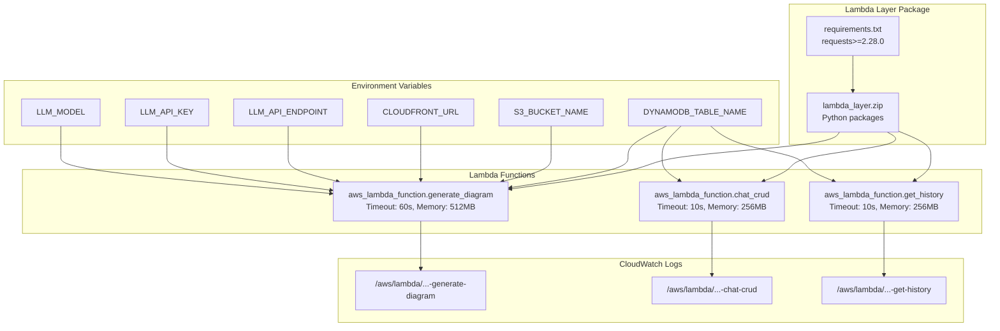
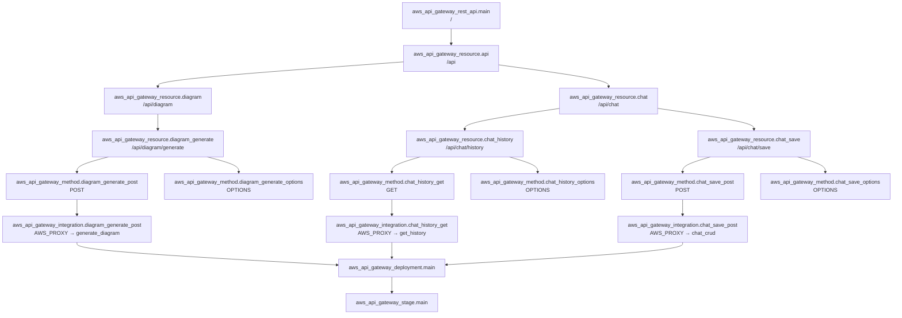
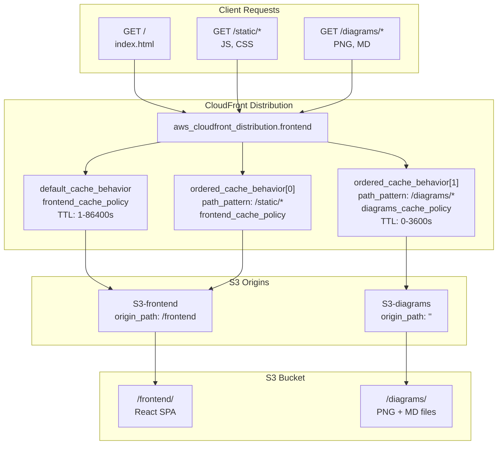
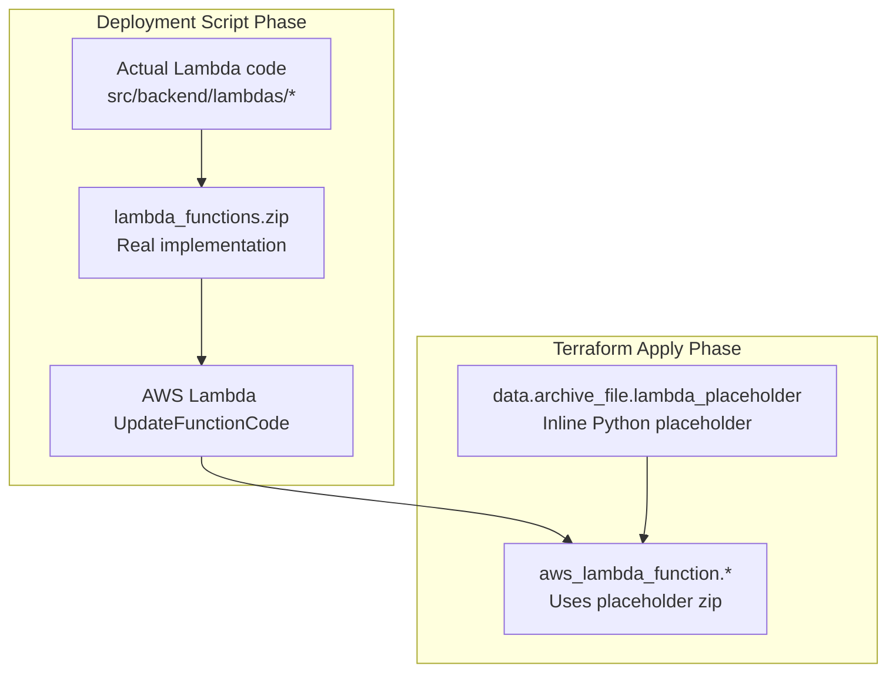

# Infrastructure as Code

> **Relevant source files**
> * [infrastructure/scripts/lambda/requirements.txt](https://github.com/dotpep/architecture-ai-assistant/blob/1285f968/infrastructure/scripts/lambda/requirements.txt)
> * [infrastructure/terraform/api_gateway.tf](https://github.com/dotpep/architecture-ai-assistant/blob/1285f968/infrastructure/terraform/api_gateway.tf)
> * [infrastructure/terraform/cloudfront.tf](https://github.com/dotpep/architecture-ai-assistant/blob/1285f968/infrastructure/terraform/cloudfront.tf)
> * [infrastructure/terraform/lambda.tf](https://github.com/dotpep/architecture-ai-assistant/blob/1285f968/infrastructure/terraform/lambda.tf)
> * [infrastructure/terraform/tfplan](https://github.com/dotpep/architecture-ai-assistant/blob/1285f968/infrastructure/terraform/tfplan)
> * [infrastructure/terraform/variables.tf](https://github.com/dotpep/architecture-ai-assistant/blob/1285f968/infrastructure/terraform/variables.tf)
> * [src/backend/shared/aws_helpers.py](https://github.com/dotpep/architecture-ai-assistant/blob/1285f968/src/backend/shared/aws_helpers.py)
> * [src/backend/shared/utils.py](https://github.com/dotpep/architecture-ai-assistant/blob/1285f968/src/backend/shared/utils.py)
> * [src/frontend/src/components/DownloadButtons.tsx](https://github.com/dotpep/architecture-ai-assistant/blob/1285f968/src/frontend/src/components/DownloadButtons.tsx)

## Purpose and Scope

This document provides an overview of the Terraform-based Infrastructure as Code (IaC) implementation for the Architecture AI Assistant. It covers the organization of Terraform modules, resource dependency relationships, and the overall infrastructure provisioning approach. For detailed information about specific resource types, see:

* Lambda function configuration: [5.1](/dotpep/architecture-ai-assistant/5.1-lambda-infrastructure)
* API Gateway setup: [5.2](/dotpep/architecture-ai-assistant/5.2-api-gateway-configuration)
* CloudFront and S3 configuration: [5.3](/dotpep/architecture-ai-assistant/5.3-cloudfront-and-s3-configuration)
* IAM roles and security policies: [5.4](/dotpep/architecture-ai-assistant/5.4-iam-roles-and-security)
* Terraform variables and configuration management: [5.5](/dotpep/architecture-ai-assistant/5.5-terraform-variables-and-configuration)

For deployment procedures and the deployment script, see [6.1](/dotpep/architecture-ai-assistant/6.1-deployment-script).

---

## Terraform Module Structure

The infrastructure code is organized into modular Terraform files, each responsible for a specific AWS service or resource category. This separation enables independent development, testing, and maintenance of each infrastructure component.

### File Organization Diagram

```mermaid
flowchart TD

main["main.tf<br>Provider & Backend"]
vars["variables.tf<br>Input Variables"]
outputs["outputs.tf<br>Output Values"]
lambda["lambda.tf<br>Lambda Functions & Layers"]
apigw["api_gateway.tf<br>REST API & Routes"]
cf["cloudfront.tf<br>CDN Distribution"]
s3["s3.tf<br>Storage Buckets"]
ddb["dynamodb.tf<br>chat_history Table"]
iam["iam.tf<br>Roles & Policies"]
lambda_res["aws_lambda_function<br>aws_lambda_layer_version"]
apigw_res["aws_api_gateway_rest_api<br>aws_api_gateway_deployment"]
cf_res["aws_cloudfront_distribution<br>aws_cloudfront_cache_policy"]
s3_res["aws_s3_bucket<br>aws_s3_bucket_policy"]
ddb_res["aws_dynamodb_table"]
iam_res["aws_iam_role<br>aws_iam_policy"]

lambda --> lambda_res
apigw --> apigw_res
cf --> cf_res
s3 --> s3_res
ddb --> ddb_res
iam --> iam_res

subgraph subGraph1 ["Resources Created"]
    lambda_res
    apigw_res
    cf_res
    s3_res
    ddb_res
    iam_res
end

subgraph infrastructure/terraform/ ["infrastructure/terraform/"]
    main
    vars
    outputs
    lambda
    apigw
    cf
    s3
    ddb
    iam
    main --> lambda
    main --> apigw
    main --> cf
    main --> s3
    main --> ddb
    main --> iam
    vars --> lambda
    vars --> apigw
    vars --> cf
    lambda --> outputs
    apigw --> outputs
    cf --> outputs
end
```



**Sources:** [infrastructure/terraform/lambda.tf L1-L184](https://github.com/dotpep/architecture-ai-assistant/blob/1285f968/infrastructure/terraform/lambda.tf#L1-L184)

 [infrastructure/terraform/api_gateway.tf L1-L449](https://github.com/dotpep/architecture-ai-assistant/blob/1285f968/infrastructure/terraform/api_gateway.tf#L1-L449)

 [infrastructure/terraform/cloudfront.tf L1-L179](https://github.com/dotpep/architecture-ai-assistant/blob/1285f968/infrastructure/terraform/cloudfront.tf#L1-L179)

 [infrastructure/terraform/variables.tf L1-L53](https://github.com/dotpep/architecture-ai-assistant/blob/1285f968/infrastructure/terraform/variables.tf#L1-L53)

### Terraform Configuration Files

| File | Primary Resources | Lines of Code | Purpose |
| --- | --- | --- | --- |
| `main.tf` | Provider configuration | ~50 | AWS provider setup and backend configuration |
| `variables.tf` | Variable declarations | 53 | Input parameters for customization |
| `outputs.tf` | Output values | ~50 | Export values for deployment scripts |
| `lambda.tf` | Lambda functions, layers | 184 | Function definitions and configurations |
| `api_gateway.tf` | API Gateway resources | 449 | REST API structure and Lambda integrations |
| `cloudfront.tf` | CloudFront distribution | 179 | CDN configuration and cache policies |
| `s3.tf` | S3 buckets | ~100 | Storage for frontend and diagrams |
| `dynamodb.tf` | DynamoDB table | ~50 | Chat history storage schema |
| `iam.tf` | IAM roles and policies | ~300 | Least-privilege security policies |

**Sources:** [infrastructure/terraform/lambda.tf L1-L184](https://github.com/dotpep/architecture-ai-assistant/blob/1285f968/infrastructure/terraform/lambda.tf#L1-L184)

 [infrastructure/terraform/api_gateway.tf L1-L449](https://github.com/dotpep/architecture-ai-assistant/blob/1285f968/infrastructure/terraform/api_gateway.tf#L1-L449)

 [infrastructure/terraform/cloudfront.tf L1-L179](https://github.com/dotpep/architecture-ai-assistant/blob/1285f968/infrastructure/terraform/cloudfront.tf#L1-L179)

---

## Resource Dependency Graph

The Terraform resources have explicit and implicit dependencies that determine the order of creation and deletion. Understanding these dependencies is critical for troubleshooting deployment issues and managing infrastructure changes.

### Core Infrastructure Dependencies



**Sources:** [infrastructure/terraform/lambda.tf L57-L87](https://github.com/dotpep/architecture-ai-assistant/blob/1285f968/infrastructure/terraform/lambda.tf#L57-L87)

 [infrastructure/terraform/api_gateway.tf L5-L449](https://github.com/dotpep/architecture-ai-assistant/blob/1285f968/infrastructure/terraform/api_gateway.tf#L5-L449)

 [infrastructure/terraform/cloudfront.tf L8-L178](https://github.com/dotpep/architecture-ai-assistant/blob/1285f968/infrastructure/terraform/cloudfront.tf#L8-L178)

### Dependency Types

The infrastructure uses three types of dependencies:

1. **Explicit Dependencies** (solid arrows): Created using Terraform references like `aws_iam_role.lambda_generate_diagram.arn`
2. **Implicit Dependencies** (dashed arrows): Environment variables that reference other resources
3. **Logical Dependencies**: Order enforced through `depends_on` blocks

**Sources:** [infrastructure/terraform/lambda.tf L60-L81](https://github.com/dotpep/architecture-ai-assistant/blob/1285f968/infrastructure/terraform/lambda.tf#L60-L81)

---

## Lambda Function Infrastructure Pattern

The Lambda functions follow a consistent infrastructure pattern with shared dependencies and environment variable injection.

### Lambda Layer and Function Structure



**Sources:** [infrastructure/terraform/lambda.tf L8-L19](https://github.com/dotpep/architecture-ai-assistant/blob/1285f968/infrastructure/terraform/lambda.tf#L8-L19)

 [infrastructure/terraform/lambda.tf L57-L87](https://github.com/dotpep/architecture-ai-assistant/blob/1285f968/infrastructure/terraform/lambda.tf#L57-L87)

 [infrastructure/terraform/lambda.tf L89-L97](https://github.com/dotpep/architecture-ai-assistant/blob/1285f968/infrastructure/terraform/lambda.tf#L89-L97)

 [infrastructure/scripts/lambda/requirements.txt L1-L2](https://github.com/dotpep/architecture-ai-assistant/blob/1285f968/infrastructure/scripts/lambda/requirements.txt#L1-L2)

### Lambda Configuration Table

| Function | Handler | Runtime | Timeout | Memory | Environment Variables |
| --- | --- | --- | --- | --- | --- |
| `generate_diagram` | `lambda_function.handler` | python3.11 | 60s | 512MB | 7 variables including LLM config |
| `chat_crud` | `lambda_function.handler` | python3.11 | 10s | 256MB | 2 variables: DynamoDB, environment |
| `get_history` | `lambda_function.handler` | python3.11 | 10s | 256MB | 2 variables: DynamoDB, environment |

**Shared Layer:** `aws_lambda_layer_version.shared_dependencies` provides the `requests` library to all functions.

**Sources:** [infrastructure/terraform/lambda.tf L57-L87](https://github.com/dotpep/architecture-ai-assistant/blob/1285f968/infrastructure/terraform/lambda.tf#L57-L87)

 [infrastructure/terraform/lambda.tf L105-L130](https://github.com/dotpep/architecture-ai-assistant/blob/1285f968/infrastructure/terraform/lambda.tf#L105-L130)

 [infrastructure/terraform/lambda.tf L148-L173](https://github.com/dotpep/architecture-ai-assistant/blob/1285f968/infrastructure/terraform/lambda.tf#L148-L173)

---

## API Gateway Resource Hierarchy

The API Gateway is structured as a hierarchical REST API with distinct resource paths and method integrations for each Lambda function.

### API Resource Tree and Lambda Integrations



**Sources:** [infrastructure/terraform/api_gateway.tf L5-L58](https://github.com/dotpep/architecture-ai-assistant/blob/1285f968/infrastructure/terraform/api_gateway.tf#L5-L58)

 [infrastructure/terraform/api_gateway.tf L67-L106](https://github.com/dotpep/architecture-ai-assistant/blob/1285f968/infrastructure/terraform/api_gateway.tf#L67-L106)

 [infrastructure/terraform/api_gateway.tf L390-L448](https://github.com/dotpep/architecture-ai-assistant/blob/1285f968/infrastructure/terraform/api_gateway.tf#L390-L448)

### CORS Configuration Pattern

Each API resource implements CORS through OPTIONS methods with mock integrations. The pattern is consistent across all three endpoints:

1. **OPTIONS Method**: `authorization = "NONE"`, `http_method = "OPTIONS"`
2. **Mock Integration**: Returns `statusCode: 200` without invoking Lambda
3. **Integration Response**: Sets CORS headers: * `Access-Control-Allow-Origin: '*'` * `Access-Control-Allow-Headers: 'Content-Type,X-Amz-Date,Authorization,X-Api-Key,X-Amz-Security-Token'` * `Access-Control-Allow-Methods: 'POST,OPTIONS'` (or GET for history endpoint)

**Sources:** [infrastructure/terraform/api_gateway.tf L111-L157](https://github.com/dotpep/architecture-ai-assistant/blob/1285f968/infrastructure/terraform/api_gateway.tf#L111-L157)

 [infrastructure/terraform/api_gateway.tf L208-L254](https://github.com/dotpep/architecture-ai-assistant/blob/1285f968/infrastructure/terraform/api_gateway.tf#L208-L254)

 [infrastructure/terraform/api_gateway.tf L305-L351](https://github.com/dotpep/architecture-ai-assistant/blob/1285f968/infrastructure/terraform/api_gateway.tf#L305-L351)

---

## CloudFront Distribution Architecture

The CloudFront distribution serves as the unified entry point for both the React frontend and generated diagram files, implementing multi-origin routing and caching strategies.

### CloudFront Origins and Cache Behaviors



**Sources:** [infrastructure/terraform/cloudfront.tf L72-L148](https://github.com/dotpep/architecture-ai-assistant/blob/1285f968/infrastructure/terraform/cloudfront.tf#L72-L148)

 [infrastructure/terraform/cloudfront.tf L21-L64](https://github.com/dotpep/architecture-ai-assistant/blob/1285f968/infrastructure/terraform/cloudfront.tf#L21-L64)

### Cache Policy Configuration

The CloudFront distribution uses two custom cache policies optimized for different content types:

**Frontend Cache Policy** (`aws_cloudfront_cache_policy.frontend_cache`):

* Default TTL: 86400s (1 day)
* Max TTL: 604800s (7 days)
* Min TTL: 3600s (1 hour)
* Compression: Brotli + Gzip enabled
* Used for: React SPA assets (HTML, JS, CSS)

**Diagrams Cache Policy** (`aws_cloudfront_cache_policy.diagrams_cache`):

* Default TTL: 3600s (1 hour)
* Max TTL: 86400s (1 day)
* Min TTL: 0s
* Compression: Brotli + Gzip enabled
* Used for: Generated diagram files (PNG, Markdown)

**Sources:** [infrastructure/terraform/cloudfront.tf L20-L41](https://github.com/dotpep/architecture-ai-assistant/blob/1285f968/infrastructure/terraform/cloudfront.tf#L20-L41)

 [infrastructure/terraform/cloudfront.tf L43-L64](https://github.com/dotpep/architecture-ai-assistant/blob/1285f968/infrastructure/terraform/cloudfront.tf#L43-L64)

---

## Placeholder Lambda Code Strategy

Terraform requires Lambda function code to exist during initial provisioning, but the actual function code is deployed separately by the deployment script. This creates a chicken-and-egg problem solved through placeholder Lambda functions.

### Placeholder Code Pattern



The placeholder code defined in [infrastructure/terraform/lambda.tf L26-L48](https://github.com/dotpep/architecture-ai-assistant/blob/1285f968/infrastructure/terraform/lambda.tf#L26-L48)

 provides a minimal viable Lambda function that:

1. Returns HTTP 200 status
2. Includes CORS headers
3. Returns a JSON message: `{'message': 'Placeholder - deploy actual function code'}`

This allows Terraform to create the Lambda function resources, after which the deployment script updates them with the real function code.

**Sources:** [infrastructure/terraform/lambda.tf L26-L48](https://github.com/dotpep/architecture-ai-assistant/blob/1285f968/infrastructure/terraform/lambda.tf#L26-L48)

 [infrastructure/terraform/lambda.tf L66-L67](https://github.com/dotpep/architecture-ai-assistant/blob/1285f968/infrastructure/terraform/lambda.tf#L66-L67)

 [infrastructure/terraform/lambda.tf L114-L115](https://github.com/dotpep/architecture-ai-assistant/blob/1285f968/infrastructure/terraform/lambda.tf#L114-L115)

 [infrastructure/terraform/lambda.tf L157-L158](https://github.com/dotpep/architecture-ai-assistant/blob/1285f968/infrastructure/terraform/lambda.tf#L157-L158)

---

## Infrastructure State Management

Terraform maintains the infrastructure state in `terraform.tfstate`, which tracks the mapping between declared resources and actual AWS resources. The state file is critical for detecting drift and planning updates.

### State Management Strategy

| Aspect | Implementation |
| --- | --- |
| **State Storage** | Local file `terraform.tfstate` in `infrastructure/terraform/` |
| **State Locking** | Not implemented (single-user deployment assumed) |
| **State Backup** | `terraform.tfstate.backup` created automatically |
| **Sensitive Data** | Contains sensitive values (API keys, ARNs) - not committed to Git |
| **State Refresh** | Automatic on `terraform plan` and `terraform apply` |

### Deployment Redeployment Triggers

The `aws_api_gateway_deployment` resource uses a SHA-1 hash of all method and integration resource IDs to trigger redeployment when the API structure changes:

```
triggers = {
  redeployment = sha1(jsonencode([
    aws_api_gateway_resource.api.id,
    aws_api_gateway_method.diagram_generate_post.id,
    aws_api_gateway_integration.diagram_generate_post.id,
    ...
  ]))
}
```

This ensures API Gateway stages are updated whenever methods or integrations change.

**Sources:** [infrastructure/terraform/api_gateway.tf L390-L437](https://github.com/dotpep/architecture-ai-assistant/blob/1285f968/infrastructure/terraform/api_gateway.tf#L390-L437)

---

## Resource Naming Convention

All AWS resources follow a consistent naming pattern that includes the project name, resource type, and environment:

**Pattern:** `${var.project_name}-{resource-type}-${var.environment}`

**Examples:**

* Lambda: `architecture-ai-assistant-generate-diagram-dev`
* API Gateway: `architecture-ai-assistant-api-dev`
* S3 Bucket: `architecture-ai-assistant-bucket-dev`
* DynamoDB: `chat_history` (environment-agnostic)
* CloudFront: Tagged as `architecture-ai-assistant-cloudfront`

This naming convention enables:

* Multi-environment deployments (dev, staging, prod)
* Resource identification in AWS Console
* Cost allocation and tracking
* Automated cleanup scripts

**Sources:** [infrastructure/terraform/lambda.tf L58](https://github.com/dotpep/architecture-ai-assistant/blob/1285f968/infrastructure/terraform/lambda.tf#L58-L58)

 [infrastructure/terraform/api_gateway.tf L6](https://github.com/dotpep/architecture-ai-assistant/blob/1285f968/infrastructure/terraform/api_gateway.tf#L6-L6)

 [infrastructure/terraform/variables.tf L16-L32](https://github.com/dotpep/architecture-ai-assistant/blob/1285f968/infrastructure/terraform/variables.tf#L16-L32)

---

## Lifecycle Management

Terraform resources implement lifecycle rules to prevent accidental data loss and ensure smooth updates:

### Lambda Layer Lifecycle

```
lifecycle {
  create_before_destroy = true
}
```

Ensures a new layer version is created and attached to Lambda functions before deleting the old version, preventing function downtime.

**Sources:** [infrastructure/terraform/lambda.tf L16-L18](https://github.com/dotpep/architecture-ai-assistant/blob/1285f968/infrastructure/terraform/lambda.tf#L16-L18)

### API Gateway Deployment Lifecycle

```
lifecycle {
  create_before_destroy = true
}
```

Creates a new deployment before destroying the old one, ensuring API availability during updates.

**Sources:** [infrastructure/terraform/api_gateway.tf L416-L418](https://github.com/dotpep/architecture-ai-assistant/blob/1285f968/infrastructure/terraform/api_gateway.tf#L416-L418)

---

## Integration with Deployment Script

The Terraform infrastructure is designed to work in conjunction with `deploy.sh`, which orchestrates the complete deployment process:

1. **Phase 1**: Package Lambda layer and function code (outside Terraform)
2. **Phase 2**: Run `terraform init`, `terraform plan`, `terraform apply`
3. **Phase 3**: Build React frontend using Terraform outputs (API Gateway URL)
4. **Phase 4**: Upload frontend to S3 and invalidate CloudFront cache

Terraform provides outputs (`outputs.tf`) that the deployment script uses:

* `cloudfront_url`: Frontend distribution URL
* `api_gateway_url`: Backend API endpoint
* `s3_bucket_name`: Target bucket for frontend upload

**Sources:** See [6.1](/dotpep/architecture-ai-assistant/6.1-deployment-script) for deployment script details

---

## Summary

The Terraform infrastructure implements a modular, maintainable Infrastructure as Code solution with:

* **9 separate configuration files** organized by AWS service
* **50+ AWS resources** provisioned across Lambda, API Gateway, CloudFront, S3, DynamoDB, and IAM
* **Explicit dependency management** ensuring correct creation and deletion order
* **Environment-specific deployments** through variable parameterization
* **Placeholder code strategy** solving the Lambda code bootstrapping problem
* **Consistent naming conventions** for multi-environment support

The infrastructure supports the complete Architecture AI Assistant application stack while maintaining separation of concerns and enabling independent evolution of each component.

**Sources:** [infrastructure/terraform/lambda.tf L1-L184](https://github.com/dotpep/architecture-ai-assistant/blob/1285f968/infrastructure/terraform/lambda.tf#L1-L184)

 [infrastructure/terraform/api_gateway.tf L1-L449](https://github.com/dotpep/architecture-ai-assistant/blob/1285f968/infrastructure/terraform/api_gateway.tf#L1-L449)

 [infrastructure/terraform/cloudfront.tf L1-L179](https://github.com/dotpep/architecture-ai-assistant/blob/1285f968/infrastructure/terraform/cloudfront.tf#L1-L179)

 [infrastructure/terraform/variables.tf L1-L53](https://github.com/dotpep/architecture-ai-assistant/blob/1285f968/infrastructure/terraform/variables.tf#L1-L53)