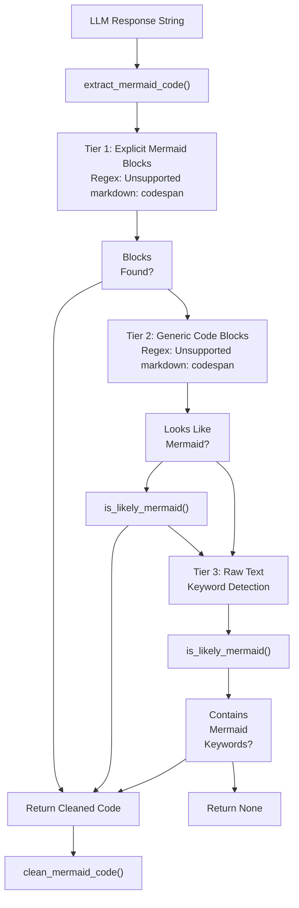
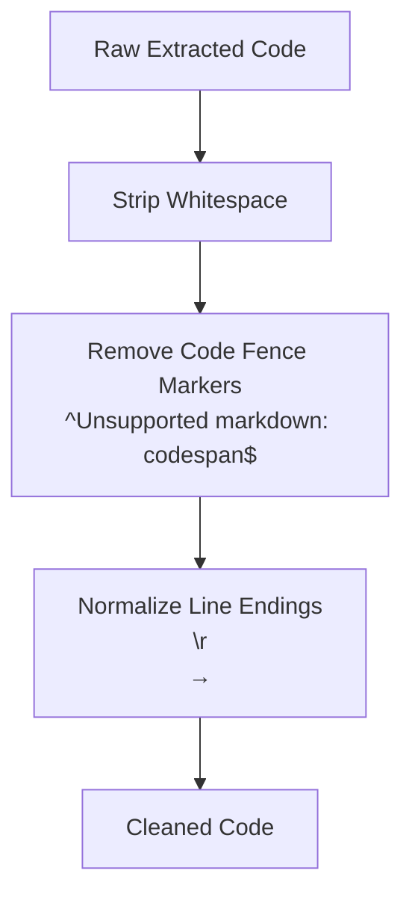
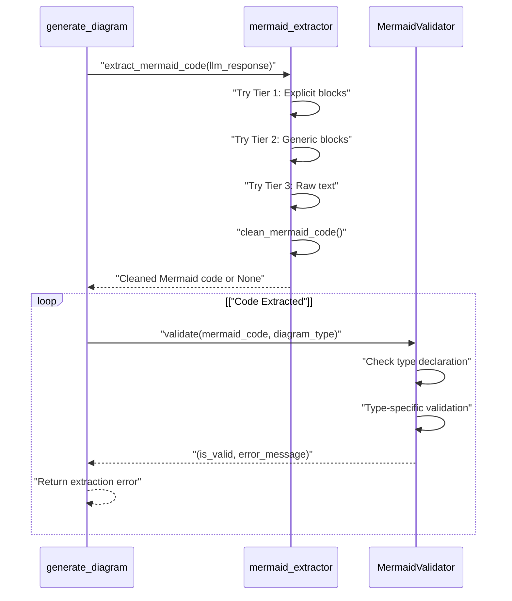
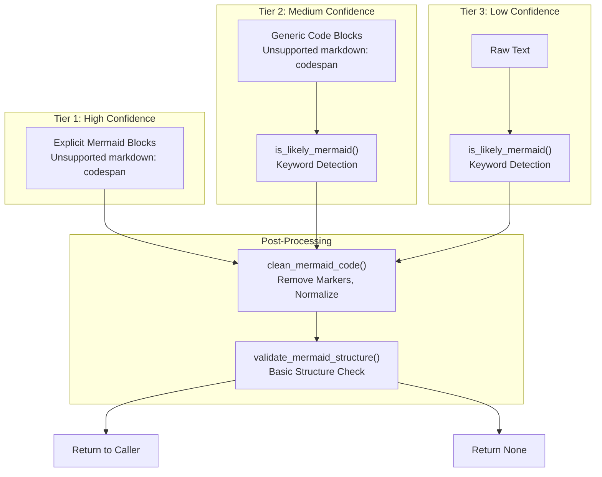

# Mermaid Code Extraction

> **Relevant source files**
> * [src/backend/lambda_functions/generate_diagram/mermaid_extractor.py](https://github.com/dotpep/architecture-ai-assistant/blob/1285f968/src/backend/lambda_functions/generate_diagram/mermaid_extractor.py)
> * [src/backend/lambda_functions/generate_diagram/mermaid_validator.py](https://github.com/dotpep/architecture-ai-assistant/blob/1285f968/src/backend/lambda_functions/generate_diagram/mermaid_validator.py)
> * [src/backend/lambda_functions/generate_diagram/prompt_builder.py](https://github.com/dotpep/architecture-ai-assistant/blob/1285f968/src/backend/lambda_functions/generate_diagram/prompt_builder.py)

## Purpose and Scope

The Mermaid code extraction module (`mermaid_extractor.py`) is responsible for parsing LLM responses and extracting valid Mermaid diagram code. This module implements a multi-tier extraction strategy to handle various response formats that different LLM providers may produce. It bridges the gap between the unstructured text output from the LLM and the structured Mermaid syntax required for validation and rendering.

For information about validating the extracted Mermaid code, see [Mermaid Code Validation](/dotpep/architecture-ai-assistant/4.1.1-mermaid-code-validation). For the complete diagram generation pipeline, see [Generate Diagram Function](/dotpep/architecture-ai-assistant/4.1-generate-diagram-function).

**Sources:** [src/backend/lambda_functions/generate_diagram/mermaid_extractor.py L1-L181](https://github.com/dotpep/architecture-ai-assistant/blob/1285f968/src/backend/lambda_functions/generate_diagram/mermaid_extractor.py#L1-L181)

## Extraction Strategy Overview

The extraction process follows a hierarchical fallback approach with three tiers, each designed to handle increasingly loose response formats:

| Tier | Pattern | Description | Reliability |
| --- | --- | --- | --- |
| 1 | Explicit Mermaid Block | ````mermaid\n...\n`````` | High - preferred format |
| 2 | Generic Code Block | `````\n...\n`````` with Mermaid heuristics | Medium - requires content validation |
| 3 | Raw Text | No delimiters, keyword-based detection | Low - last resort |

The `extract_mermaid_code()` function [src/backend/lambda_functions/generate_diagram/mermaid_extractor.py L10-L58](https://github.com/dotpep/architecture-ai-assistant/blob/1285f968/src/backend/lambda_functions/generate_diagram/mermaid_extractor.py#L10-L58)

 implements this cascading strategy, attempting each tier sequentially until valid Mermaid code is found.

**Sources:** [src/backend/lambda_functions/generate_diagram/mermaid_extractor.py L10-L58](https://github.com/dotpep/architecture-ai-assistant/blob/1285f968/src/backend/lambda_functions/generate_diagram/mermaid_extractor.py#L10-L58)

## Extraction Flow Architecture



**Diagram: Multi-Tier Mermaid Code Extraction Flow**

This diagram shows the sequential fallback mechanism used by `extract_mermaid_code()` to handle various LLM response formats. Each tier attempts progressively less strict pattern matching.

**Sources:** [src/backend/lambda_functions/generate_diagram/mermaid_extractor.py L10-L58](https://github.com/dotpep/architecture-ai-assistant/blob/1285f968/src/backend/lambda_functions/generate_diagram/mermaid_extractor.py#L10-L58)

 [src/backend/lambda_functions/generate_diagram/mermaid_extractor.py L61-L95](https://github.com/dotpep/architecture-ai-assistant/blob/1285f968/src/backend/lambda_functions/generate_diagram/mermaid_extractor.py#L61-L95)

## Tier 1: Explicit Mermaid Block Extraction

The primary extraction pattern uses regular expressions to find code blocks explicitly tagged as Mermaid:

```markdown
# Pattern implementation at lines 24-36
r'```mermaid\s*\n(.*?)```'
```

This pattern uses `re.DOTALL` and `re.IGNORECASE` flags to:

* Match across multiple lines (DOTALL)
* Handle case variations like "Mermaid" or "MERMAID" (IGNORECASE)

The function extracts **all** matching blocks using `re.findall()` [src/backend/lambda_functions/generate_diagram/mermaid_extractor.py L25-L29](https://github.com/dotpep/architecture-ai-assistant/blob/1285f968/src/backend/lambda_functions/generate_diagram/mermaid_extractor.py#L25-L29)

 and returns the first non-empty block after stripping whitespace [src/backend/lambda_functions/generate_diagram/mermaid_extractor.py L32-L36](https://github.com/dotpep/architecture-ai-assistant/blob/1285f968/src/backend/lambda_functions/generate_diagram/mermaid_extractor.py#L32-L36)

 This handles cases where the LLM includes multiple code blocks or empty blocks in its response.

**Sources:** [src/backend/lambda_functions/generate_diagram/mermaid_extractor.py L24-L36](https://github.com/dotpep/architecture-ai-assistant/blob/1285f968/src/backend/lambda_functions/generate_diagram/mermaid_extractor.py#L24-L36)

## Tier 2: Generic Code Block with Heuristics

When no explicit Mermaid blocks are found, the extractor falls back to generic code block detection:

```markdown
# Pattern implementation at lines 38-51
r'```\s*\n(.*?)```'
```

This pattern matches any triple-backtick code block. To avoid false positives, each extracted block is validated using the `is_likely_mermaid()` heuristic function [src/backend/lambda_functions/generate_diagram/mermaid_extractor.py L61-L95](https://github.com/dotpep/architecture-ai-assistant/blob/1285f968/src/backend/lambda_functions/generate_diagram/mermaid_extractor.py#L61-L95)

 which checks for Mermaid diagram type keywords:

| Diagram Type | Detection Pattern |
| --- | --- |
| Flowchart | `^\s*graph\s+(TD\|LR\|TB\|RL\|BT)` |
| Flowchart | `^\s*flowchart\s+(TD\|LR\|TB\|RL\|BT)` |
| Sequence | `^\s*sequenceDiagram` |
| Class | `^\s*classDiagram` |
| State | `^\s*stateDiagram(-v2)?` |
| ER Diagram | `^\s*erDiagram` |
| Journey | `^\s*journey` |
| Gantt | `^\s*gantt` |
| Pie | `^\s*pie` |
| Git Graph | `^\s*gitGraph` |

The heuristic uses case-insensitive matching with the `re.MULTILINE` flag [src/backend/lambda_functions/generate_diagram/mermaid_extractor.py L92](https://github.com/dotpep/architecture-ai-assistant/blob/1285f968/src/backend/lambda_functions/generate_diagram/mermaid_extractor.py#L92-L92)

 to detect diagram type declarations at the start of any line.

**Sources:** [src/backend/lambda_functions/generate_diagram/mermaid_extractor.py L38-L51](https://github.com/dotpep/architecture-ai-assistant/blob/1285f968/src/backend/lambda_functions/generate_diagram/mermaid_extractor.py#L38-L51)

 [src/backend/lambda_functions/generate_diagram/mermaid_extractor.py L61-L95](https://github.com/dotpep/architecture-ai-assistant/blob/1285f968/src/backend/lambda_functions/generate_diagram/mermaid_extractor.py#L61-L95)

## Tier 3: Raw Text Extraction

As a last resort, if no code blocks are detected, the extractor checks whether the entire response text contains Mermaid keywords:

```markdown
# Implementation at lines 53-56
if is_likely_mermaid(llm_response):
    return llm_response.strip()
```

This handles cases where the LLM omits code block delimiters entirely and returns raw Mermaid syntax. While less common with modern LLMs, this tier ensures maximum compatibility with various LLM configurations.

**Sources:** [src/backend/lambda_functions/generate_diagram/mermaid_extractor.py L53-L58](https://github.com/dotpep/architecture-ai-assistant/blob/1285f968/src/backend/lambda_functions/generate_diagram/mermaid_extractor.py#L53-L58)

## Code Cleaning and Normalization

After extraction, the `clean_mermaid_code()` function [src/backend/lambda_functions/generate_diagram/mermaid_extractor.py L157-L180](https://github.com/dotpep/architecture-ai-assistant/blob/1285f968/src/backend/lambda_functions/generate_diagram/mermaid_extractor.py#L157-L180)

 normalizes the extracted code:



**Diagram: Code Cleaning Pipeline**

The cleaning process:

1. **Whitespace removal** - Strips leading/trailing whitespace [src/backend/lambda_functions/generate_diagram/mermaid_extractor.py L171](https://github.com/dotpep/architecture-ai-assistant/blob/1285f968/src/backend/lambda_functions/generate_diagram/mermaid_extractor.py#L171-L171)
2. **Fence marker removal** - Eliminates any remaining ````mermaid` or ````` markers using regex substitution [src/backend/lambda_functions/generate_diagram/mermaid_extractor.py L174-L175](https://github.com/dotpep/architecture-ai-assistant/blob/1285f968/src/backend/lambda_functions/generate_diagram/mermaid_extractor.py#L174-L175)
3. **Line ending normalization** - Converts Windows-style `\r\n` to Unix-style `\n` [src/backend/lambda_functions/generate_diagram/mermaid_extractor.py L178](https://github.com/dotpep/architecture-ai-assistant/blob/1285f968/src/backend/lambda_functions/generate_diagram/mermaid_extractor.py#L178-L178)

This ensures consistent input for downstream validation and rendering modules.

**Sources:** [src/backend/lambda_functions/generate_diagram/mermaid_extractor.py L157-L180](https://github.com/dotpep/architecture-ai-assistant/blob/1285f968/src/backend/lambda_functions/generate_diagram/mermaid_extractor.py#L157-L180)

## Integration with Validation Module

The extraction module is designed to work in tandem with `MermaidValidator` from `mermaid_validator.py`:



**Diagram: Extraction and Validation Integration**

The extraction module operates **before** validation in the pipeline:

1. `extract_mermaid_code()` returns the first successfully extracted code block
2. If extraction fails (returns `None`), the pipeline terminates with an extraction error
3. If extraction succeeds, the cleaned code is passed to `MermaidValidator.validate()` [src/backend/lambda_functions/generate_diagram/mermaid_validator.py L45-L101](https://github.com/dotpep/architecture-ai-assistant/blob/1285f968/src/backend/lambda_functions/generate_diagram/mermaid_validator.py#L45-L101)
4. The validator performs comprehensive syntax and structure checks

This separation of concerns allows the extraction logic to focus on parsing LLM responses while the validator handles Mermaid-specific correctness.

**Sources:** [src/backend/lambda_functions/generate_diagram/mermaid_extractor.py L10-L58](https://github.com/dotpep/architecture-ai-assistant/blob/1285f968/src/backend/lambda_functions/generate_diagram/mermaid_extractor.py#L10-L58)

 [src/backend/lambda_functions/generate_diagram/mermaid_validator.py L45-L101](https://github.com/dotpep/architecture-ai-assistant/blob/1285f968/src/backend/lambda_functions/generate_diagram/mermaid_validator.py#L45-L101)

## Utility Functions

### extract_all_mermaid_blocks()

The `extract_all_mermaid_blocks()` function [src/backend/lambda_functions/generate_diagram/mermaid_extractor.py L98-L125](https://github.com/dotpep/architecture-ai-assistant/blob/1285f968/src/backend/lambda_functions/generate_diagram/mermaid_extractor.py#L98-L125)

 provides an alternative extraction method that returns **all** Mermaid blocks found in the response:

```markdown
blocks = extract_all_mermaid_blocks(llm_response)
# Returns: ["graph TD\n...", "sequenceDiagram\n..."]
```

This function is useful for:

* Debugging LLM responses that contain multiple diagrams
* Batch processing scenarios
* Quality assurance testing

Unlike `extract_mermaid_code()`, this function does **not** apply heuristic filtering and only extracts explicitly tagged `mermaid` blocks.

**Sources:** [src/backend/lambda_functions/generate_diagram/mermaid_extractor.py L98-L125](https://github.com/dotpep/architecture-ai-assistant/blob/1285f968/src/backend/lambda_functions/generate_diagram/mermaid_extractor.py#L98-L125)

### validate_mermaid_structure()

The `validate_mermaid_structure()` function [src/backend/lambda_functions/generate_diagram/mermaid_extractor.py L128-L154](https://github.com/dotpep/architecture-ai-assistant/blob/1285f968/src/backend/lambda_functions/generate_diagram/mermaid_extractor.py#L128-L154)

 performs lightweight validation within the extraction module:

| Check | Implementation | Purpose |
| --- | --- | --- |
| Non-empty | `len(mermaid_code.strip()) < 5` | Reject trivial strings |
| Mermaid keywords | `is_likely_mermaid()` | Ensure valid diagram type |
| Multi-line | `'\n' not in mermaid_code` | Reject single-line input |

This basic validation acts as a pre-filter before the more comprehensive validation in `MermaidValidator`. It prevents obviously invalid code from proceeding through the pipeline.

**Sources:** [src/backend/lambda_functions/generate_diagram/mermaid_extractor.py L128-L154](https://github.com/dotpep/architecture-ai-assistant/blob/1285f968/src/backend/lambda_functions/generate_diagram/mermaid_extractor.py#L128-L154)

## Error Handling

The extraction module uses `Optional[str]` return types to signal failure:

```python
def extract_mermaid_code(llm_response: str) -> Optional[str]:
    # Returns None if extraction fails at all tiers
```

Error conditions handled:

* **Null/empty input** - Returns `None` immediately [src/backend/lambda_functions/generate_diagram/mermaid_extractor.py L21-L22](https://github.com/dotpep/architecture-ai-assistant/blob/1285f968/src/backend/lambda_functions/generate_diagram/mermaid_extractor.py#L21-L22)
* **Invalid type** - Returns `None` if input is not a string [src/backend/lambda_functions/generate_diagram/mermaid_extractor.py L21-L22](https://github.com/dotpep/architecture-ai-assistant/blob/1285f968/src/backend/lambda_functions/generate_diagram/mermaid_extractor.py#L21-L22)
* **No matches** - Returns `None` after exhausting all extraction tiers [src/backend/lambda_functions/generate_diagram/mermaid_extractor.py L58](https://github.com/dotpep/architecture-ai-assistant/blob/1285f968/src/backend/lambda_functions/generate_diagram/mermaid_extractor.py#L58-L58)

The calling code in `generate_diagram` Lambda function checks for `None` and constructs appropriate error responses for the client.

**Sources:** [src/backend/lambda_functions/generate_diagram/mermaid_extractor.py L10-L58](https://github.com/dotpep/architecture-ai-assistant/blob/1285f968/src/backend/lambda_functions/generate_diagram/mermaid_extractor.py#L10-L58)

## Pattern Matching Strategy Summary



**Diagram: Complete Extraction Architecture**

This diagram illustrates the complete extraction architecture, showing how the three tiers feed into post-processing stages before returning results to the caller. Each tier has progressively lower confidence, but all extracted code undergoes the same cleaning and basic validation.

**Sources:** [src/backend/lambda_functions/generate_diagram/mermaid_extractor.py L1-L181](https://github.com/dotpep/architecture-ai-assistant/blob/1285f968/src/backend/lambda_functions/generate_diagram/mermaid_extractor.py#L1-L181)