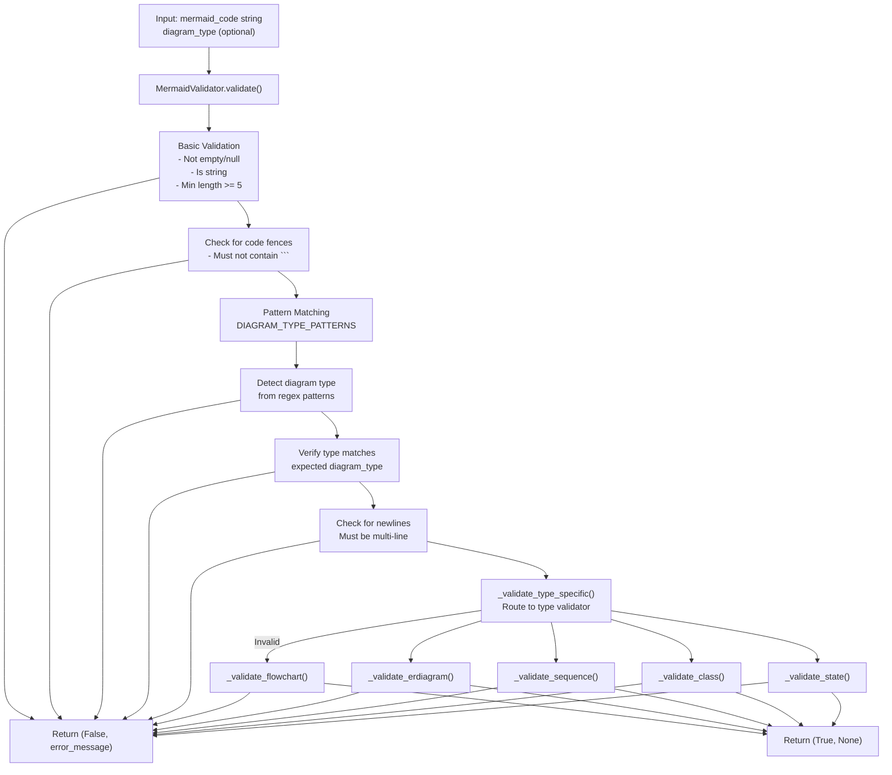
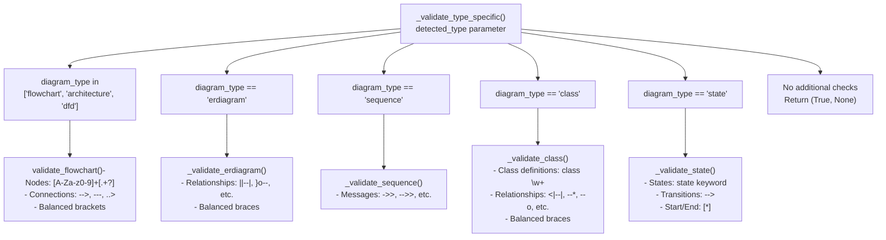
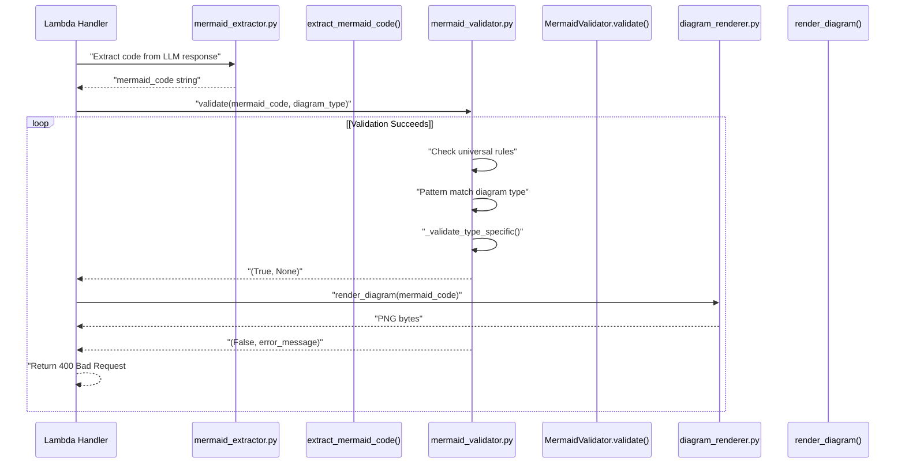

# Mermaid Code Validation

> **Relevant source files**
> * [src/backend/lambda_functions/generate_diagram/mermaid_extractor.py](https://github.com/dotpep/architecture-ai-assistant/blob/1285f968/src/backend/lambda_functions/generate_diagram/mermaid_extractor.py)
> * [src/backend/lambda_functions/generate_diagram/mermaid_validator.py](https://github.com/dotpep/architecture-ai-assistant/blob/1285f968/src/backend/lambda_functions/generate_diagram/mermaid_validator.py)
> * [src/backend/lambda_functions/generate_diagram/prompt_builder.py](https://github.com/dotpep/architecture-ai-assistant/blob/1285f968/src/backend/lambda_functions/generate_diagram/prompt_builder.py)

## Purpose and Scope

This document details the Mermaid code validation system implemented in the `generate_diagram` Lambda function. The `MermaidValidator` class validates Mermaid diagram syntax before rendering, ensuring that only well-formed diagrams are passed to the Kroki service. This validation occurs after code extraction (see [Mermaid Code Extraction](/dotpep/architecture-ai-assistant/4.1.2-mermaid-code-extraction)) and before rendering (see [Diagram Rendering and Storage](/dotpep/architecture-ai-assistant/4.1.3-diagram-rendering-and-storage)).

The validator performs both universal syntax checks (applicable to all diagram types) and type-specific validation rules for flowcharts, ER diagrams, sequence diagrams, class diagrams, state diagrams, architecture diagrams, and data flow diagrams (DFDs).

Sources: [src/backend/lambda_functions/generate_diagram/mermaid_validator.py L1-L222](https://github.com/dotpep/architecture-ai-assistant/blob/1285f968/src/backend/lambda_functions/generate_diagram/mermaid_validator.py#L1-L222)

## Validation Pipeline

The validation system operates as a two-stage pipeline: universal validation followed by type-specific validation.

### Validation Flow Diagram



Sources: [src/backend/lambda_functions/generate_diagram/mermaid_validator.py L44-L101](https://github.com/dotpep/architecture-ai-assistant/blob/1285f968/src/backend/lambda_functions/generate_diagram/mermaid_validator.py#L44-L101)

## Diagram Type Pattern Matching

The `MermaidValidator` class uses the `DIAGRAM_TYPE_PATTERNS` dictionary to detect and validate diagram type declarations. Each diagram type maps to one or more regex patterns that match valid diagram headers.

### Pattern Dictionary Structure

| Diagram Type | Regex Patterns | Description |
| --- | --- | --- |
| `flowchart` | `r'^\s*graph\s+(TD\|LR\|TB\|RL\|BT)'``r'^\s*flowchart\s+(TD\|LR\|TB\|RL\|BT)'` | Matches both `graph` and `flowchart` keywords with directional modifiers |
| `erdiagram` | `r'^\s*erDiagram'` | Matches entity-relationship diagram declaration |
| `sequence` | `r'^\s*sequenceDiagram'` | Matches sequence diagram declaration |
| `class` | `r'^\s*classDiagram'` | Matches class diagram declaration |
| `state` | `r'^\s*stateDiagram'``r'^\s*stateDiagram-v2'` | Matches both versions of state diagram syntax |
| `architecture` | `r'^\s*graph\s+(TD\|LR\|TB\|RL\|BT)'``r'^\s*flowchart\s+(TD\|LR\|TB\|RL\|BT)'` | Architecture diagrams use flowchart syntax |
| `dfd` | `r'^\s*graph\s+(TD\|LR\|TB\|RL\|BT)'``r'^\s*flowchart\s+(TD\|LR\|TB\|RL\|BT)'` | Data flow diagrams use flowchart syntax |

The pattern matching uses `re.MULTILINE | re.IGNORECASE` flags to handle various code formatting styles.

Sources: [src/backend/lambda_functions/generate_diagram/mermaid_validator.py L16-L42](https://github.com/dotpep/architecture-ai-assistant/blob/1285f968/src/backend/lambda_functions/generate_diagram/mermaid_validator.py#L16-L42)

 [src/backend/lambda_functions/generate_diagram/mermaid_validator.py L69-L90](https://github.com/dotpep/architecture-ai-assistant/blob/1285f968/src/backend/lambda_functions/generate_diagram/mermaid_validator.py#L69-L90)

## Universal Validation Rules

Before type-specific validation, all Mermaid code undergoes universal checks performed in the `validate()` method:

### Universal Checks

1. **Null/Type Check** [mermaid_validator.py L56-L57](https://github.com/dotpep/architecture-ai-assistant/blob/1285f968/mermaid_validator.py#L56-L57) * Code must not be `None` or empty * Code must be a string type * Error: `"Mermaid code is empty or not a string"`
2. **Minimum Length** [mermaid_validator.py L61-L63](https://github.com/dotpep/architecture-ai-assistant/blob/1285f968/mermaid_validator.py#L61-L63) * Stripped code must have at least 5 characters * Error: `"Mermaid code is too short to be valid"`
3. **Code Fence Check** [mermaid_validator.py L65-L67](https://github.com/dotpep/architecture-ai-assistant/blob/1285f968/mermaid_validator.py#L65-L67) * Code must not contain triple backticks (```) * Indicates improper extraction or cleaning * Error: `"Mermaid code contains code fence markers (```)"
4. **Diagram Type Declaration** [mermaid_validator.py L69-L83](https://github.com/dotpep/architecture-ai-assistant/blob/1285f968/mermaid_validator.py#L69-L83) * Code must start with a valid diagram type declaration * Checked against `DIAGRAM_TYPE_PATTERNS` * Error: `"Mermaid code does not start with a valid diagram type declaration"`
5. **Type Verification** [mermaid_validator.py L85-L89](https://github.com/dotpep/architecture-ai-assistant/blob/1285f968/mermaid_validator.py#L85-L89) * If `diagram_type` parameter provided, detected type must match * Error: `"Diagram type mismatch: expected {type}, detected {detected_type}"`
6. **Multi-line Requirement** [mermaid_validator.py L91-L93](https://github.com/dotpep/architecture-ai-assistant/blob/1285f968/mermaid_validator.py#L91-L93) * Code must contain at least one newline character * Prevents single-line invalid diagrams * Error: `"Mermaid code should contain multiple lines"`

Sources: [src/backend/lambda_functions/generate_diagram/mermaid_validator.py L44-L101](https://github.com/dotpep/architecture-ai-assistant/blob/1285f968/src/backend/lambda_functions/generate_diagram/mermaid_validator.py#L44-L101)

## Type-Specific Validation

The `_validate_type_specific()` method routes to specialized validators based on the detected diagram type. Each validator checks for type-specific syntax requirements.

### Type-Specific Validation Routing



Sources: [src/backend/lambda_functions/generate_diagram/mermaid_validator.py L103-L126](https://github.com/dotpep/architecture-ai-assistant/blob/1285f968/src/backend/lambda_functions/generate_diagram/mermaid_validator.py#L103-L126)

### Flowchart Validation

The `_validate_flowchart()` method validates flowcharts, architecture diagrams, and DFDs.

**Requirements:**

* At least one node definition OR connection
* Balanced brackets for node shapes

**Node Pattern:** `[A-Za-z0-9_]+\[.+?\]` matches node definitions like `A[Label]`

**Connection Pattern:** `--+>|---+|\.\.+>` matches various arrow types:

* `-->` solid arrow
* `---` solid line
* `..>` dotted arrow

**Bracket Balancing:**

* Square brackets `[]` for rectangular nodes
* Parentheses `()` for rounded nodes
* Curly braces `{}` for diamond/decision nodes

Sources: [src/backend/lambda_functions/generate_diagram/mermaid_validator.py L128-L148](https://github.com/dotpep/architecture-ai-assistant/blob/1285f968/src/backend/lambda_functions/generate_diagram/mermaid_validator.py#L128-L148)

### ER Diagram Validation

The `_validate_erdiagram()` method ensures entity-relationship syntax correctness.

**Requirements:**

* At least one relationship notation
* Balanced curly braces (accounting for relationship syntax)

**Relationship Patterns:**

* `||--` exactly one
* `}o--` zero or more
* `|o--` zero or one
* `}|--` one or more

The validator removes relationship syntax before counting braces to avoid false positives from relationship notation containing braces.

Sources: [src/backend/lambda_functions/generate_diagram/mermaid_validator.py L150-L165](https://github.com/dotpep/architecture-ai-assistant/blob/1285f968/src/backend/lambda_functions/generate_diagram/mermaid_validator.py#L150-L165)

### Sequence Diagram Validation

The `_validate_sequence()` method checks for message syntax.

**Requirements:**

* At least one message notation

**Message Patterns:** `->>|-->>|->>?[+\-]?|-->>?[+\-]?` matches:

* `->>` synchronous message
* `-->>` asynchronous message
* Activation/deactivation modifiers `+` and `-`

Sources: [src/backend/lambda_functions/generate_diagram/mermaid_validator.py L167-L176](https://github.com/dotpep/architecture-ai-assistant/blob/1285f968/src/backend/lambda_functions/generate_diagram/mermaid_validator.py#L167-L176)

### Class Diagram Validation

The `_validate_class()` method validates object-oriented class diagrams.

**Requirements:**

* At least one class definition OR relationship
* Balanced curly braces

**Class Pattern:** `class\s+\w+` matches class declarations

**Relationship Patterns:**

* `<|--` inheritance
* `--*` composition
* `--o` aggregation
* `-->` association
* `..>` dependency

Sources: [src/backend/lambda_functions/generate_diagram/mermaid_validator.py L178-L192](https://github.com/dotpep/architecture-ai-assistant/blob/1285f968/src/backend/lambda_functions/generate_diagram/mermaid_validator.py#L178-L192)

### State Diagram Validation

The `_validate_state()` method checks state machine syntax.

**Requirements:**

* At least one of: state declaration, transition, or start/end marker

**State Pattern:** `state\s+` matches state declarations

**Transition Pattern:** `-->` matches state transitions

**Start/End Pattern:** `\[\*\]` matches initial and final state markers

Sources: [src/backend/lambda_functions/generate_diagram/mermaid_validator.py L194-L205](https://github.com/dotpep/architecture-ai-assistant/blob/1285f968/src/backend/lambda_functions/generate_diagram/mermaid_validator.py#L194-L205)

## Validation Response Format

The `validate()` method returns a tuple: `(is_valid: bool, error_message: Optional[str])`

### Success Response

```
(True, None)
```

### Error Response Examples

```python
(False, "Mermaid code is empty or not a string")
(False, "Mermaid code is too short to be valid")
(False, "Mermaid code contains code fence markers (```)")
(False, "Mermaid code does not start with a valid diagram type declaration")
(False, "Diagram type mismatch: expected flowchart, detected sequence")
(False, "Mermaid code should contain multiple lines")
(False, "Flowchart must contain at least one node or connection")
(False, "Unbalanced square brackets in flowchart")
(False, "ER diagram must contain at least one relationship")
(False, "Sequence diagram must contain at least one message")
(False, "Class diagram must contain at least one class or relationship")
(False, "State diagram must contain at least one state or transition")
```

Sources: [src/backend/lambda_functions/generate_diagram/mermaid_validator.py L44-L55](https://github.com/dotpep/architecture-ai-assistant/blob/1285f968/src/backend/lambda_functions/generate_diagram/mermaid_validator.py#L44-L55)

 [src/backend/lambda_functions/generate_diagram/mermaid_validator.py L128-L205](https://github.com/dotpep/architecture-ai-assistant/blob/1285f968/src/backend/lambda_functions/generate_diagram/mermaid_validator.py#L128-L205)

## Convenience Function

The module provides `validate_mermaid_code()` as a convenience wrapper around `MermaidValidator.validate()`:

```python
def validate_mermaid_code(mermaid_code: str, diagram_type: Optional[str] = None) -> Tuple[bool, Optional[str]]
```

This function is the primary interface used by the `generate_diagram` Lambda function's main handler.

Sources: [src/backend/lambda_functions/generate_diagram/mermaid_validator.py L210-L221](https://github.com/dotpep/architecture-ai-assistant/blob/1285f968/src/backend/lambda_functions/generate_diagram/mermaid_validator.py#L210-L221)

## Integration with Generate Diagram Pipeline

The validator integrates into the diagram generation flow between code extraction and rendering:



This validation step prevents invalid Mermaid code from being sent to Kroki, reducing external API calls and providing immediate feedback on syntax errors.

Sources: [src/backend/lambda_functions/generate_diagram/mermaid_validator.py L1-L222](https://github.com/dotpep/architecture-ai-assistant/blob/1285f968/src/backend/lambda_functions/generate_diagram/mermaid_validator.py#L1-L222)

 [src/backend/lambda_functions/generate_diagram/mermaid_extractor.py L1-L181](https://github.com/dotpep/architecture-ai-assistant/blob/1285f968/src/backend/lambda_functions/generate_diagram/mermaid_extractor.py#L1-L181)

## Validation Rules Summary Table

| Validation Stage | Check | Pattern/Logic | Error Message |
| --- | --- | --- | --- |
| Basic | Empty/Null | `not mermaid_code or not isinstance(mermaid_code, str)` | "Mermaid code is empty or not a string" |
| Basic | Minimum Length | `len(code.strip()) < 5` | "Mermaid code is too short to be valid" |
| Basic | Code Fences | `'```' in code` | "Mermaid code contains code fence markers" |
| Basic | Type Declaration | Match against `DIAGRAM_TYPE_PATTERNS` | "Does not start with valid diagram type declaration" |
| Basic | Type Match | `detected_type != diagram_type` | "Diagram type mismatch: expected X, detected Y" |
| Basic | Multi-line | `'\n' not in code` | "Mermaid code should contain multiple lines" |
| Flowchart | Nodes/Connections | `[A-Za-z0-9_]+\[.+?\]` OR `--+>\|---+\|\.\.+>` | "Must contain at least one node or connection" |
| Flowchart | Balanced Brackets | Count `[]`, `()`, `{}` | "Unbalanced [brackets/parentheses/braces]" |
| ER Diagram | Relationships | `\|\|--\|\}o--\|\|o--\|\}\|--` | "Must contain at least one relationship" |
| ER Diagram | Balanced Braces | Count `{}` after removing relationship syntax | "Unbalanced curly braces" |
| Sequence | Messages | `->> | -->> |
| Class | Class/Relationship | `class\s+\w+` OR `<\|--\|--\*\|--o\|-->\|\.\.>` | "Must contain at least one class or relationship" |
| Class | Balanced Braces | Count `{}` | "Unbalanced curly braces" |
| State | State/Transition | `state\s+` OR `-->` OR `\[\*\]` | "Must contain at least one state or transition" |

Sources: [src/backend/lambda_functions/generate_diagram/mermaid_validator.py L44-L205](https://github.com/dotpep/architecture-ai-assistant/blob/1285f968/src/backend/lambda_functions/generate_diagram/mermaid_validator.py#L44-L205)