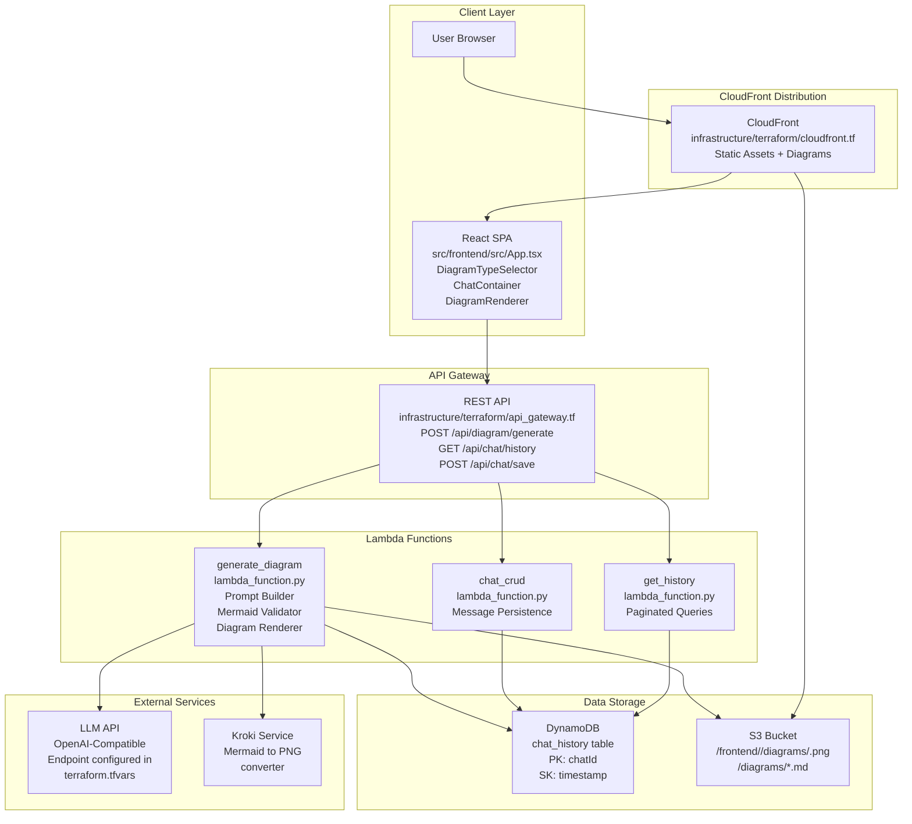
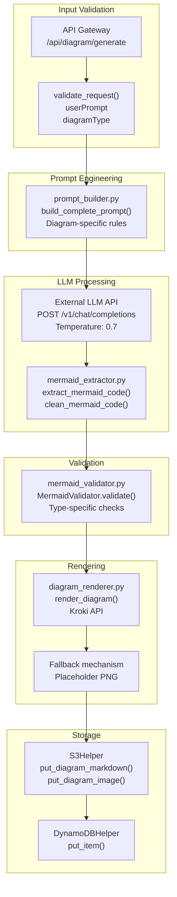
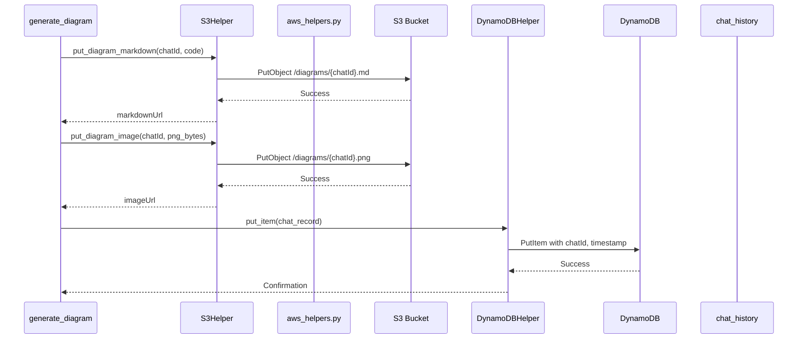
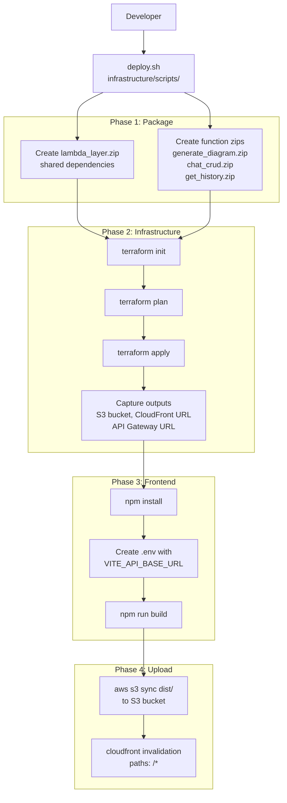

# Overview

> **Relevant source files**
> * [.kiro/specs/architecture-ai-assistant/tasks.md](https://github.com/dotpep/architecture-ai-assistant/blob/1285f968/.kiro/specs/architecture-ai-assistant/tasks.md)
> * [README.md](https://github.com/dotpep/architecture-ai-assistant/blob/1285f968/README.md)
> * [infrastructure/scripts/deploy.sh](https://github.com/dotpep/architecture-ai-assistant/blob/1285f968/infrastructure/scripts/deploy.sh)

This document provides a comprehensive introduction to the Architecture AI Assistant, a cloud-native web application that generates software architecture diagrams through natural language conversations with an LLM. This page covers the system's purpose, overall architecture, technology stack, core components, and primary workflows.

For detailed information about specific subsystems, see:

* System architecture and component interactions: [System Architecture](/dotpep/architecture-ai-assistant/2-system-architecture)
* Frontend implementation details: [Frontend Application](/dotpep/architecture-ai-assistant/3-frontend-application)
* Backend Lambda function implementation: [Backend Lambda Functions](/dotpep/architecture-ai-assistant/4-backend-lambda-functions)
* Infrastructure provisioning: [Infrastructure as Code](/dotpep/architecture-ai-assistant/5-infrastructure-as-code)
* Deployment procedures: [Deployment Guide](/dotpep/architecture-ai-assistant/6-deployment-guide)

---

## System Purpose

The Architecture AI Assistant is a serverless web application that enables users to generate professional architecture diagrams using natural language prompts. The system supports seven diagram types (Flowchart, ERD, Sequence, Class, State, Architecture, DFD) and provides interactive visualization, file export capabilities, and persistent chat history.

**Key capabilities:**

* Natural language to Mermaid diagram conversion via LLM integration
* Real-time diagram rendering with zoom and pan controls
* PNG and Markdown export functionality
* Persistent conversation history across sessions
* Serverless, auto-scaling infrastructure on AWS

**Sources:** [README.md L1-L13](https://github.com/dotpep/architecture-ai-assistant/blob/1285f968/README.md#L1-L13)

---

## Architecture Overview

The system follows a three-tier serverless architecture with clear separation between presentation (React SPA), application logic (Lambda functions), and data persistence (DynamoDB + S3).

### Complete System Architecture Diagram



**Sources:** [README.md L14-L20](https://github.com/dotpep/architecture-ai-assistant/blob/1285f968/README.md#L14-L20)

 High-level system diagrams from context

---

## Technology Stack

### Frontend Layer

| Technology | Purpose | Configuration |
| --- | --- | --- |
| **React 18** | UI framework | [src/frontend/package.json](https://github.com/dotpep/architecture-ai-assistant/blob/1285f968/src/frontend/package.json) |
| **TypeScript** | Type safety | [src/frontend/tsconfig.json](https://github.com/dotpep/architecture-ai-assistant/blob/1285f968/src/frontend/tsconfig.json) |
| **Vite** | Build system | [src/frontend/vite.config.ts](https://github.com/dotpep/architecture-ai-assistant/blob/1285f968/src/frontend/vite.config.ts) |
| **React Flow** | Interactive diagram rendering | [src/frontend/src/components/DiagramRenderer.tsx](https://github.com/dotpep/architecture-ai-assistant/blob/1285f968/src/frontend/src/components/DiagramRenderer.tsx) |
| **Axios** | HTTP client | [src/frontend/src/services/api.ts](https://github.com/dotpep/architecture-ai-assistant/blob/1285f968/src/frontend/src/services/api.ts) |
| **Tailwind CSS** | Styling | [src/frontend/tailwind.config.js](https://github.com/dotpep/architecture-ai-assistant/blob/1285f968/src/frontend/tailwind.config.js) |

### Backend Layer

| Technology | Purpose | Implementation |
| --- | --- | --- |
| **Python 3.11** | Lambda runtime | [infrastructure/terraform/lambda.tf L1-L50](https://github.com/dotpep/architecture-ai-assistant/blob/1285f968/infrastructure/terraform/lambda.tf#L1-L50) |
| **Boto3** | AWS SDK | [src/backend/shared/aws_helpers.py](https://github.com/dotpep/architecture-ai-assistant/blob/1285f968/src/backend/shared/aws_helpers.py) |
| **Requests** | HTTP client for LLM/Kroki | [src/backend/lambda_functions/generate_diagram/](https://github.com/dotpep/architecture-ai-assistant/blob/1285f968/src/backend/lambda_functions/generate_diagram/) |

### Infrastructure Layer

| Technology | Purpose | Configuration |
| --- | --- | --- |
| **Terraform** | Infrastructure as Code | [infrastructure/terraform/main.tf](https://github.com/dotpep/architecture-ai-assistant/blob/1285f968/infrastructure/terraform/main.tf) |
| **AWS Lambda** | Serverless compute | [infrastructure/terraform/lambda.tf](https://github.com/dotpep/architecture-ai-assistant/blob/1285f968/infrastructure/terraform/lambda.tf) |
| **API Gateway** | REST API management | [infrastructure/terraform/api_gateway.tf](https://github.com/dotpep/architecture-ai-assistant/blob/1285f968/infrastructure/terraform/api_gateway.tf) |
| **DynamoDB** | NoSQL database | [infrastructure/terraform/dynamodb.tf](https://github.com/dotpep/architecture-ai-assistant/blob/1285f968/infrastructure/terraform/dynamodb.tf) |
| **S3** | Object storage | [infrastructure/terraform/s3.tf](https://github.com/dotpep/architecture-ai-assistant/blob/1285f968/infrastructure/terraform/s3.tf) |
| **CloudFront** | CDN | [infrastructure/terraform/cloudfront.tf](https://github.com/dotpep/architecture-ai-assistant/blob/1285f968/infrastructure/terraform/cloudfront.tf) |
| **IAM** | Access control | [infrastructure/terraform/iam.tf](https://github.com/dotpep/architecture-ai-assistant/blob/1285f968/infrastructure/terraform/iam.tf) |

**Sources:** [README.md L14-L20](https://github.com/dotpep/architecture-ai-assistant/blob/1285f968/README.md#L14-L20)

 [.kiro/specs/architecture-ai-assistant/tasks.md L1-L50](https://github.com/dotpep/architecture-ai-assistant/blob/1285f968/.kiro/specs/architecture-ai-assistant/tasks.md#L1-L50)

---

## Core Components

### Frontend Application

The React application provides the user interface for diagram generation and visualization.

**Entry point:** [src/frontend/src/main.tsx](https://github.com/dotpep/architecture-ai-assistant/blob/1285f968/src/frontend/src/main.tsx)

**Root component:** [src/frontend/src/App.tsx](https://github.com/dotpep/architecture-ai-assistant/blob/1285f968/src/frontend/src/App.tsx)

**Key components:**

* `DiagramTypeSelector` - Dropdown for selecting diagram type (Flowchart, ERD, etc.)
* `ChatContainer` - Manages conversation state and message list
* `ChatInput` - Text input for user prompts
* `DiagramRenderer` - React Flow integration for interactive diagram display
* `MermaidCodePreview` - Syntax-highlighted code block display
* `DownloadButtons` - PNG and Markdown export functionality

**API service:** [src/frontend/src/services/api.ts](https://github.com/dotpep/architecture-ai-assistant/blob/1285f968/src/frontend/src/services/api.ts)

 - Abstracts all backend HTTP communication

**Type definitions:** [src/frontend/src/types/index.ts](https://github.com/dotpep/architecture-ai-assistant/blob/1285f968/src/frontend/src/types/index.ts)

 - TypeScript interfaces for type safety

### Backend Lambda Functions

Three specialized Lambda functions handle distinct responsibilities:

#### 1. generate_diagram

**Location:** [src/backend/lambda_functions/generate_diagram/lambda_function.py](https://github.com/dotpep/architecture-ai-assistant/blob/1285f968/src/backend/lambda_functions/generate_diagram/lambda_function.py)

**Responsibilities:**

* Construct diagram-type-specific prompts via `prompt_builder.py`
* Call external LLM API with constructed prompt
* Extract Mermaid code via `mermaid_extractor.py`
* Validate syntax via `mermaid_validator.py`
* Render PNG via `diagram_renderer.py` and Kroki service
* Store files in S3 and metadata in DynamoDB

**Timeout:** 60 seconds
**Memory:** Configured in [infrastructure/terraform/lambda.tf L20-L40](https://github.com/dotpep/architecture-ai-assistant/blob/1285f968/infrastructure/terraform/lambda.tf#L20-L40)

#### 2. chat_crud

**Location:** [src/backend/lambda_functions/chat_crud/lambda_function.py](https://github.com/dotpep/architecture-ai-assistant/blob/1285f968/src/backend/lambda_functions/chat_crud/lambda_function.py)

**Responsibilities:**

* Save chat messages to DynamoDB
* Generate unique `chatId` using UUID
* Add ISO 8601 timestamps

**Timeout:** 10 seconds

#### 3. get_history

**Location:** [src/backend/lambda_functions/get_history/lambda_function.py](https://github.com/dotpep/architecture-ai-assistant/blob/1285f968/src/backend/lambda_functions/get_history/lambda_function.py)

**Responsibilities:**

* Query DynamoDB for chat history
* Implement pagination with `limit` parameter
* Return results sorted by timestamp descending

**Timeout:** 10 seconds

### Shared Backend Utilities

**Location:** [src/backend/shared/](https://github.com/dotpep/architecture-ai-assistant/blob/1285f968/src/backend/shared/)

* `aws_helpers.py` - DynamoDB and S3 operation wrappers
* `utils.py` - UUID generation, timestamp helpers

These utilities are packaged as a Lambda Layer and shared across all functions.

**Sources:** [README.md L227-L264](https://github.com/dotpep/architecture-ai-assistant/blob/1285f968/README.md#L227-L264)

 [.kiro/specs/architecture-ai-assistant/tasks.md L143-L273](https://github.com/dotpep/architecture-ai-assistant/blob/1285f968/.kiro/specs/architecture-ai-assistant/tasks.md#L143-L273)

---

## Primary Workflow: Diagram Generation

The diagram generation workflow is the core feature, orchestrating multiple services to transform natural language into visual diagrams.

### Diagram Generation Pipeline



### Processing Steps

1. **Request Validation** - Verify `userPrompt` and `diagramType` are present and valid
2. **Prompt Construction** - Build LLM prompt with diagram-type-specific Mermaid syntax rules
3. **LLM Generation** - Call external LLM API (OpenAI-compatible endpoint)
4. **Code Extraction** - Parse response using multi-strategy extraction (explicit mermaid blocks, generic code blocks, raw text)
5. **Syntax Validation** - Check Mermaid syntax, diagram type consistency, bracket balancing
6. **PNG Rendering** - Convert Mermaid to PNG via Kroki service with fallback retry logic
7. **File Storage** - Save both `.md` (source) and `.png` (rendered) to S3
8. **Metadata Persistence** - Store chat record with CloudFront URLs in DynamoDB
9. **Response** - Return `chatId`, `mermaidCode`, `imageUrl`, `markdownUrl` to client

**Sources:** Backend processing pipeline diagram from context, [.kiro/specs/architecture-ai-assistant/tasks.md L178-L217](https://github.com/dotpep/architecture-ai-assistant/blob/1285f968/.kiro/specs/architecture-ai-assistant/tasks.md#L178-L217)

---

## Supported Diagram Types

The system supports seven Mermaid diagram types, each with specialized prompt templates:

| Diagram Type | Mermaid Syntax | Use Case | Prompt Configuration |
| --- | --- | --- | --- |
| **Flowchart** | `graph TD` | Process flows, decision trees | [prompt_builder.py](https://github.com/dotpep/architecture-ai-assistant/blob/1285f968/prompt_builder.py#LNaN-LNaN) |
| **ERD** | `erDiagram` | Database schemas, entity relationships | [prompt_builder.py](https://github.com/dotpep/architecture-ai-assistant/blob/1285f968/prompt_builder.py#LNaN-LNaN) |
| **Sequence** | `sequenceDiagram` | Interaction flows, API calls | [prompt_builder.py](https://github.com/dotpep/architecture-ai-assistant/blob/1285f968/prompt_builder.py#LNaN-LNaN) |
| **Class** | `classDiagram` | Object-oriented design, class structures | [prompt_builder.py](https://github.com/dotpep/architecture-ai-assistant/blob/1285f968/prompt_builder.py#LNaN-LNaN) |
| **State** | `stateDiagram-v2` | State machines, lifecycle flows | [prompt_builder.py](https://github.com/dotpep/architecture-ai-assistant/blob/1285f968/prompt_builder.py#LNaN-LNaN) |
| **Architecture** | `graph TB` | System architecture, component diagrams | [prompt_builder.py](https://github.com/dotpep/architecture-ai-assistant/blob/1285f968/prompt_builder.py#LNaN-LNaN) |
| **DFD** | `graph LR` | Data flow diagrams | [prompt_builder.py](https://github.com/dotpep/architecture-ai-assistant/blob/1285f968/prompt_builder.py#LNaN-LNaN) |

Each diagram type has:

* Type-specific validation rules in `mermaid_validator.py`
* Specialized system prompts with syntax examples in `prompt_builder.py`
* Custom error messages for common syntax issues

**Sources:** [README.md L9](https://github.com/dotpep/architecture-ai-assistant/blob/1285f968/README.md#L9-L9)

 [.kiro/specs/architecture-ai-assistant/tasks.md L156-L177](https://github.com/dotpep/architecture-ai-assistant/blob/1285f968/.kiro/specs/architecture-ai-assistant/tasks.md#L156-L177)

---

## Data Flow and Storage

### DynamoDB Schema

**Table:** `chat_history`
**Configuration:** [infrastructure/terraform/dynamodb.tf](https://github.com/dotpep/architecture-ai-assistant/blob/1285f968/infrastructure/terraform/dynamodb.tf)

| Attribute | Type | Key Type | Purpose |
| --- | --- | --- | --- |
| `chatId` | String | Partition Key | Unique conversation identifier (UUID) |
| `timestamp` | Number | Sort Key | Unix timestamp for ordering |
| `userMessage` | String | - | User's prompt text |
| `diagramType` | String | - | Selected diagram type |
| `mermaidCode` | String | - | Generated Mermaid syntax |
| `imageUrl` | String | - | CloudFront URL to PNG file |
| `markdownUrl` | String | - | CloudFront URL to markdown file |
| `status` | String | - | Generation status (completed, error) |

**Capacity mode:** On-demand (pay-per-request)

### S3 Bucket Structure

**Bucket:** `architecture-ai-assistant-{environment}`
**Configuration:** [infrastructure/terraform/s3.tf](https://github.com/dotpep/architecture-ai-assistant/blob/1285f968/infrastructure/terraform/s3.tf)

```css
s3://{bucket-name}/
├── frontend/
│   ├── index.html
│   ├── assets/
│   │   ├── index-{hash}.js
│   │   └── index-{hash}.css
│   └── ...
└── diagrams/
    ├── {chatId}.md      # Mermaid source code
    └── {chatId}.png     # Rendered PNG image
```

**Access:** CloudFront Origin Access Control (OAC) - bucket not publicly accessible

### Data Persistence Flow



**Sources:** [infrastructure/terraform/dynamodb.tf](https://github.com/dotpep/architecture-ai-assistant/blob/1285f968/infrastructure/terraform/dynamodb.tf)

 [infrastructure/terraform/s3.tf](https://github.com/dotpep/architecture-ai-assistant/blob/1285f968/infrastructure/terraform/s3.tf)

 [src/backend/shared/aws_helpers.py](https://github.com/dotpep/architecture-ai-assistant/blob/1285f968/src/backend/shared/aws_helpers.py)

---

## Deployment Architecture

Deployment is fully automated via a single script that orchestrates Terraform and frontend build processes.

### Deployment Pipeline

**Script:** [infrastructure/scripts/deploy.sh](https://github.com/dotpep/architecture-ai-assistant/blob/1285f968/infrastructure/scripts/deploy.sh)



### Deployment Phases

1. **Package Lambda Functions** [deploy.sh L74-L134](https://github.com/dotpep/architecture-ai-assistant/blob/1285f968/deploy.sh#L74-L134) * Create Lambda layer with shared dependencies from [src/backend/shared/](https://github.com/dotpep/architecture-ai-assistant/blob/1285f968/src/backend/shared/) * Package individual functions with function-specific requirements * Output: `lambda_layer.zip`, `generate_diagram.zip`, `chat_crud.zip`, `get_history.zip`
2. **Terraform Apply** [deploy.sh L140-L179](https://github.com/dotpep/architecture-ai-assistant/blob/1285f968/deploy.sh#L140-L179) * Copy packaged zips to `infrastructure/terraform/` * Run `terraform init`, `terraform plan`, `terraform apply` * Capture outputs: `s3_bucket_name`, `cloudfront_distribution_id`, `cloudfront_url`, `api_gateway_url`
3. **Build Frontend** [deploy.sh L186-L205](https://github.com/dotpep/architecture-ai-assistant/blob/1285f968/deploy.sh#L186-L205) * Run `npm install` in [src/frontend/](https://github.com/dotpep/architecture-ai-assistant/blob/1285f968/src/frontend/) * Generate `.env` file with `VITE_API_BASE_URL` from Terraform output * Run `npm run build` to create production bundle in `dist/`
4. **Upload and Invalidate** [deploy.sh L208-L227](https://github.com/dotpep/architecture-ai-assistant/blob/1285f968/deploy.sh#L208-L227) * Sync `dist/` to S3 bucket at `/frontend/` path * Create CloudFront invalidation for `/*` paths * Wait for invalidation to complete (typically 2-5 minutes)

**Prerequisites:** AWS CLI, Terraform, Node.js, Python 3, zip utility

**Sources:** [infrastructure/scripts/deploy.sh L1-L246](https://github.com/dotpep/architecture-ai-assistant/blob/1285f968/infrastructure/scripts/deploy.sh#L1-L246)

 [README.md L102-L184](https://github.com/dotpep/architecture-ai-assistant/blob/1285f968/README.md#L102-L184)

---

## API Endpoints

All API endpoints are defined in [infrastructure/terraform/api_gateway.tf](https://github.com/dotpep/architecture-ai-assistant/blob/1285f968/infrastructure/terraform/api_gateway.tf)

 and follow the pattern:

**Base URL:** `https://{api-id}.execute-api.{region}.amazonaws.com/prod/api`

### Endpoint Specifications

| Method | Path | Lambda Function | Purpose |
| --- | --- | --- | --- |
| POST | `/diagram/generate` | `generate_diagram` | Generate new diagram from prompt |
| GET | `/chat/history` | `get_history` | Retrieve paginated chat history |
| POST | `/chat/save` | `chat_crud` | Save chat message manually |

### Request/Response Formats

**POST /api/diagram/generate**

Request body:

```sql
{
  "userPrompt": "Create a microservices architecture",
  "diagramType": "flowchart"
}
```

Response:

```json
{
  "chatId": "550e8400-e29b-41d4-a716-446655440000",
  "timestamp": 1702564800,
  "mermaidCode": "graph TD\n  A[Service] --> B[Database]",
  "imageUrl": "https://{cloudfront}.cloudfront.net/diagrams/{chatId}.png",
  "markdownUrl": "https://{cloudfront}.cloudfront.net/diagrams/{chatId}.md",
  "status": "completed"
}
```

**GET /api/chat/history**

Query parameters:

* `limit` (optional, default: 50) - Number of results per page
* `nextToken` (optional) - Pagination token from previous response

Response:

```json
{
  "chats": [
    {
      "chatId": "...",
      "timestamp": 1702564800,
      "userMessage": "...",
      "diagramType": "flowchart",
      "mermaidCode": "...",
      "imageUrl": "...",
      "markdownUrl": "..."
    }
  ],
  "count": 25,
  "nextToken": "..."
}
```

**Sources:** [README.md L266-L308](https://github.com/dotpep/architecture-ai-assistant/blob/1285f968/README.md#L266-L308)

 [infrastructure/terraform/api_gateway.tf](https://github.com/dotpep/architecture-ai-assistant/blob/1285f968/infrastructure/terraform/api_gateway.tf)

---

## Security and IAM

### Lambda Execution Roles

Each Lambda function has a dedicated execution role with least-privilege permissions:

**Configuration:** [infrastructure/terraform/iam.tf](https://github.com/dotpep/architecture-ai-assistant/blob/1285f968/infrastructure/terraform/iam.tf)

* **generate_diagram role:** DynamoDB PutItem, S3 PutObject, CloudWatch Logs
* **chat_crud role:** DynamoDB PutItem, CloudWatch Logs
* **get_history role:** DynamoDB Query/Scan, CloudWatch Logs

### API Gateway Security

* **CORS:** Configured for all origins (`*`) for development; production should restrict to CloudFront URL
* **Authentication:** Currently open; production deployments should add API keys or AWS IAM authentication
* **Rate limiting:** API Gateway default throttling (10,000 requests per second)

### S3 Bucket Security

* **Public access:** Blocked at bucket level
* **CloudFront access:** Origin Access Control (OAC) restricts access to CloudFront only
* **Encryption:** Server-side encryption with S3-managed keys (SSE-S3)

### Sensitive Data

* **LLM API Key:** Stored in Terraform variables, injected as Lambda environment variable, never logged
* **Configuration:** [infrastructure/terraform/variables.tf](https://github.com/dotpep/architecture-ai-assistant/blob/1285f968/infrastructure/terraform/variables.tf)  defines `llm_api_key` as sensitive

**Sources:** [infrastructure/terraform/iam.tf](https://github.com/dotpep/architecture-ai-assistant/blob/1285f968/infrastructure/terraform/iam.tf)

 [README.md L71-L69](https://github.com/dotpep/architecture-ai-assistant/blob/1285f968/README.md#L71-L69)

---

## Monitoring and Observability

### CloudWatch Logs

Lambda function logs are automatically sent to CloudWatch:

* `/aws/lambda/architecture-ai-assistant-generate-diagram-{env}`
* `/aws/lambda/architecture-ai-assistant-chat-crud-{env}`
* `/aws/lambda/architecture-ai-assistant-get-history-{env}`

**Retention:** Configured in [infrastructure/terraform/lambda.tf](https://github.com/dotpep/architecture-ai-assistant/blob/1285f968/infrastructure/terraform/lambda.tf)

### Key Metrics

| Metric | Source | Purpose |
| --- | --- | --- |
| Lambda invocations | CloudWatch | Track usage patterns |
| Lambda errors | CloudWatch | Monitor failure rates |
| Lambda duration | CloudWatch | Identify performance issues |
| API Gateway 4xx/5xx | CloudWatch | Track client/server errors |
| DynamoDB consumed capacity | CloudWatch | Monitor database usage |
| CloudFront cache hit ratio | CloudWatch | Optimize caching strategy |

**Sources:** [README.md L343-L360](https://github.com/dotpep/architecture-ai-assistant/blob/1285f968/README.md#L343-L360)

---

## Cost Estimation

Approximate monthly costs for moderate usage (1,000 diagram generations):

| Service | Monthly Cost | Basis |
| --- | --- | --- |
| Lambda | $5-20 | Invocations + compute time |
| API Gateway | $3-10 | Request count |
| DynamoDB | $1-5 | On-demand read/write units |
| S3 | $1-3 | Storage (GB) + requests |
| CloudFront | $1-5 | Data transfer (GB) |
| **Total AWS** | **$11-43** | Excludes LLM API costs |

**LLM API costs:** Variable by provider (OpenAI, Anthropic, etc.) and token usage

**Sources:** [README.md L361-L371](https://github.com/dotpep/architecture-ai-assistant/blob/1285f968/README.md#L361-L371)

---

## Next Steps

This overview provides the foundation for understanding the Architecture AI Assistant. For detailed information about specific subsystems:

* **Architecture deep-dive:** [System Architecture](/dotpep/architecture-ai-assistant/2-system-architecture) - Component interactions, data flow, API interfaces
* **Frontend implementation:** [Frontend Application](/dotpep/architecture-ai-assistant/3-frontend-application) - React components, state management, build system
* **Backend logic:** [Backend Lambda Functions](/dotpep/architecture-ai-assistant/4-backend-lambda-functions) - Prompt engineering, validation, rendering pipeline
* **Infrastructure:** [Infrastructure as Code](/dotpep/architecture-ai-assistant/5-infrastructure-as-code) - Terraform modules, resource configuration
* **Deployment:** [Deployment Guide](/dotpep/architecture-ai-assistant/6-deployment-guide) - Step-by-step deployment, troubleshooting, IAM setup
* **Testing:** [Testing](/dotpep/architecture-ai-assistant/7-testing) - Unit tests, integration tests, E2E verification

**Sources:** Table of contents from context