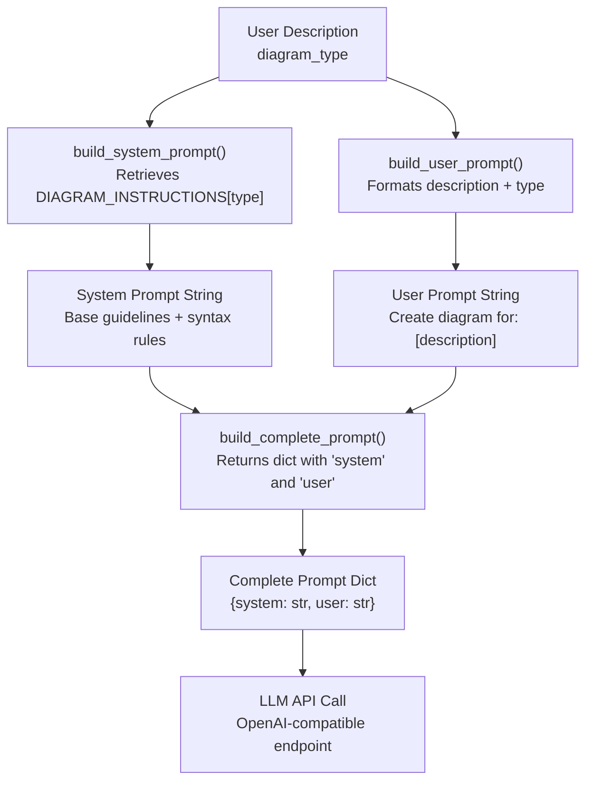
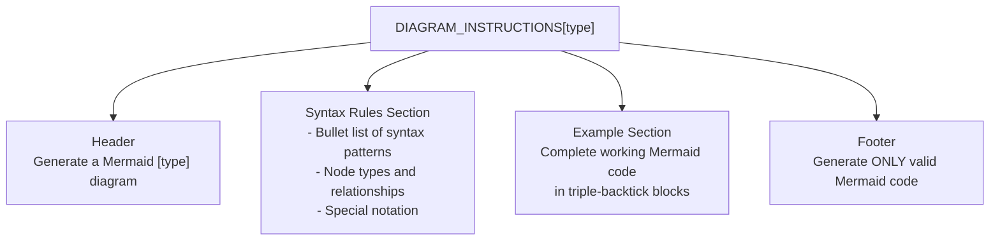
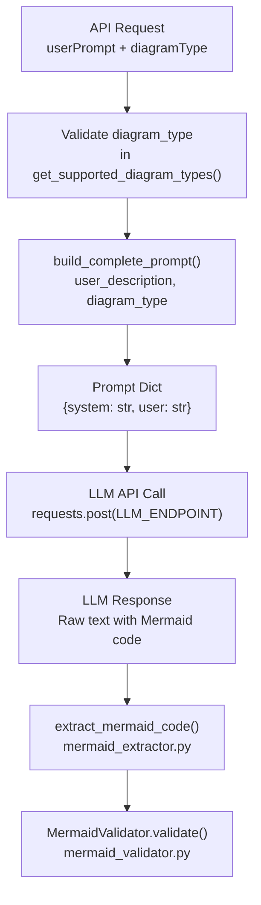
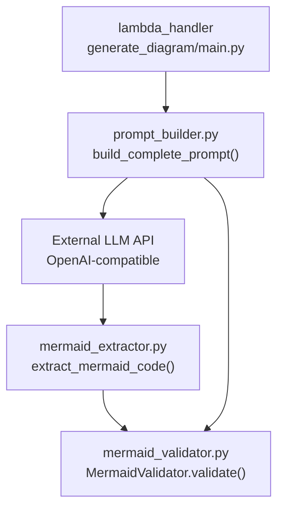

# Prompt Builder

> **Relevant source files**
> * [src/backend/lambda_functions/generate_diagram/mermaid_extractor.py](https://github.com/dotpep/architecture-ai-assistant/blob/1285f968/src/backend/lambda_functions/generate_diagram/mermaid_extractor.py)
> * [src/backend/lambda_functions/generate_diagram/mermaid_validator.py](https://github.com/dotpep/architecture-ai-assistant/blob/1285f968/src/backend/lambda_functions/generate_diagram/mermaid_validator.py)
> * [src/backend/lambda_functions/generate_diagram/prompt_builder.py](https://github.com/dotpep/architecture-ai-assistant/blob/1285f968/src/backend/lambda_functions/generate_diagram/prompt_builder.py)

The Prompt Builder module is responsible for constructing specialized prompts that instruct the Large Language Model (LLM) to generate valid Mermaid diagram code. This module implements diagram-type-specific prompt engineering, embedding syntax rules, examples, and formatting requirements to ensure the LLM produces syntactically correct Mermaid code for each of the seven supported diagram types.

The Prompt Builder operates as a critical preprocessing step in the diagram generation pipeline. For information about how the LLM response is processed after generation, see [Mermaid Code Extraction](/dotpep/architecture-ai-assistant/4.1.2-mermaid-code-extraction). For details on how generated code is validated, see [Mermaid Code Validation](/dotpep/architecture-ai-assistant/4.1.1-mermaid-code-validation).

**Sources:** [src/backend/lambda_functions/generate_diagram/prompt_builder.py L1-L308](https://github.com/dotpep/architecture-ai-assistant/blob/1285f968/src/backend/lambda_functions/generate_diagram/prompt_builder.py#L1-L308)

## Module Overview

The `prompt_builder.py` module consists of a core dictionary (`DIAGRAM_INSTRUCTIONS`) containing template prompts for each diagram type, and four utility functions that construct complete prompt structures for LLM consumption. The module enforces strict separation between system-level instructions (how to generate Mermaid code) and user-level instructions (what diagram to create).

**Sources:** [src/backend/lambda_functions/generate_diagram/prompt_builder.py L1-L10](https://github.com/dotpep/architecture-ai-assistant/blob/1285f968/src/backend/lambda_functions/generate_diagram/prompt_builder.py#L1-L10)

## Prompt Construction Pipeline

The following diagram shows how user input flows through the Prompt Builder functions to produce a complete LLM prompt:

**Prompt Builder Flow**



**Sources:** [src/backend/lambda_functions/generate_diagram/prompt_builder.py L225-L297](https://github.com/dotpep/architecture-ai-assistant/blob/1285f968/src/backend/lambda_functions/generate_diagram/prompt_builder.py#L225-L297)

## Supported Diagram Types

The module supports seven distinct diagram types, each with specialized Mermaid syntax instructions:

| Diagram Type | Key in `DIAGRAM_INSTRUCTIONS` | Mermaid Declaration | Primary Use Case |
| --- | --- | --- | --- |
| Flowchart | `flowchart` | `graph TD` or `graph LR` | Process flows, decision trees |
| ER Diagram | `erdiagram` | `erDiagram` | Database entity relationships |
| Sequence Diagram | `sequence` | `sequenceDiagram` | Message flows, API interactions |
| Class Diagram | `class` | `classDiagram` | Object-oriented design |
| State Diagram | `state` | `stateDiagram-v2` | State machines, workflows |
| Architecture | `architecture` | `graph TD` or `graph LR` | System architecture |
| Data Flow Diagram | `dfd` | `graph TD` or `graph LR` | Data movement through systems |

**Sources:** [src/backend/lambda_functions/generate_diagram/prompt_builder.py L9-L222](https://github.com/dotpep/architecture-ai-assistant/blob/1285f968/src/backend/lambda_functions/generate_diagram/prompt_builder.py#L9-L222)

## Diagram Instruction Structure

Each entry in the `DIAGRAM_INSTRUCTIONS` dictionary follows a standardized template structure:

**Instruction Template Components**



**Sources:** [src/backend/lambda_functions/generate_diagram/prompt_builder.py L11-L222](https://github.com/dotpep/architecture-ai-assistant/blob/1285f968/src/backend/lambda_functions/generate_diagram/prompt_builder.py#L11-L222)

### Example: Flowchart Instructions

The flowchart instruction template demonstrates the structure. It starts with syntax rules defining graph direction (`graph TD`, `graph LR`), node shapes (`A[Rectangle]`, `B(Rounded)`, `C{Diamond}`), connection types (`-->`, `---`, `.->`), and advanced features like subgraphs. It provides a complete working example showing a simple decision flow with labeled connections. This pattern repeats for each diagram type with type-specific syntax.

**Sources:** [src/backend/lambda_functions/generate_diagram/prompt_builder.py L11-L32](https://github.com/dotpep/architecture-ai-assistant/blob/1285f968/src/backend/lambda_functions/generate_diagram/prompt_builder.py#L11-L32)

### Example: ER Diagram Instructions

The ER diagram instructions emphasize relationship notation (`||--o{` for one-to-many, `||--||` for one-to-one) and cardinality symbols. The example demonstrates entity definitions with attributes using the brace syntax (`ENTITY { type attribute }`).

**Sources:** [src/backend/lambda_functions/generate_diagram/prompt_builder.py L34-L61](https://github.com/dotpep/architecture-ai-assistant/blob/1285f968/src/backend/lambda_functions/generate_diagram/prompt_builder.py#L34-L61)

## Core Functions

### build_system_prompt

```python
def build_system_prompt(diagram_type: str) -> str
```

Constructs the system-level prompt by combining a base instruction set with diagram-type-specific syntax rules. The function retrieves the appropriate instruction template from `DIAGRAM_INSTRUCTIONS` and prepends it with universal guidelines.

**Base Prompt Guidelines:**

1. Generate ONLY valid Mermaid syntax
2. Wrap diagram code in triple-backtick mermaid blocks
3. Keep diagrams clear and readable
4. Use appropriate node types and relationships
5. Add descriptive labels where helpful
6. Follow syntax rules exactly as specified

**Validation:** Raises `ValueError` if the requested diagram type is not in `DIAGRAM_INSTRUCTIONS`.

**Sources:** [src/backend/lambda_functions/generate_diagram/prompt_builder.py L225-L259](https://github.com/dotpep/architecture-ai-assistant/blob/1285f968/src/backend/lambda_functions/generate_diagram/prompt_builder.py#L225-L259)

### build_user_prompt

```python
def build_user_prompt(user_description: str, diagram_type: str) -> str
```

Formats the user's natural language description into a structured prompt that explicitly states the diagram type and reminds the LLM to use proper code block formatting. The resulting string follows the pattern:

```sql
Create a {diagram_type} diagram for the following:

{user_description}

Remember to wrap your Mermaid code in ```mermaid code blocks.
```

**Sources:** [src/backend/lambda_functions/generate_diagram/prompt_builder.py L262-L277](https://github.com/dotpep/architecture-ai-assistant/blob/1285f968/src/backend/lambda_functions/generate_diagram/prompt_builder.py#L262-L277)

### build_complete_prompt

```python
def build_complete_prompt(user_description: str, diagram_type: str) -> Dict[str, str]
```

Primary interface function that orchestrates the complete prompt construction. Returns a dictionary with two keys:

* `'system'`: Output of `build_system_prompt(diagram_type)`
* `'user'`: Output of `build_user_prompt(user_description, diagram_type)`

This structure aligns with OpenAI-compatible chat completion APIs that accept separate system and user message roles.

**Sources:** [src/backend/lambda_functions/generate_diagram/prompt_builder.py L280-L297](https://github.com/dotpep/architecture-ai-assistant/blob/1285f968/src/backend/lambda_functions/generate_diagram/prompt_builder.py#L280-L297)

### get_supported_diagram_types

```python
def get_supported_diagram_types() -> list
```

Utility function that returns the keys of `DIAGRAM_INSTRUCTIONS` as a list. Used for validation and API documentation purposes.

**Sources:** [src/backend/lambda_functions/generate_diagram/prompt_builder.py L300-L307](https://github.com/dotpep/architecture-ai-assistant/blob/1285f968/src/backend/lambda_functions/generate_diagram/prompt_builder.py#L300-L307)

## Integration with Generate Diagram Pipeline

The Prompt Builder integrates into the broader diagram generation flow as follows:

**Complete Generation Flow with Prompt Builder**



**Sources:** [src/backend/lambda_functions/generate_diagram/prompt_builder.py L280-L297](https://github.com/dotpep/architecture-ai-assistant/blob/1285f968/src/backend/lambda_functions/generate_diagram/prompt_builder.py#L280-L297)

## Syntax Rules by Diagram Type

The following table details the key syntax elements embedded in each diagram type's instructions:

| Diagram Type | Start Declaration | Key Syntax Elements | Special Features |
| --- | --- | --- | --- |
| `flowchart` | `graph TD/LR` | Node shapes: `[]`, `()`, `{}`, `(())`Arrows: `-->`, `---`, `-.->` | Subgraphs, connection labels |
| `erdiagram` | `erDiagram` | Relationships: `\|\|--o{`, `\|\|--\|\|`, `}o--o{`Attributes: `{ type attr }` | Cardinality notation |
| `sequence` | `sequenceDiagram` | Messages: `->>`, `-->>` (dotted)Participants, activation boxes | Loops, alt/else blocks, notes |
| `class` | `classDiagram` | Relationships: `<\|--`, `*--`, `o--`, `-->`Visibility: `+`, `-`, `#` | Interfaces, abstract classes |
| `state` | `stateDiagram-v2` | States, transitions: `-->`Start/end: `[*]` | Composite states, choice nodes |
| `architecture` | `graph TD/LR` | Subgraphs for layersDescriptive labels | System component organization |
| `dfd` | `graph TD/LR` | Entities: `[]`, processes: `()`Data stores: `[()]` | Numbered processes, labeled flows |

**Sources:** [src/backend/lambda_functions/generate_diagram/prompt_builder.py L11-L221](https://github.com/dotpep/architecture-ai-assistant/blob/1285f968/src/backend/lambda_functions/generate_diagram/prompt_builder.py#L11-L221)

## Prompt Engineering Strategies

The module implements several prompt engineering best practices:

### 1. Role Definition

The system prompt establishes the LLM as "an expert software architect and Mermaid diagram generator" to prime the model for technical accuracy.

**Sources:** [src/backend/lambda_functions/generate_diagram/prompt_builder.py L244-L246](https://github.com/dotpep/architecture-ai-assistant/blob/1285f968/src/backend/lambda_functions/generate_diagram/prompt_builder.py#L244-L246)

### 2. Explicit Formatting Requirements

Instructions repeatedly emphasize wrapping code in triple-backtick mermaid blocks, which enables reliable extraction via the `mermaid_extractor` module's regex patterns.

**Sources:** [src/backend/lambda_functions/generate_diagram/prompt_builder.py L31-L277](https://github.com/dotpep/architecture-ai-assistant/blob/1285f968/src/backend/lambda_functions/generate_diagram/prompt_builder.py#L31-L277)

### 3. Concrete Examples

Each diagram type includes a complete working example demonstrating proper syntax, node definitions, and relationships. This provides the LLM with a clear template to follow.

**Sources:** [src/backend/lambda_functions/generate_diagram/prompt_builder.py L21-L218](https://github.com/dotpep/architecture-ai-assistant/blob/1285f968/src/backend/lambda_functions/generate_diagram/prompt_builder.py#L21-L218)

### 4. Syntax Rule Enumeration

Bullet-point lists of syntax rules break down complex Mermaid notation into digestible components, reducing the likelihood of syntax errors.

**Sources:** [src/backend/lambda_functions/generate_diagram/prompt_builder.py L14-L205](https://github.com/dotpep/architecture-ai-assistant/blob/1285f968/src/backend/lambda_functions/generate_diagram/prompt_builder.py#L14-L205)

## Error Handling

The `build_system_prompt()` and `build_complete_prompt()` functions raise `ValueError` exceptions when an unsupported diagram type is requested. The error message includes the list of valid types:

```
raise ValueError(f"Unsupported diagram type: {diagram_type}. "
                f"Supported types: {', '.join(DIAGRAM_INSTRUCTIONS.keys())}")
```

This validation occurs before any LLM API call, preventing wasted requests and providing clear user feedback.

**Sources:** [src/backend/lambda_functions/generate_diagram/prompt_builder.py L236-L242](https://github.com/dotpep/architecture-ai-assistant/blob/1285f968/src/backend/lambda_functions/generate_diagram/prompt_builder.py#L236-L242)

## Usage Example

The typical invocation pattern in the `generate_diagram` Lambda function:

```typescript
from prompt_builder import build_complete_prompt

# User request data
user_prompt = "A login system with authentication and database"
diagram_type = "flowchart"

# Build prompts
prompts = build_complete_prompt(user_prompt, diagram_type)

# prompts['system'] contains base guidelines + flowchart syntax rules
# prompts['user'] contains formatted user request

# Pass to LLM API
response = requests.post(
    LLM_ENDPOINT,
    json={
        "messages": [
            {"role": "system", "content": prompts['system']},
            {"role": "user", "content": prompts['user']}
        ],
        "temperature": 0.7
    }
)
```

**Sources:** [src/backend/lambda_functions/generate_diagram/prompt_builder.py L280-L297](https://github.com/dotpep/architecture-ai-assistant/blob/1285f968/src/backend/lambda_functions/generate_diagram/prompt_builder.py#L280-L297)

## Relationship to Other Modules

**Module Dependencies**



The Prompt Builder's syntax rules align with the `MermaidValidator`'s validation patterns. For example, the flowchart instructions specify node syntax `A[Rectangle]` and connection syntax `-->`, which the validator checks using regex patterns like `r'[A-Za-z0-9_]+\[.+?\]'` and `r'--+>'`.

**Sources:** [src/backend/lambda_functions/generate_diagram/prompt_builder.py L1-L308](https://github.com/dotpep/architecture-ai-assistant/blob/1285f968/src/backend/lambda_functions/generate_diagram/prompt_builder.py#L1-L308)

 [src/backend/lambda_functions/generate_diagram/mermaid_validator.py L15-L42](https://github.com/dotpep/architecture-ai-assistant/blob/1285f968/src/backend/lambda_functions/generate_diagram/mermaid_validator.py#L15-L42)

 [src/backend/lambda_functions/generate_diagram/mermaid_extractor.py L10-L58](https://github.com/dotpep/architecture-ai-assistant/blob/1285f968/src/backend/lambda_functions/generate_diagram/mermaid_extractor.py#L10-L58)

## Extension Guidelines

To add support for a new diagram type:

1. Add a new key-value pair to `DIAGRAM_INSTRUCTIONS` dictionary following the template structure (header, syntax rules, example, footer)
2. Ensure the Mermaid declaration pattern is added to `MermaidValidator.DIAGRAM_TYPE_PATTERNS` for validation
3. Add corresponding pattern to `mermaid_extractor.is_likely_mermaid()` for extraction
4. Implement type-specific validation in `MermaidValidator._validate_type_specific()` if needed

**Sources:** [src/backend/lambda_functions/generate_diagram/prompt_builder.py L9-L222](https://github.com/dotpep/architecture-ai-assistant/blob/1285f968/src/backend/lambda_functions/generate_diagram/prompt_builder.py#L9-L222)