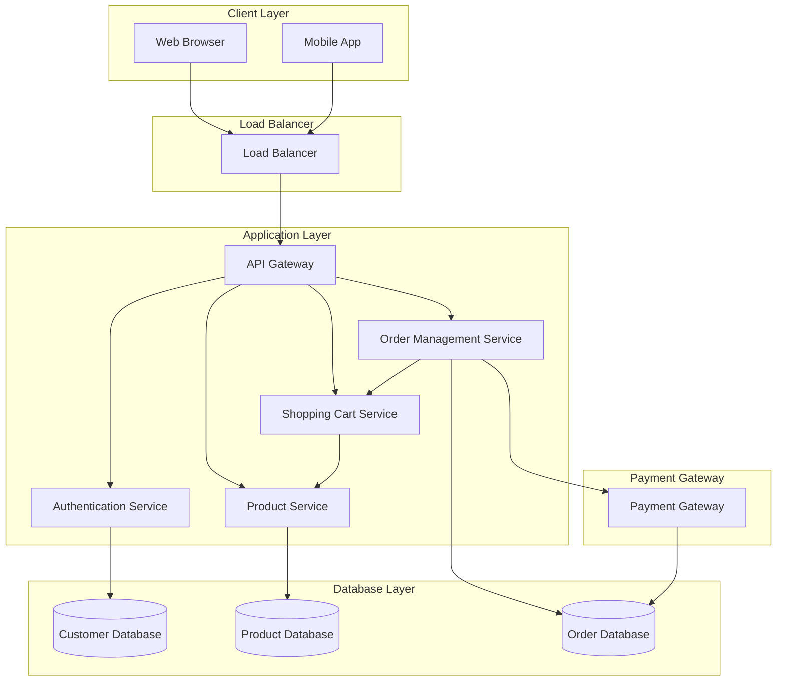

```mermaid
graph TD
    subgraph "Client Layer"
        Web[Web Browser]
        Mobile[Mobile App]
    end
    
    subgraph "Load Balancer"
        LB[Load Balancer]
    end
    
    subgraph "Application Layer"
        API[API Gateway]
        Auth[Authentication Service]
        Cart[Shopping Cart Service]
        Order[Order Management Service]
        Product[Product Service]
    end
    
    subgraph "Database Layer"
        CustomerDB[(Customer Database)]
        ProductDB[(Product Database)]
        OrderDB[(Order Database)]
    end
    
    subgraph "Payment Gateway"
        Payment[Payment Gateway]
    end
    
    Web --> LB
    Mobile --> LB
    LB --> API
    API --> Auth
    API --> Cart
    API --> Order
    API --> Product
    Cart --> Product
    Order --> Cart
    Order --> Payment
    Auth --> CustomerDB
    Product --> ProductDB
    Order --> OrderDB
    Payment --> OrderDB
```