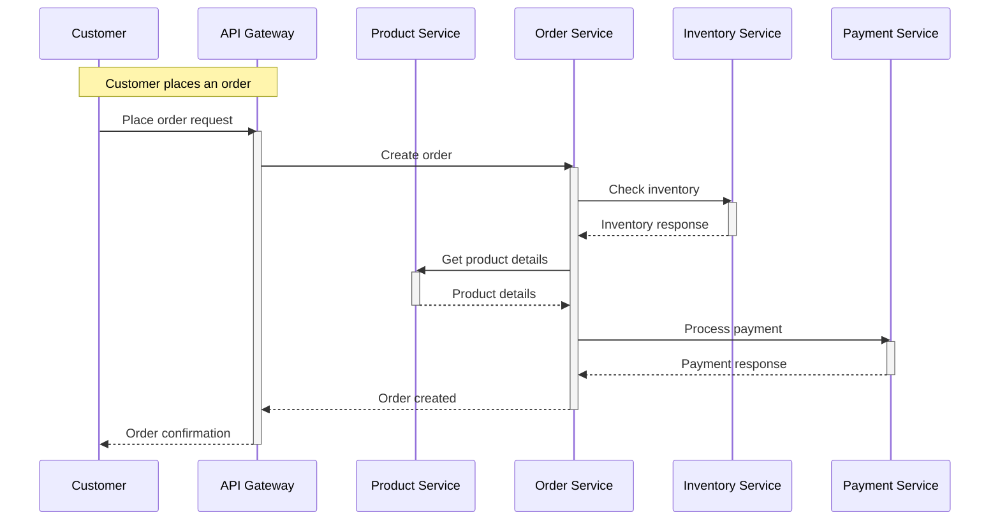

```mermaid
sequenceDiagram
    participant C as Customer
    participant GW as API Gateway
    participant P as Product Service
    participant O as Order Service
    participant I as Inventory Service
    participant PM as Payment Service
    
    Note over C,GW: Customer places an order
    C->>GW: Place order request
    activate GW
    GW->>O: Create order
    activate O
    O->>I: Check inventory
    activate I
    I-->>O: Inventory response
    deactivate I
    O->>P: Get product details
    activate P
    P-->>O: Product details
    deactivate P
    O->>PM: Process payment
    activate PM
    PM-->>O: Payment response
    deactivate PM
    O-->>GW: Order created
    deactivate O
    GW-->>C: Order confirmation
    deactivate GW
```