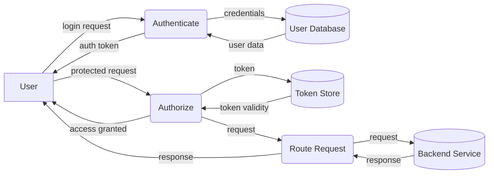

```mermaid
graph LR
    User[User] -->|login request| P1(Authenticate)
    P1 -->|credentials| DB[(User Database)]
    DB -->|user data| P1
    P1 -->|auth token| User
    User -->|protected request| P2(Authorize)
    P2 -->|token| DB2[(Token Store)]
    DB2 -->|token validity| P2
    P2 -->|access granted| User
    P2 -->|request| P3(Route Request)
    P3 -->|request| Service[(Backend Service)]
    Service -->|response| P3
    P3 -->|response| User
```