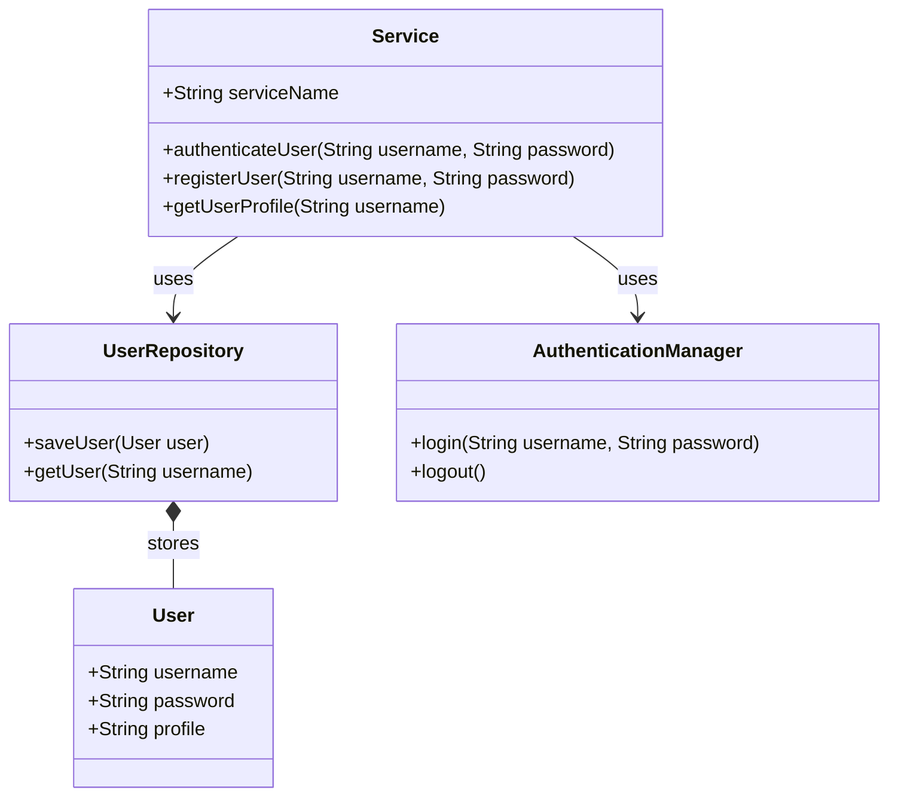

```mermaid
classDiagram
    class Service {
        +String serviceName
        +authenticateUser(String username, String password)
        +registerUser(String username, String password)
        +getUserProfile(String username)
    }
    class UserRepository {
        +saveUser(User user)
        +getUser(String username)
    }
    class AuthenticationManager {
        +login(String username, String password)
        +logout()
    }
    Service --> AuthenticationManager : uses
    Service --> UserRepository : uses
    class User {
        +String username
        +String password
        +String profile
    }
    UserRepository *-- User : stores
```