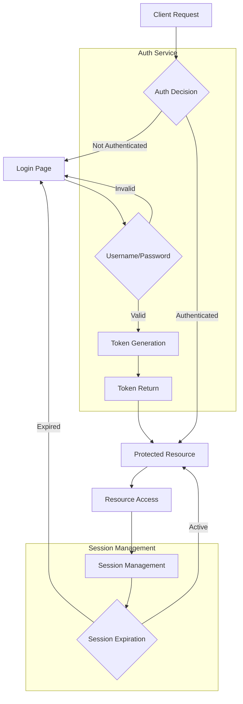

```mermaid
graph TD
    A[Client Request] --> B{Auth Decision}
    B -->|Not Authenticated| C[Login Page]
    B -->|Authenticated| D[Protected Resource]
    C --> E{Username/Password}
    E -->|Valid| F[Token Generation]
    E -->|Invalid| C
    F --> G[Token Return]
    G --> D
    D --> H[Resource Access]
    H --> I[Session Management]
    I --> J{Session Expiration}
    J -->|Expired| C
    J -->|Active| D
    subgraph Auth Service
        B
        E
        F
        G
    end
    subgraph Session Management
        I
        J
    end
```