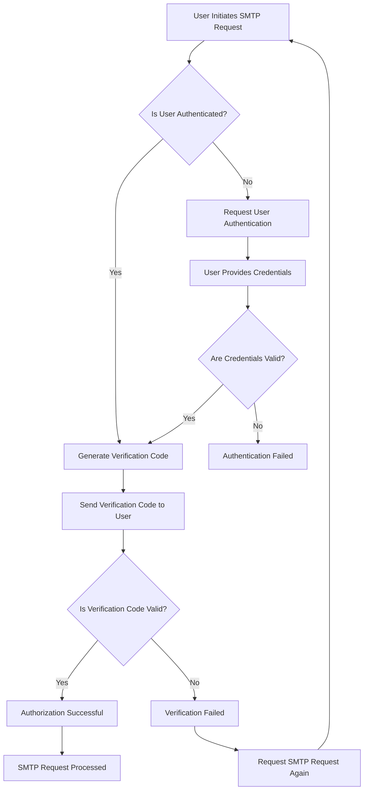

```mermaid
graph TD
    A[User Initiates SMTP Request] --> B{Is User Authenticated?}
    B -->|Yes| C[Generate Verification Code]
    B -->|No| D[Request User Authentication]
    D --> E[User Provides Credentials]
    E --> F{Are Credentials Valid?}
    F -->|Yes| C
    F -->|No| G[Authentication Failed]
    C --> H[Send Verification Code to User]
    H --> I{Is Verification Code Valid?}
    I -->|Yes| J[Authorization Successful]
    I -->|No| K[Verification Failed]
    J --> L[SMTP Request Processed]
    K --> M[Request SMTP Request Again]
    M --> A
```