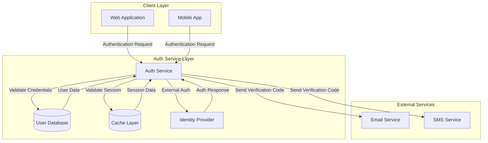

```mermaid
graph TD
    subgraph "Client Layer"
        Web[Web Application]
        Mobile[Mobile App]
    end
    
    subgraph "Auth Service Layer"
        Auth[Auth Service]
        UserDB[(User Database)]
        Cache[(Cache Layer)]
        IDP[Identity Provider]
    end
    
    subgraph "External Services"
        Email[Email Service]
        SMS[SMS Service]
    end
    
    Web -->| Authentication Request | Auth
    Mobile -->| Authentication Request | Auth
    Auth -->| Validate Credentials | UserDB
    Auth -->| Validate Session | Cache
    Auth -->| External Auth | IDP
    Auth -->| Send Verification Code | Email
    Auth -->| Send Verification Code | SMS
    IDP -->| Auth Response | Auth
    UserDB -->| User Data | Auth
    Cache -->| Session Data | Auth
```