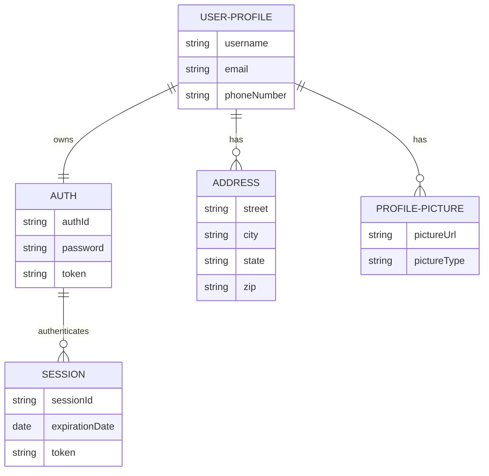

```mermaid
erDiagram
    AUTH ||--o{ SESSION : authenticates
    USER-PROFILE ||--|| AUTH : owns
    USER-PROFILE {
        string username
        string email
        string phoneNumber
    }
    AUTH {
        string authId
        string password
        string token
    }
    SESSION {
        string sessionId
        date expirationDate
        string token
    }
    USER-PROFILE ||--o{ ADDRESS : has
    ADDRESS {
        string street
        string city
        string state
        string zip
    }
    USER-PROFILE ||--o{ PROFILE-PICTURE : has
    PROFILE-PICTURE {
        string pictureUrl
        string pictureType
    }
```