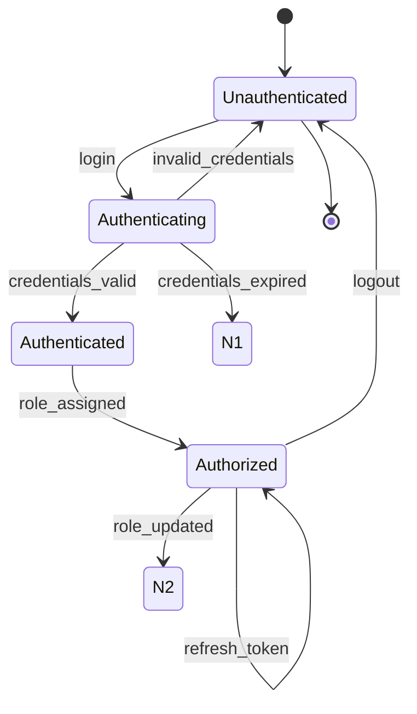

```mermaid
stateDiagram-v2
    [*] --> Unauthenticated
    Unauthenticated --> Authenticating : login
    Authenticating --> Authenticated : credentials_valid
    Authenticating --> Unauthenticated : invalid_credentials
    Authenticated --> Authorized : role_assigned
    Authorized --> Unauthenticated : logout
    Authorized --> Authorized : refresh_token
    Unauthenticated --> [*]
    note "Invalid Credentials" as N1
    Authenticating --> N1 : credentials_expired
    note "Role Assignment" as N2
    Authorized --> N2 : role_updated
```