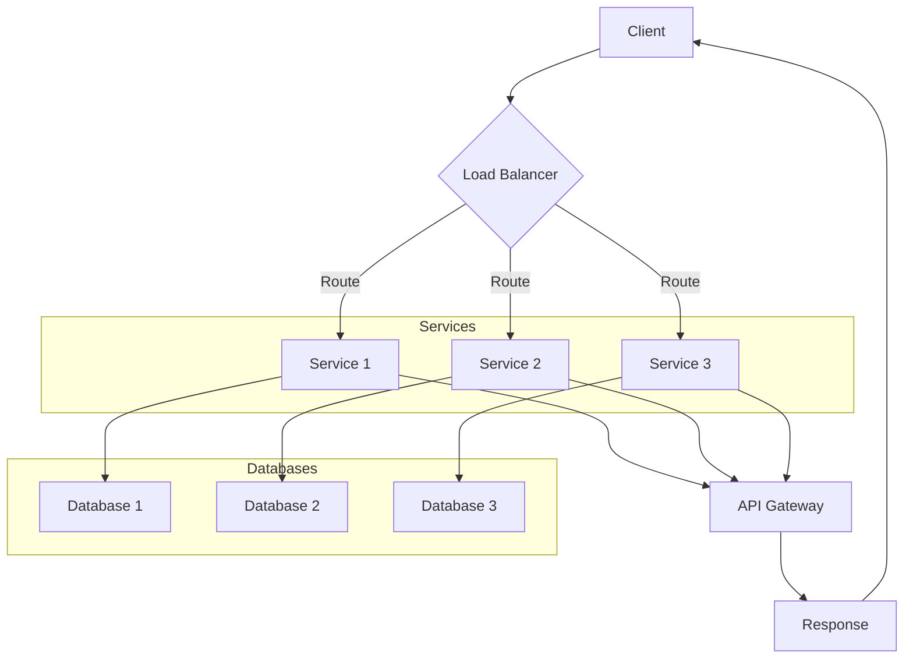

```mermaid
graph TD
    A[Client] --> B{Load Balancer}
    B -->|Route| C[Service 1]
    B -->|Route| D[Service 2]
    B -->|Route| E[Service 3]
    C --> F[Database 1]
    D --> G[Database 2]
    E --> H[Database 3]
    C --> I[API Gateway]
    D --> I
    E --> I
    I --> J[Response]
    J --> A
    subgraph Services
        C
        D
        E
    end
    subgraph Databases
        F
        G
        H
    end
```