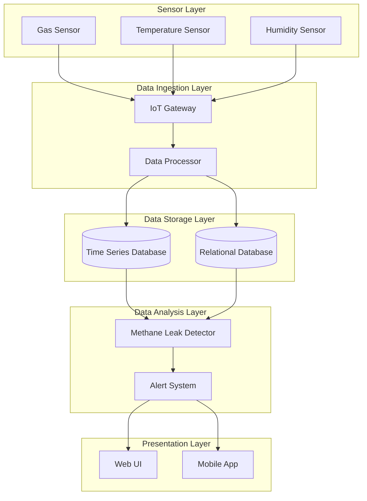

```mermaid
graph TD
    subgraph "Sensor Layer"
        Gas_Sensor[Gas Sensor]
        Temp_Sensor[Temperature Sensor]
        Hum_Sensor[Humidity Sensor]
    end
    
    subgraph "Data Ingestion Layer"
        IoT_Gateway[IoT Gateway]
        Data_Processor[Data Processor]
    end
    
    subgraph "Data Storage Layer"
        Time_Series_DB[(Time Series Database)]
        Relational_DB[(Relational Database)]
    end
    
    subgraph "Data Analysis Layer"
        Methane_Leak_Detector[Methane Leak Detector]
        Alert_System[Alert System]
    end
    
    subgraph "Presentation Layer"
        Web_UI[Web UI]
        Mobile_App[Mobile App]
    end
    
    Gas_Sensor --> IoT_Gateway
    Temp_Sensor --> IoT_Gateway
    Hum_Sensor --> IoT_Gateway
    IoT_Gateway --> Data_Processor
    Data_Processor --> Time_Series_DB
    Data_Processor --> Relational_DB
    Time_Series_DB --> Methane_Leak_Detector
    Relational_DB --> Methane_Leak_Detector
    Methane_Leak_Detector --> Alert_System
    Alert_System --> Web_UI
    Alert_System --> Mobile_App
```