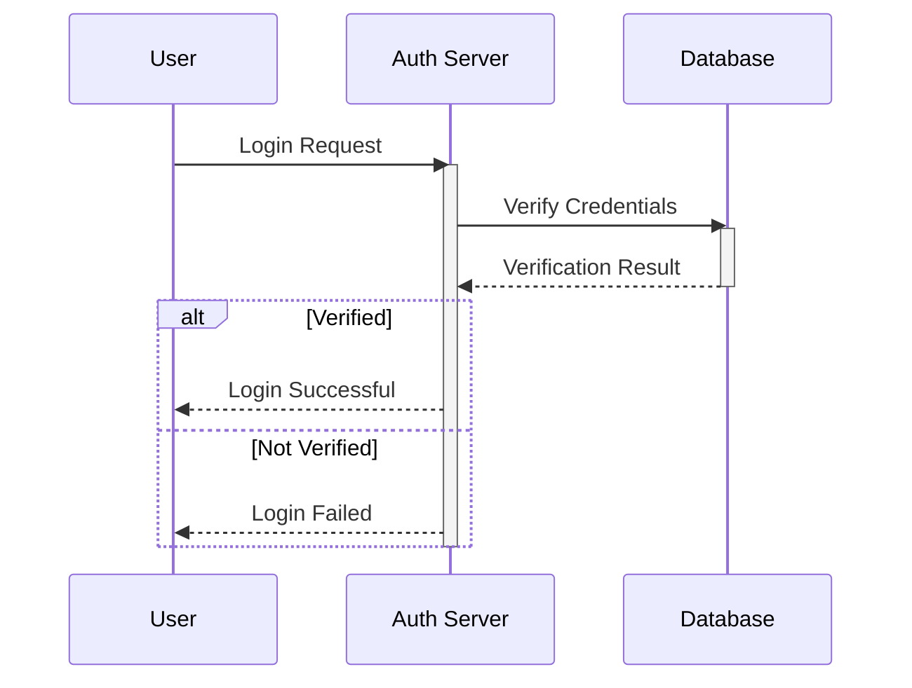

```mermaid
sequenceDiagram
    participant U as User
    participant A as Auth Server
    participant D as Database
    
    U->>A: Login Request
    activate A
    A->>D: Verify Credentials
    activate D
    D-->>A: Verification Result
    deactivate D
    alt Verified
        A-->>U: Login Successful
    else Not Verified
        A-->>U: Login Failed
    end
    deactivate A
```