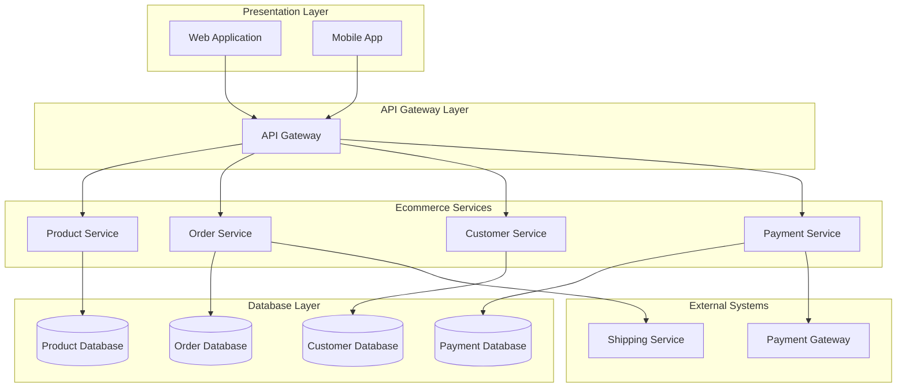

```mermaid
graph TD
    subgraph "Presentation Layer"
        Web[Web Application]
        Mobile[Mobile App]
    end
    
    subgraph "API Gateway Layer"
        API_GW[API Gateway]
    end
    
    subgraph "Ecommerce Services"
        ProductSvc[Product Service]
        OrderSvc[Order Service]
        CustomerSvc[Customer Service]
        PaymentSvc[Payment Service]
    end
    
    subgraph "Database Layer"
        ProductDB[(Product Database)]
        OrderDB[(Order Database)]
        CustomerDB[(Customer Database)]
        PaymentDB[(Payment Database)]
    end
    
    subgraph "External Systems"
        PaymentGW[Payment Gateway]
        ShippingSvc[Shipping Service]
    end
    
    Web --> API_GW
    Mobile --> API_GW
    API_GW --> ProductSvc
    API_GW --> OrderSvc
    API_GW --> CustomerSvc
    API_GW --> PaymentSvc
    ProductSvc --> ProductDB
    OrderSvc --> OrderDB
    CustomerSvc --> CustomerDB
    PaymentSvc --> PaymentDB
    PaymentSvc --> PaymentGW
    OrderSvc --> ShippingSvc
```